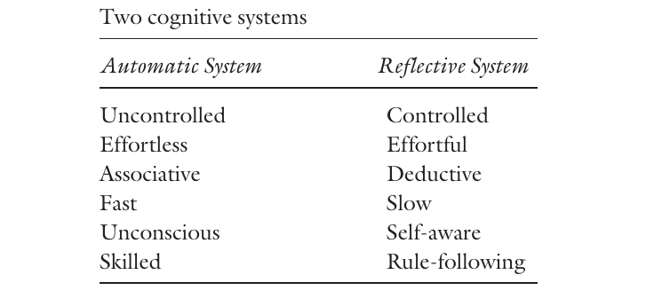
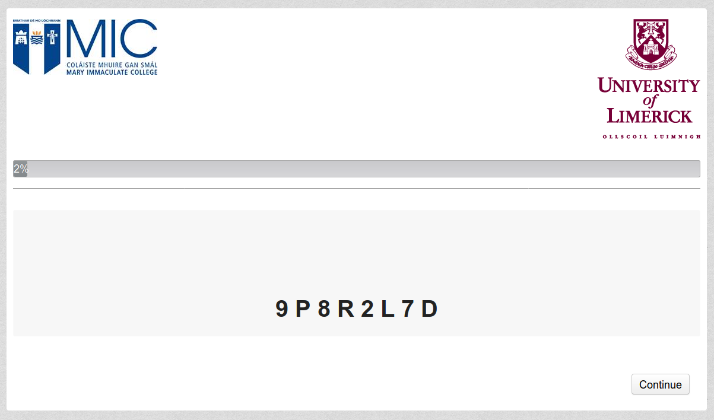

```{r setup, include=FALSE}
knitr::opts_chunk$set(echo = FALSE, include = FALSE)
# knitr::opts_chunk$set(eval = TRUE, echo = TRUE)
#knitr::opts_chunk$set(include = FALSE)
```


```{r load_libraries_cogload}
rm(list = ls())
library(citr)
#install.packages("sjstats")
library(plyr)
library(foreign)
library(car)
library(desnum)
library(ggplot2)
library(extrafont)
#devtools::install_github("crsh/papaja")
library(papaja)
#library("dplyr")
library("afex")
library("tibble")
library(scales)
#install.packages("metap")
library(metap)
library(pwr)
library(lsr)
#install.packages("sjstats")
library(sjstats)
library(DescTools)
#inatall.packages("ggstatsplot")
#library(ggstatsplot)
library(VGAM)
library(nnet)
library(mlogit)
library(reshape2)
#install.packages("powerMediation")
library("powerMediation")


library(knitr)
library(forestmangr)

#source("load_all_data.R")

#devtools::install_github("benmarwick/wordcountaddin")
#library(wordcountaddin)
#wordcountaddin::text_stats("cogload_1to5_25Sept19.Rmd")
#getwd()
```


```{r colors}

r_slidetot <- 82


#Color Format
colFmt = function(x,color){
  outputFormat = knitr::opts_knit$get("rmarkdown.pandoc.to")
  if(outputFormat == 'latex')
    paste("\\textcolor{",color,"}{",x,"}",sep="")
  else if(outputFormat == 'html')
    paste("<font color='",color,"'>",x,"</font>",sep="")
  else
    x
}

#rgb(255, 0, 0);

sentiment <- '#ff744e'
rational1 <- '#2faace'
rational <- '#248aa8'
conflict1 <- '#7d0552'
conflict <- '#2f8d2f'
cogload <- '#a0522d'
dual <- '#b93b8f'
lightgrey <- '#c0c0c0'


# \definecolor{sentiment}{RGB}{255, 115, 115} #ff7300 or #ff744e
# 
# % \definecolor{rational}{RGB}{47,170,206} #2faace
# 
# \definecolor{rational}{RGB}{36, 138, 168} #248aa8
# 
# % \definecolor{conflict}{RGB}{125, 5, 82} #7d0552
# 
# \definecolor{cogload}{RGB}{160, 82, 45} #a0522d
# 
# \definecolor{conflict}{RGB}{47,141,47} #2f8d2f
# 
# \definecolor{dual}{RGB}{185, 59, 143} #b93b8f
# 
# \definecolor{lightgrey}{RGB}{192,192,192} #c0c0c0


# plotting:
# red dumbfounded
# yellow reasons
# blue nothing wrong
dumb_palette <- c('#ff3801','#ff4c1b','#ff6035','#ff744e','#ff8868','#ff9c81','#ffb09b','#ff744e') # https://www.colorhexa.com/ff744e
reasons_palette <- c('#ffb701','#ffbf1b','#ffc635','#ffcd4e','#ffd468','#ffdb81','#ffe39b','#ffcd4e') #https://www.colorhexa.com/ffcd4e
nothing_palette <- c('#0149ff','#1b5bff','#356eff','#4e80ff','#6892ff','#81a5ff','#9bb7ff','#4e80ff') # https://www.colorhexa.com/4e80ff


```

## Overview

- Background: What is Dumbfounding
- Theoretical Approach
- Studies 1-5
- Study 6

# What is Moral Dumbfounding

## Heinz
In Europe, a woman was near death from a very bad disease, a special kind of cancer. There was one drug that the doctors thought might save her. It was a form of radium for which a druggist was charging ten times what the drug cost him to make. The sick woman's husband, Heinz, went to everyone he knew to borrow the money, but he could only get together about half of what it cost. He told the druggist that his wife was dying, and asked him to sell it cheaper or let him pay later. But the druggist said, "No, I discovered the drug and I'm going to make money from it." So, Heinz got desperate and broke into the man's store to steal the drug for his wife. The druggist had Heinz arrested and charged.

## Trolley
A Trolley is hurtling down a track towards five people. It will kill them all on impact. Paul is on a bridge under which it will pass. He can stop it by putting something very heavy in front of it. As it happens, there is a very fat man next to him – Paul's only way to stop the trolley is to push him over the bridge and onto the track, killing him to save five. Paul decides to push the man.

## Jennifer
Jennifer works in a medical school pathology lab as a research assistant. The lab prepares human cadavers that are used to teach medical students about anatomy. The cadavers come from people who had donated their body for the general use of the researchers in the lab. The bodies are normally cremated, however, severed cuts may be disposed of at the discretion of lab researchers, One night Jennifer is leaving the lab when she sees a body that is going to be discarded the next day. Jennifer was a vegetarian, for moral reasons. She thought it was wrong to kill animals for food. But then, when she saw a body about to be cremated, she thought it was irrational to waste perfectly edible meat. So she cut off a piece of flesh, and took it home and cooked it. The person had died recently of a heart attack, and she cooked the meat thoroughly, so there was no risk of disease

## Julie & Mark
Julie and Mark, who are brother and sister, are travelling together in France. They are both on summer vacation from college. One night they are staying alone in a cabin near the beach. They decide that it would be interesting and fun if they tried making love. At very least it would be a new experience for each of them. Julie was already taking birth control pills, but Mark uses a condom too, just to be safe. They both enjoy it, but they decide not to do it again. They keep that night as a special secret between them, which makes them feel even closer to each other.

# Theoretical Approach

## Dual-processes / Dual-systems



<font size=4.5>[taken from @thaler_nudge_2008, p. 20]</font size>


## Dual-Processes and Moral Dumbfounding


> <div id="footer"> <font size=2>Cillian McHugh - 19/11/21</font size></div>

- `r colFmt("Dual-process",dual)` theories of moral judgement 

- `r colFmt("Conflict",conflict)` in `r colFmt("dual-process",dual)` occurs when
  - a `r colFmt("habitual (System 1)",sentiment)` response is `r colFmt("different",conflict)` 
  - from a response that results from `r colFmt("deliberation (System 2)",rational)` 

<p style="font-size:16px"><br></p>

- `r colFmt("Three response options in the dumbfounding paradigm",lightgrey)` 
  - `r colFmt("It's wrong and I can provide a valid reason",lightgrey)`
  - `r colFmt("It's wrong but I can't think of a reason",lightgrey)`
  - `r colFmt("There is nothing wrong (competing intuitions)",lightgrey)`

<p style="font-size:16px">[@crockett_models_2013; @cushman_action_2013; @greene_secret_2008; @evans_resolution_2007; @evans_dualprocess_2013]</p>

## Dual-Processes and Moral Dumbfounding


> <div id="footer"> <font size=2>Cillian McHugh - 19/11/21</font size></div>

- `r colFmt("Dual-process",dual)` theories of moral judgement 

- `r colFmt("Conflict",conflict)` in `r colFmt("dual-process",dual)` occurs when
  - a `r colFmt("habitual (System 1)",sentiment)` response is `r colFmt("different",conflict)` 
  - from a response that results from `r colFmt("deliberation (System 2)",rational)` 

<p style="font-size:16px"><br></p>

- Three response options in the `r colFmt("dumbfounding paradigm",conflict)` 
  - `r colFmt("It's wrong and I can provide a valid reason",lightgrey)`
  - `r colFmt("It's wrong but I can't think of a reason",lightgrey)`
  - `r colFmt("There is nothing wrong (competing intuitions)",lightgrey)`

<p style="font-size:16px">[@crockett_models_2013; @cushman_action_2013; @greene_secret_2008; @evans_resolution_2007; @evans_dualprocess_2013]</p>

## Dual-Processes and Moral Dumbfounding


> <div id="footer"> <font size=2>Cillian McHugh - 19/11/21</font size></div>

- `r colFmt("Dual-process",dual)` theories of moral judgement 

- `r colFmt("Conflict",conflict)` in `r colFmt("dual-process",dual)` occurs when
  - a `r colFmt("habitual (System 1)",sentiment)` response is `r colFmt("different",conflict)` 
  - from a response that results from `r colFmt("deliberation (System 2)",rational)` 

<p style="font-size:16px"><br></p>

- Three response options in the `r colFmt("dumbfounding paradigm",conflict)` 
  - **`r colFmt("It's wrong and I can provide a valid reason",rational)`**
  - `r colFmt("It's wrong but I can't think of a reason",lightgrey)`
  - `r colFmt("There is nothing wrong (competing intuitions)",lightgrey)`

<p style="font-size:16px">[@crockett_models_2013; @cushman_action_2013; @greene_secret_2008; @evans_resolution_2007; @evans_dualprocess_2013]</p>

## Dual-Processes and Moral Dumbfounding


> <div id="footer"> <font size=2>Cillian McHugh - 19/11/21</font size></div>

- `r colFmt("Dual-process",dual)` theories of moral judgement 

- `r colFmt("Conflict",conflict)` in `r colFmt("dual-process",dual)` occurs when
  - a `r colFmt("habitual (System 1)",sentiment)` response is `r colFmt("different",conflict)` 
  - from a response that results from `r colFmt("deliberation (System 2)",rational)` 

<p style="font-size:16px"><br></p>

- Three response options in the `r colFmt("dumbfounding paradigm",conflict)`
  - `r colFmt("It's wrong and I can provide a valid reason",rational)` 
  - **`r colFmt("It's wrong but I can't think of a reason",sentiment)`**
  - `r colFmt("There is nothing wrong (competing intuitions)",lightgrey)`

<p style="font-size:16px">[@crockett_models_2013; @cushman_action_2013; @greene_secret_2008; @evans_resolution_2007; @evans_dualprocess_2013]</p>

## Dual-Processes and Moral Dumbfounding


> <div id="footer"> <font size=2>Cillian McHugh - 19/11/21</font size></div>

- `r colFmt("Dual-process",dual)` theories of moral judgement 

- `r colFmt("Conflict",conflict)` in `r colFmt("dual-process",dual)` occurs when
  - a `r colFmt("habitual (System 1)",sentiment)` response is `r colFmt("different",conflict)` 
  - from a response that results from `r colFmt("deliberation (System 2)",rational)` 

<p style="font-size:16px"><br></p>

- Three response options in the `r colFmt("dumbfounding paradigm",conflict)` 
  - `r colFmt("It's wrong and I can provide a valid reason",rational)` 
  - `r colFmt("It's wrong but I can't think of a reason",sentiment)`
  - **`r colFmt("There is nothing wrong (competing intuitions)",sentiment)`**

<p style="font-size:16px">[@crockett_models_2013; @cushman_action_2013; @greene_secret_2008; @evans_resolution_2007; @evans_dualprocess_2013]</p>

## Dual-Processes and Moral Dumbfounding


> <div id="footer"> <font size=2>Cillian McHugh - 19/11/21</font size></div>

- `r colFmt("Dual-process",dual)` theories of moral judgement 

- `r colFmt("Conflict",conflict)` in `r colFmt("dual-process",dual)` occurs when
  - a `r colFmt("habitual (System 1)",sentiment)` response is `r colFmt("different",conflict)` 
  - from a response that results from `r colFmt("deliberation (System 2)",rational)` 

<p style="font-size:16px"><br></p>

- Three response options in the `r colFmt("dumbfounding paradigm",conflict)` 
  - `r colFmt("It's wrong and I can provide a valid reason",rational)` 
  - `r colFmt("It's wrong but I can't think of a reason",sentiment)`
  - `r colFmt("There is nothing wrong (competing intuitions)",sentiment)`

<p style="font-size:16px">[@crockett_models_2013; @cushman_action_2013; @greene_secret_2008; @evans_resolution_2007; @evans_dualprocess_2013]</p>


## Cognitive Load and Moral Dumbfounding


> <div id="footer"> <font size=2>Cillian McHugh - 19/11/21</font size></div>

- Manipulations of `r colFmt("Cognitive load", cogload)` are known to inhibit `r colFmt("deliberative responding",rational)`

- Recall the three response options in `r colFmt("dumbfounding",conflict)`
  - `r colFmt("(a) It's wrong and I can provide a valid reason",rational)` 
  - `r colFmt("(b) It's wrong but I can't think of a reason",sentiment)`
  - `r colFmt("(c) There is nothing wrong (competing intuitions)",sentiment)`

**`r colFmt("Cognitive load", cogload)` & dumbfounded responding**


**`r colFmt("&#x2193;",rational)`** **`r colFmt("&#x2193;",rational)`** **`r colFmt("&#x2193;",rational)`** **`r colFmt("&#x2193;",rational)`** &nbsp;&nbsp; &nbsp;&nbsp;&nbsp;&nbsp;&nbsp;&nbsp;&nbsp;   `r colFmt("Giving reasons (a)",rational)` &nbsp;&nbsp;&nbsp;&nbsp; &nbsp;&nbsp;&nbsp;&nbsp;&nbsp;&nbsp;&nbsp;   **`r colFmt("&#x2193;",rational)`** **`r colFmt("&#x2193;",rational)`** **`r colFmt("&#x2193;",rational)`** **`r colFmt("&#x2193;",rational)`**

**`r colFmt("&#x2191;",sentiment)`** &nbsp;&nbsp; **`r colFmt("&#x2191;",sentiment)`** &nbsp;&nbsp;&nbsp;  `r colFmt("Dumbfounded responding (b)",sentiment)` &nbsp;&nbsp;&nbsp;  **`r colFmt("&#x2191;",sentiment)`** **`r colFmt("&#x2191;",sentiment)`** **`r colFmt("&#x2191;",sentiment)`** 

**`r colFmt("&#x2191;",sentiment)`** &nbsp;&nbsp; **`r colFmt("&#x2191;",sentiment)`** &nbsp;&nbsp;&nbsp;  `r colFmt("There is nothing wrong (c)",sentiment)` &nbsp;&nbsp; &nbsp; &nbsp; &nbsp; &nbsp; **`r colFmt("&#x2191;",sentiment)`**


## Individual Differences in Moral Dumbfounding


> <div id="footer"> <font size=2>Cillian McHugh - 19/11/21</font size></div>

- Dumbfounded responding may be linked with individual differences

- `r colFmt("Need for Cognition",rational1)` has been linked to dual-process approaches to cognition

- The `r colFmt("Need for Cognition Scale",rational1)` (`r colFmt("NFC",rational1)`) is a measure of an individual’s tendency <br><br> &nbsp;&nbsp;&nbsp;&nbsp;&nbsp;&nbsp;&nbsp;&nbsp;&nbsp;&nbsp;&nbsp;&nbsp;*"to engage in and enjoy effortful analytic activity"* <br>

<p style="font-size:16px">&nbsp;&nbsp;&nbsp;&nbsp;&nbsp;&nbsp;&nbsp;&nbsp;&nbsp;&nbsp;&nbsp;&nbsp;&nbsp;&nbsp;&nbsp;&nbsp;&nbsp;&nbsp;&nbsp;&nbsp;&nbsp;&nbsp;&nbsp;&nbsp;&nbsp;&nbsp;&nbsp;&nbsp;&nbsp;&nbsp;&nbsp;&nbsp;&nbsp;&nbsp;&nbsp;&nbsp;&nbsp;&nbsp;&nbsp;&nbsp;&nbsp;&nbsp;&nbsp;&nbsp;&nbsp;&nbsp;&nbsp;&nbsp;&nbsp;&nbsp;&nbsp;&nbsp;&nbsp;&nbsp;&nbsp;&nbsp;[@forsterlee_examination_1999, p. 471; see also @cacioppo_need_1982]</p> 
  - tendency to engage in `r colFmt("deliberation",rational)`
  - a person’s need to understand and make sense of the world

<p style="font-size:16px">[@cacioppo_need_1982; @petty_efficient_1984; @petty_dispositional_1996; @forsterlee_examination_1999; @evans_dualprocess_2013]</p>


## Individual Differences in Moral Dumbfounding


> <div id="footer"> <font size=2>Cillian McHugh - 19/11/21</font size></div>

### We hypothesised:
- People who score highly on the `r colFmt("NFC",rational1)`
  - will be more likely to `r colFmt("provide reasons",rational)` for their judgement
- People who score low on the `r colFmt("NFC",rational1)`
  - are likely `r colFmt("to fail to identify reasons",sentiment)` for their judgement
- `r colFmt("NFC",rational1)` is related to a need to understand and make sense of the world
  - Of the people who `r colFmt("fail to identify reasons",sentiment)` for their judgement: 
    - those who `r colFmt("revise",sentiment)` their judgement will likely score higher on the `r colFmt("NFC",rational1)` than people who provide a `r colFmt("dumbfounded response",sentiment)`
    
# Studies 1-5    
## Studies 1-5

> <div id="footer"> <font size=2>Cillian McHugh - 19/11/21</font size></div>

```{r load data set Study 1}

#rm(list = ls())

load("loaded_data/one.RData")
df3 <- study_1

df4 <- df3[which(df3$condition=="cog_load"),]
df5 <- df3[which(df3$condition=="control"),]


```

- **Study 1:** `r length(df3$InCS)` participants (*`r colFmt("n",cogload)`* = `r colFmt(sum(df3$condition=="cog_load"),cogload)`; *`r colFmt("n",rational)`* = `r colFmt(sum(df3$condition=="control"),rational)`; `r sum(df3$gender=="Female")` female, `r sum(df3$gender=="Male")` male; *M*~age~ = `r round(mean(df3$age),digits=2)`, min = `r min(df3$age)`, max = `r max(df3$age)`, *SD* = `r round(sd(df3$age),digits=2)`; undergraduate students, postgraduate students, and alumni from MIC, and UL)
  
```{r load data set Study 2}

#rm(list = ls())

load("loaded_data/two.RData")
df3 <- study_2

df4 <- df3[which(df3$condition=="cog_load"),]
df5 <- df3[which(df3$condition=="control"),]


```

- **Study 2:** `r length(df3$InCS)` participants (*`r colFmt("n",cogload)`* = `r colFmt(sum(df3$condition=="cog_load"),cogload)`; *`r colFmt("n",rational)`* = `r colFmt(sum(df3$condition=="control"),rational)`; `r sum(df3$gender=="Female")` female, `r sum(df3$gender=="Male")` male; *M*~age~ = `r round(mean(df3$age),digits=2)`, min = `r min(df3$age)`, max = `r max(df3$age)`, *SD* = `r round(sd(df3$age),digits=2)`; MTurk)

```{r load data set Study 3}

#rm(list = ls())

load("loaded_data/three.RData")
df3 <- study_3

df4 <- df3[which(df3$condition=="cog_load"),]
df5 <- df3[which(df3$condition=="control"),]


```

- **Study 3:** `r length(df3$InCS)` participants (*`r colFmt("n",cogload)`* = `r colFmt(sum(df3$condition=="cog_load"),cogload)`; *`r colFmt("n",rational)`* = `r colFmt(sum(df3$condition=="control"),rational)`; `r sum(df3$gender=="Female")` female, `r sum(df3$gender=="Male")` male; *M*~age~ = `r round(mean(df3$age),digits=2)`, min = `r min(df3$age)`, max = `r max(df3$age)`, *SD* = `r round(sd(df3$age),digits=2)`; MTurk)

```{r load data set Study 4}

#rm(list = ls())

load("loaded_data/four.RData")
df3 <- study_4

df4 <- df3[which(df3$condition=="cog_load"),]
df5 <- df3[which(df3$condition=="control"),]


```

- **Study 4:** `r length(df3$InCS)` participants (*`r colFmt("n",cogload)`* = `r colFmt(sum(df3$condition=="cog_load"),cogload)`; *`r colFmt("n",rational)`* = `r colFmt(sum(df3$condition=="control"),rational)`; `r sum(df3$gender=="Female")` female, `r sum(df3$gender=="Male")` male; *M*~age~ = `r round(mean(df3$age),digits=2)`, min = `r min(df3$age)`, max = `r max(df3$age)`, *SD* = `r round(sd(df3$age),digits=2)`; MTurk)

```{r load data set Study 5}

#rm(list = ls())

load("loaded_data/five.RData")
df3 <- study_5

df4 <- df3[which(df3$condition=="cog_load"),]
df5 <- df3[which(df3$condition=="control"),]


```

- **Study 5:** `r length(df3$InCS)` participants (*`r colFmt("n",cogload)`* = `r colFmt(sum(df3$condition=="cog_load"),cogload)`; *`r colFmt("n",rational)`* = `r colFmt(sum(df3$condition=="control"),rational)`; `r sum(df3$gender=="Female")` female, `r sum(df3$gender=="Male")` male; *M*~age~ = `r round(mean(df3$age),digits=2)`, min = `r min(df3$age)`, max = `r max(df3$age)`, *SD* = `r round(sd(df3$age),digits=2)`; students and alumni from MIC, and UL)

## Cognitive Load Manipulations (Studies 1 & 5)

> <div id="footer"> <font size=2>Cillian McHugh - 19/11/21</font size></div>




## Cognitive Load Manipulations (Studies 2, 3, & 4)

> <div id="footer"> <font size=2>Cillian McHugh - 19/11/21</font size></div>


```{r dotpattern,fig.cap="Sample dot patterns",include=TRUE,fig.height=2, fig.width=6}

x <- c(10,20,30,30)
y <- c(10,30,10,20)
x <- x - 5
y <- y - 5


#rbind(x,y)
z <- cbind.data.frame(x,y)
z$diff <- rep("b",length=length(z$x))

x <- c(10,10,10)
y <- c(10,20,30)
x <- x - 5
y <- y - 5


#rbind(x,y)
z2 <- cbind.data.frame(x,y)
z2$diff <- rep("a",length=length(z2$x))

z3 <- rbind(z,z2)
#z3
#rm(g)
ggplot(z3, aes(x=x,y=y)) +
 geom_point(size=8) +
 xlab(NULL) + ylab(NULL) + 
 scale_x_continuous(breaks = c(10,20),
                            labels = NULL, limits = c(1, 29)) +
#g <- g + scale_x_continuous(breaks = c(0,10,20,30), labels = NULL, limits = c(0, 30))
 scale_y_continuous(breaks = c(10,20),
                            labels = NULL, limits = c(1, 29))+
  facet_grid(.~diff,switch = 'x')+
 theme(plot.title=element_text(family="Times", size=12),
               legend.text=element_text(family="Times", size=8),
               legend.title=element_text(family="Times", size=12),
               axis.text=element_text(family="Times", size=8),
               axis.title=element_text(family="Times", size=12),
               panel.background = element_rect(fill = "white",
                                               colour = NA),
               panel.border = element_rect(fill = NA, size = 1,
                                           colour = "black"),
               panel.grid.major = element_line(colour = "black"),
               panel.grid.minor = element_line(colour = "white",
                                               size = 0.25),
               axis.ticks.length = unit(0,"cm"),
       plot.margin = NULL,
       strip.background = element_rect(fill = NA, size = 1,
                                           colour = "white"),
       strip.text = element_text(family = "Times",size = 16),
       panel.spacing = unit(4, "lines"))


ggsave("mpa_graphs/dot_pattern.png"
       , width = 16, height = 8
       , units = "cm", dpi = 300)

```

(scored out of 9; 1 misplaced dot = 7/9)

[taken from @deneys_when_2007]

## Results (Studies 1-5)

> <div id="footer"> <font size=2>Cillian McHugh - 19/11/21</font size></div>

- **Study 10:** **`r colFmt("Significant association",rational)`** between response to the `r colFmt("Critical Slide",conflict)` and `r colFmt("Cognitive Load",cogload)`; `r colFmt("No significant association",sentiment)` with `r colFmt("NFC",rational1)`
- **Study 11:** **`r colFmt("Significant association",rational)`** between response to the `r colFmt("Critical Slide",conflict)` and `r colFmt("Cognitive Load",cogload)`; `r colFmt("No significant association",sentiment)` with `r colFmt("NFC",rational1)`
- **Study 12:** **`r colFmt("Significant association",rational)`** between response to the `r colFmt("Critical Slide",conflict)` and `r colFmt("Cognitive Load",cogload)`; **`r colFmt("Significant association",rational)`** with `r colFmt("NFC",rational1)`
- **Study 13:** `r colFmt("No significant association",sentiment)` between response to the `r colFmt("Critical Slide",conflict)` and `r colFmt("Cognitive Load",cogload)`; `r colFmt("No significant association",sentiment)` with `r colFmt("NFC",rational1)`
- **Study 14:** `r colFmt("No significant association",sentiment)` between response to the `r colFmt("Critical Slide",conflict)` and `r colFmt("Cognitive Load",cogload)`; `r colFmt("No significant association",sentiment)` with `r colFmt("NFC",rational1)`


## Study 1: Results


```{r}

df3 <- study_1

y <- table(df3$condition,df3$InCS)
y <- as.data.frame(y)
colnames(y) <- c("condition","InCS","Freq")

z <- as.data.frame(table(df3$condition,df3$InCS)/length(df3$gender)*2)
perc <- z$Freq
test <- cbind(y,perc)
test$condition
test


y <- table(df3$condition,df3$Dumb_incl_string)
y <- as.data.frame(y)
colnames(y) <- c("condition","InCS","Freq")


ab_graph <- function(){
  a <- df3[which(df3$condition==levels(as.factor(df3$condition))[1]),]
  b <- df3[which(df3$condition==levels(as.factor(df3$condition))[2]),]
  #levels(as.factor(df3$condition))[1]
  
  ay <- as.data.frame(table(a$InCS,a$condition))
  by <- as.data.frame(table(b$InCS,b$condition))

  aperc <- ay$Freq/length(a$gender)
  ay <- cbind(ay,aperc)
  colnames(ay) <- c("InCS","condition","Freq","perc")
  
  bperc <- by$Freq/length(b$gender)
  by <- cbind(by,bperc)
  colnames(by) <- c("InCS","condition","Freq","perc")
  
  c <- rbind(ay,by)
  
  c
}

test <- ab_graph()


xaxiscolors <- c(nothing_palette[3],dumb_palette[3],reasons_palette[3])

rm(x,y)
```


> <div id="footer"> <font size=2>Cillian McHugh - 19/11/21</font size></div>

```{r makegraph9, include=TRUE}


ggplot(test, aes(x=reorder(InCS), y=perc, fill=factor(condition,labels=c("Cognitive load","Control")))) +
  scale_y_continuous(limits = c(-.03,1),
                     labels = percent_format()
  )+ 
  geom_col(position = "dodge",
           color="black",
           size=.2
  )+
  geom_text(#family = "Times",
            size=4.2,
            aes( label = scales::percent(perc,accuracy=1),
                 y= perc ),
            stat= "identity",
            vjust = -.5,
            position = position_dodge(.9),
            fontface='plain'
            )+
  geom_text(#family = "Times",
            size=4.2,
            aes(label = format(Freq),
                y= -3*(..count../100)/(..count..)),
            stat= "count",
            position = position_dodge(0.9),
            #vjust = -.05,
            fontface='plain'
            ) +
  xlab("Response to Critical Slide") +
  ylab("Percentage of participants selecting each response")+
  scale_x_discrete(labels=c("Reasons", "Dumbfounded","Nothing Wrong")) +
  scale_fill_grey(start = .5, end = .8) +
  labs(fill="Condition") +
  #theme_apa() +
  theme_bw() +
  theme(panel.border = element_blank(),
        axis.line = element_line(size = .2),
        strip.background  = element_blank(),
        panel.grid = element_blank(),
        plot.title=element_text(#family="Times",
                                size=12
                                ),
        legend.text=element_text(#family="Times",
                                 size=8
                                 ),
          legend.title=element_text(#family="Times",
                                    size=10
                                    ),
          axis.text=element_text(#family="Times",
                                 colour = "black",
                                 size=8
                                 ),
          axis.ticks.x = element_blank(),
          axis.title=element_text(#family="Times",
                                  size=12
                                  ),
          strip.text=element_text(#family = "Times",
                                  size = 12
                                  ),
         # strip.background = element_rect(fill = "white"),
          legend.position="right")


```


## Study 2: Results


```{r}

df3 <- study_2

y <- table(df3$condition,df3$InCS)
y <- as.data.frame(y)
colnames(y) <- c("condition","InCS","Freq")

z <- as.data.frame(table(df3$condition,df3$InCS)/length(df3$gender)*2)
perc <- z$Freq
test <- cbind(y,perc)
test$condition
test


y <- table(df3$condition,df3$Dumb_incl_string)
y <- as.data.frame(y)
colnames(y) <- c("condition","InCS","Freq")


ab_graph <- function(){
  a <- df3[which(df3$condition==levels(as.factor(df3$condition))[1]),]
  b <- df3[which(df3$condition==levels(as.factor(df3$condition))[2]),]
  #levels(as.factor(df3$condition))[1]
  
  ay <- as.data.frame(table(a$InCS,a$condition))
  by <- as.data.frame(table(b$InCS,b$condition))
  
  aperc <- ay$Freq/length(a$gender)
  ay <- cbind(ay,aperc)
  colnames(ay) <- c("InCS","condition","Freq","perc")
  
  bperc <- by$Freq/length(b$gender)
  by <- cbind(by,bperc)
  colnames(by) <- c("InCS","condition","Freq","perc")
  
  c <- rbind(ay,by)
  
  c
}

test <- ab_graph()


xaxiscolors <- c(nothing_palette[3],dumb_palette[3],reasons_palette[3])

rm(x,y)
```


```{r}

df3 <- study_2

#y <- table(df3$InCS,df3$condition)
y <- table(df3$InCS,df3$engaged)
y <- as.data.frame(y)
#colnames(y) <- c("condition","InCS","Freq")
colnames(y) <- c("InCS","condition","Freq")

z <- as.data.frame(table(df3$condition,df3$InCS)/length(df3$gender)*2)


z <- rbind(as.data.frame(table(df3$InCS[which(df3$engaged=="engaged")])/
                           length(df3$InCS[which(df3$engaged=="engaged")])),
           as.data.frame(table(df3$InCS[which(df3$engaged=="not engaged")])/
                           length(df3$InCS[which(df3$engaged=="not engaged")])))


perc <- z$Freq
test <- cbind(y,perc)
```

> <div id="footer"> <font size=2>Cillian McHugh - 19/11/21</font size></div>

```{r makegraph10, include=TRUE}


ggplot(test, aes(x=reorder(InCS), y=perc, fill=factor(condition,labels=c("Cognitive load","Control")))) +
  scale_y_continuous(limits = c(-.03,1),
                     labels = percent_format()
  )+ 
  geom_col(position = "dodge",
           color="black",
           size=.2
  )+
  geom_text(#family = "Times",
            size=4.2,
            aes( label = scales::percent(perc,accuracy=1),
                 y= perc ),
            stat= "identity",
            vjust = -.5,
            position = position_dodge(.9),
            fontface='plain'
            )+
  geom_text(#family = "Times",
            size=4.2,
            aes(label = format(Freq),
                y= -3*(..count../100)/(..count..)),
            stat= "count",
            position = position_dodge(0.9),
            #vjust = -.05,
            fontface='plain'
            ) +
  xlab("Response to Critical Slide") +
  ylab("Percentage of participants selecting each response")+
  scale_x_discrete(labels=c("Reasons", "Dumbfounded","Nothing Wrong")) +
  scale_fill_grey(start = .5, end = .8) +
  labs(fill="Condition") +
  #theme_apa() +
  theme_bw() +
  theme(panel.border = element_blank(),
        axis.line = element_line(size = .2),
        strip.background  = element_blank(),
        panel.grid = element_blank(),
        plot.title=element_text(#family="Times",
                                size=12
                                ),
        legend.text=element_text(#family="Times",
                                 size=8
                                 ),
          legend.title=element_text(#family="Times",
                                    size=10
                                    ),
          axis.text=element_text(#family="Times",
                                 colour = "black",
                                 size=8
                                 ),
          axis.ticks.x = element_blank(),
          axis.title=element_text(#family="Times",
                                  size=12
                                  ),
          strip.text=element_text(#family = "Times",
                                  size = 12
                                  ),
         # strip.background = element_rect(fill = "white"),
          legend.position="right")


```


## Study 3: Results


```{r}

df3 <- study_3
df3 <- df3[which(df3$engaged==TRUE),]

y <- table(df3$condition,df3$InCS)
y <- as.data.frame(y)
colnames(y) <- c("condition","InCS","Freq")

z <- as.data.frame(table(df3$condition,df3$InCS)/length(df3$gender)*2)
perc <- z$Freq
test <- cbind(y,perc)
test$condition
test


y <- table(df3$condition,df3$Dumb_incl_string)
y <- as.data.frame(y)
colnames(y) <- c("condition","InCS","Freq")


ab_graph <- function(){
  a <- df3[which(df3$condition==levels(as.factor(df3$condition))[1]),]
  b <- df3[which(df3$condition==levels(as.factor(df3$condition))[2]),]
  #levels(as.factor(df3$condition))[1]
  
  ay <- as.data.frame(table(a$InCS,a$condition))
  by <- as.data.frame(table(b$InCS,b$condition))
  
  aperc <- ay$Freq/length(a$gender)
  ay <- cbind(ay,aperc)
  colnames(ay) <- c("InCS","condition","Freq","perc")
  
  bperc <- by$Freq/length(b$gender)
  by <- cbind(by,bperc)
  colnames(by) <- c("InCS","condition","Freq","perc")
  
  c <- rbind(ay,by)
  
  c
}

test <- ab_graph()


xaxiscolors <- c(nothing_palette[3],dumb_palette[3],reasons_palette[3])

rm(x,y)
```

```{r}


y <- table(df3$condition,df3$InCS)
y <- as.data.frame(y)
colnames(y) <- c("condition","InCS","Freq")

z <- as.data.frame(table(df3$condition,df3$InCS)/length(df3$gender)*2)
perc <- z$Freq
test <- cbind(y,perc)
test$condition
test


y <- table(df3$condition,df3$Dumb_incl_string)
y <- as.data.frame(y)
colnames(y) <- c("condition","InCS","Freq")


ab_graph <- function(){
  a <- df3[which(df3$condition==levels(as.factor(df3$condition))[1]),]
  b <- df3[which(df3$condition==levels(as.factor(df3$condition))[2]),]
  #levels(as.factor(df3$condition))[1]
  
  ay <- as.data.frame(table(a$InCS,a$condition))
  by <- as.data.frame(table(b$InCS,b$condition))
  
  aperc <- ay$Freq/length(a$gender)
  ay <- cbind(ay,aperc)
  colnames(ay) <- c("InCS","condition","Freq","perc")
  
  bperc <- by$Freq/length(b$gender)
  by <- cbind(by,bperc)
  colnames(by) <- c("InCS","condition","Freq","perc")
  
  c <- rbind(ay,by)
  
  c
}

test <- ab_graph()


rm(x,y)
```


> <div id="footer"> <font size=2>Cillian McHugh - 19/11/21</font size></div>

```{r , include=TRUE}


ggplot(test, aes(x=reorder(InCS), y=perc, fill=factor(condition,labels=c("Cognitive load","Control")))) +
  scale_y_continuous(limits = c(-.03,1),
                     labels = percent_format()
  )+ 
  geom_col(position = "dodge",
           color="black",
           size=.2
  )+
  geom_text(#family = "Times",
            size=4.2,
            aes( label = scales::percent(perc,accuracy=1),
                 y= perc ),
            stat= "identity",
            vjust = -.5,
            position = position_dodge(.9),
            fontface='plain'
            )+
  geom_text(#family = "Times",
            size=4.2,
            aes(label = format(Freq),
                y= -3*(..count../100)/(..count..)),
            stat= "count",
            position = position_dodge(0.9),
            #vjust = -.05,
            fontface='plain'
            ) +
  xlab("Response to Critical Slide") +
  ylab("Percentage of participants selecting each response")+
  scale_x_discrete(labels=c("Reasons", "Dumbfounded","Nothing Wrong")) +
  scale_fill_grey(start = .5, end = .8) +
  labs(fill="Condition") +
  #theme_apa() +
  theme_bw() +
  theme(panel.border = element_blank(),
        axis.line = element_line(size = .2),
        strip.background  = element_blank(),
        panel.grid = element_blank(),
        plot.title=element_text(#family="Times",
                                size=12
                                ),
        legend.text=element_text(#family="Times",
                                 size=8
                                 ),
          legend.title=element_text(#family="Times",
                                    size=10
                                    ),
          axis.text=element_text(#family="Times",
                                 colour = "black",
                                 size=8
                                 ),
          axis.ticks.x = element_blank(),
          axis.title=element_text(#family="Times",
                                  size=12
                                  ),
          strip.text=element_text(#family = "Times",
                                  size = 12
                                  ),
         # strip.background = element_rect(fill = "white"),
          legend.position="right")


```


## Study 4: Results


```{r}

df3 <- study_4
df3 <- df3[which(df3$engaged==TRUE),]

y <- table(df3$condition,df3$InCS)
y <- as.data.frame(y)
colnames(y) <- c("condition","InCS","Freq")

z <- as.data.frame(table(df3$condition,df3$InCS)/length(df3$gender)*2)
perc <- z$Freq
test <- cbind(y,perc)
test$condition
test


y <- table(df3$condition,df3$Dumb_incl_string)
y <- as.data.frame(y)
colnames(y) <- c("condition","InCS","Freq")


ab_graph <- function(){
  a <- df3[which(df3$condition==levels(as.factor(df3$condition))[1]),]
  b <- df3[which(df3$condition==levels(as.factor(df3$condition))[2]),]
  #levels(as.factor(df3$condition))[1]
  
  ay <- as.data.frame(table(a$InCS,a$condition))
  by <- as.data.frame(table(b$InCS,b$condition))
  
  aperc <- ay$Freq/length(a$gender)
  ay <- cbind(ay,aperc)
  colnames(ay) <- c("InCS","condition","Freq","perc")
  
  bperc <- by$Freq/length(b$gender)
  by <- cbind(by,bperc)
  colnames(by) <- c("InCS","condition","Freq","perc")
  
  c <- rbind(ay,by)
  
  c
}

test <- ab_graph()


xaxiscolors <- c(nothing_palette[3],dumb_palette[3],reasons_palette[3])

rm(x,y)
```


```{r}


y <- table(df3$condition,df3$InCS)
y <- as.data.frame(y)
colnames(y) <- c("condition","InCS","Freq")

z <- as.data.frame(table(df3$condition,df3$InCS)/length(df3$gender)*2)
perc <- z$Freq
test <- cbind(y,perc)
test$condition
test


y <- table(df3$condition,df3$Dumb_incl_string)
y <- as.data.frame(y)
colnames(y) <- c("condition","InCS","Freq")


ab_graph <- function(){
  a <- df3[which(df3$condition==levels(as.factor(df3$condition))[1]),]
  b <- df3[which(df3$condition==levels(as.factor(df3$condition))[2]),]
  #levels(as.factor(df3$condition))[1]
  
  ay <- as.data.frame(table(a$InCS,a$condition))
  by <- as.data.frame(table(b$InCS,b$condition))
  
  aperc <- ay$Freq/length(a$gender)
  ay <- cbind(ay,aperc)
  colnames(ay) <- c("InCS","condition","Freq","perc")
  
  bperc <- by$Freq/length(b$gender)
  by <- cbind(by,bperc)
  colnames(by) <- c("InCS","condition","Freq","perc")
  
  c <- rbind(ay,by)
  
  c
}


test <- ab_graph()


rm(x,y)
```


```{r}


y <- table(df3$condition,df3$InCS)
y <- as.data.frame(y)
colnames(y) <- c("condition","InCS","Freq")

z <- as.data.frame(table(df3$condition,df3$InCS)/length(df3$gender)*2)
perc <- z$Freq
test <- cbind(y,perc)
test$condition
test


y <- table(df3$condition,df3$Dumb_incl_string)
y <- as.data.frame(y)
colnames(y) <- c("condition","InCS","Freq")


ab_graph <- function(){
  a <- df3[which(df3$condition==levels(as.factor(df3$condition))[1]),]
  b <- df3[which(df3$condition==levels(as.factor(df3$condition))[2]),]
  #levels(as.factor(df3$condition))[1]
  
  ay <- as.data.frame(table(a$InCS,a$condition))
  by <- as.data.frame(table(b$InCS,b$condition))
  
  aperc <- ay$Freq/length(a$gender)
  ay <- cbind(ay,aperc)
  colnames(ay) <- c("InCS","condition","Freq","perc")
  
  bperc <- by$Freq/length(b$gender)
  by <- cbind(by,bperc)
  colnames(by) <- c("InCS","condition","Freq","perc")
  
  c <- rbind(ay,by)
  
  c
}

test <- ab_graph()


test <- round_df(test,digits = 3)

rm(x,y)
```


> <div id="footer"> <font size=2>Cillian McHugh - 19/11/21</font size></div>

```{r , include=TRUE}


ggplot(test, aes(x=reorder(InCS), y=perc, fill=factor(condition,labels=c("Cognitive load","Control")))) +
  scale_y_continuous(limits = c(-.03,1),
                     labels = percent_format()
  )+ 
  geom_col(position = "dodge",
           color="black",
           size=.2
  )+
  geom_text(#family = "Times",
            size=4.2,
            aes( label = scales::percent(perc,accuracy=1),
                 y= perc ),
            stat= "identity",
            vjust = -.5,
            position = position_dodge(.9),
            fontface='plain'
            )+
  geom_text(#family = "Times",
            size=4.2,
            aes(label = format(Freq),
                y= -3*(..count../100)/(..count..)),
            stat= "count",
            position = position_dodge(0.9),
            #vjust = -.05,
            fontface='plain'
            ) +
  xlab("Response to Critical Slide") +
  ylab("Percentage of participants selecting each response")+
  scale_x_discrete(labels=c("Reasons", "Dumbfounded","Nothing Wrong")) +
  scale_fill_grey(start = .5, end = .8) +
  labs(fill="Condition") +
  #theme_apa() +
  theme_bw() +
  theme(panel.border = element_blank(),
        axis.line = element_line(size = .2),
        strip.background  = element_blank(),
        panel.grid = element_blank(),
        plot.title=element_text(#family="Times",
                                size=12
                                ),
        legend.text=element_text(#family="Times",
                                 size=8
                                 ),
          legend.title=element_text(#family="Times",
                                    size=10
                                    ),
          axis.text=element_text(#family="Times",
                                 colour = "black",
                                 size=8
                                 ),
          axis.ticks.x = element_blank(),
          axis.title=element_text(#family="Times",
                                  size=12
                                  ),
          strip.text=element_text(#family = "Times",
                                  size = 12
                                  ),
         # strip.background = element_rect(fill = "white"),
          legend.position="right")


```


## Study 5: Results


> <div id="footer"> <font size=2>Cillian McHugh - 19/11/21</font size></div>

```{r}

df3 <- study_5


y <- table(df3$condition,df3$InCS)
y <- as.data.frame(y)
colnames(y) <- c("condition","InCS","Freq")

z <- as.data.frame(table(df3$condition,df3$InCS)/length(df3$gender)*2)
perc <- z$Freq
test <- cbind(y,perc)
test$condition
test


#y <- table(df3$condition,df3$Dumb_incl_string)
#y <- as.data.frame(y)
#colnames(y) <- c("condition","InCS","Freq")


ab_graph <- function(){
  a <- df3[which(df3$condition==levels(as.factor(df3$condition))[1]),]
  b <- df3[which(df3$condition==levels(as.factor(df3$condition))[2]),]
  #levels(as.factor(df3$condition))[1]
  
  ay <- as.data.frame(table(a$InCS,a$condition))
  by <- as.data.frame(table(b$InCS,b$condition))
  
  aperc <- ay$Freq/length(a$gender)
  ay <- cbind(ay,aperc)
  colnames(ay) <- c("InCS","condition","Freq","perc")
  
  bperc <- by$Freq/length(b$gender)
  by <- cbind(by,bperc)
  colnames(by) <- c("InCS","condition","Freq","perc")
  
  c <- rbind(ay,by)
  
  c
}

test <- ab_graph()


xaxiscolors <- c(nothing_palette[3],dumb_palette[3],reasons_palette[3])

rm(x,y)
```

```{r}


y <- table(df3$condition,df3$InCS)
y <- as.data.frame(y)
colnames(y) <- c("condition","InCS","Freq")

z <- as.data.frame(table(df3$condition,df3$InCS)/length(df3$gender)*2)
perc <- z$Freq
test <- cbind(y,perc)
test$condition
test


#y <- table(df3$condition,df3$Dumb_incl_string)
#y <- as.data.frame(y)
#colnames(y) <- c("condition","InCS","Freq")


ab_graph <- function(){
  a <- df3[which(df3$condition==levels(as.factor(df3$condition))[1]),]
  b <- df3[which(df3$condition==levels(as.factor(df3$condition))[2]),]
  #levels(as.factor(df3$condition))[1]
  
  ay <- as.data.frame(table(a$InCS,a$condition))
  by <- as.data.frame(table(b$InCS,b$condition))
  
  aperc <- ay$Freq/length(a$gender)
  ay <- cbind(ay,aperc)
  colnames(ay) <- c("InCS","condition","Freq","perc")
  
  bperc <- by$Freq/length(b$gender)
  by <- cbind(by,bperc)
  colnames(by) <- c("InCS","condition","Freq","perc")
  
  c <- rbind(ay,by)
  
  c
}

test <- ab_graph()


rm(x,y)
```


```{r}


y <- table(df3$condition,df3$InCS)
y <- as.data.frame(y)
colnames(y) <- c("condition","InCS","Freq")

z <- as.data.frame(table(df3$condition,df3$InCS)/length(df3$gender)*2)
perc <- z$Freq
test <- cbind(y,perc)
test$condition
test

# 
# y <- table(df3$condition,df3$Dumb_incl_string)
# y <- as.data.frame(y)
# colnames(y) <- c("condition","InCS","Freq")


ab_graph <- function(){
  a <- df3[which(df3$condition==levels(as.factor(df3$condition))[1]),]
  b <- df3[which(df3$condition==levels(as.factor(df3$condition))[2]),]
  #levels(as.factor(df3$condition))[1]
  
  ay <- as.data.frame(table(a$InCS,a$condition))
  by <- as.data.frame(table(b$InCS,b$condition))
  
  aperc <- ay$Freq/length(a$gender)
  ay <- cbind(ay,aperc)
  colnames(ay) <- c("InCS","condition","Freq","perc")
  
  bperc <- by$Freq/length(b$gender)
  by <- cbind(by,bperc)
  colnames(by) <- c("InCS","condition","Freq","perc")
  
  c <- rbind(ay,by)
  
  c
}


ab_graph <- function(){
  a <- df3[which(df3$condition==levels(as.factor(df3$condition))[1]),]
  b <- df3[which(df3$condition==levels(as.factor(df3$condition))[2]),]
  a#levels(as.factor(df3$condition))[1]
  
  ay <- as.data.frame(table(a$InCS,as.character(a$condition)))
  by <- as.data.frame(table(b$InCS,as.character(b$condition)))
  
  aperc <- ay$Freq/length(a$gender)
  ay <- cbind(ay,aperc)
  colnames(ay) <- c("InCS","condition","Freq","perc")
  
  bperc <- by$Freq/length(b$gender)
  by <- cbind(by,bperc)
  colnames(by) <- c("InCS","condition","Freq","perc")
  
  c <- rbind(ay,by)
  
  c
}

test <- ab_graph()


test <- ab_graph()


rm(x,y)
```


```{r , include=TRUE}


ggplot(test, aes(x=reorder(InCS), y=perc, fill=factor(condition,labels=c("Cognitive load","Control")))) +
  scale_y_continuous(limits = c(-.03,1),
                     labels = percent_format()
  )+ 
  geom_col(position = "dodge",
           color="black",
           size=.2
  )+
  geom_text(#family = "Times",
            size=4.2,
            aes( label = scales::percent(perc,accuracy=1),
                 y= perc ),
            stat= "identity",
            vjust = -.5,
            position = position_dodge(.9),
            fontface='plain'
            )+
  geom_text(#family = "Times",
            size=4.2,
            aes(label = format(Freq),
                y= -3*(..count../100)/(..count..)),
            stat= "count",
            position = position_dodge(0.9),
            #vjust = -.05,
            fontface='plain'
            ) +
  xlab("Response to Critical Slide") +
  ylab("Percentage of participants selecting each response")+
  scale_x_discrete(labels=c("Reasons", "Dumbfounded","Nothing Wrong")) +
  scale_fill_grey(start = .5, end = .8) +
  labs(fill="Condition") +
  #theme_apa() +
  theme_bw() +
  theme(panel.border = element_blank(),
        axis.line = element_line(size = .2),
        strip.background  = element_blank(),
        panel.grid = element_blank(),
        plot.title=element_text(#family="Times",
                                size=12
                                ),
        legend.text=element_text(#family="Times",
                                 size=8
                                 ),
          legend.title=element_text(#family="Times",
                                    size=10
                                    ),
          axis.text=element_text(#family="Times",
                                 colour = "black",
                                 size=8
                                 ),
          axis.ticks.x = element_blank(),
          axis.title=element_text(#family="Times",
                                  size=12
                                  ),
          strip.text=element_text(#family = "Times",
                                  size = 12
                                  ),
         # strip.background = element_rect(fill = "white"),
          legend.position="right")


```


```{r}


load("loaded_data/combined.RData")

df3 <- eng_0123a
y <- table(df3$condition,df3$InCS)
y <- as.data.frame(y)
colnames(y) <- c("condition","InCS","Freq")

z <- as.data.frame(table(df3$condition,df3$InCS)/length(df3$gender)*2)
perc <- z$Freq
test <- cbind(y,perc)
test$condition
test

# 
# y <- table(df3$condition,df3$Dumb_incl_string)
# y <- as.data.frame(y)
# colnames(y) <- c("condition","InCS","Freq")


ab_graph <- function(){
  a <- df3[which(df3$condition==levels(as.factor(df3$condition))[1]),]
  b <- df3[which(df3$condition==levels(as.factor(df3$condition))[2]),]
  a#levels(as.factor(df3$condition))[1]
  
  ay <- as.data.frame(table(a$InCS,as.character(a$condition)))
  by <- as.data.frame(table(b$InCS,as.character(b$condition)))
  
  aperc <- ay$Freq/length(a$gender)
  ay <- cbind(ay,aperc)
  colnames(ay) <- c("InCS","condition","Freq","perc")
  
  bperc <- by$Freq/length(b$gender)
  by <- cbind(by,bperc)
  colnames(by) <- c("InCS","condition","Freq","perc")
  
  c <- rbind(ay,by)
  
  c
}


test <- ab_graph()

test <- 
  test %>% 
  round_df(digits = 2)


rm(x,y)
```

## Combined Results


> <div id="footer"> <font size=2>Cillian McHugh - 19/11/21</font size></div>

```{r , include=TRUE}


ggplot(test, aes(x=reorder(InCS), y=perc, fill=factor(condition,labels=c("Cognitive load\n(\U1D615 = 319)","Control\n(\U1D615 = 307)")))) +
  scale_y_continuous(limits = c(-.03,1),
                     labels = percent_format()
  )+ 
  geom_col(position = "dodge",
           color="black",
           size=.2
  )+
  geom_text(#family = "Times",
            size=4.2,
            aes( label = scales::percent(perc,accuracy=1),
                 y= perc ),
            stat= "identity",
            vjust = -.5,
            position = position_dodge(.9),
            fontface='plain'
            )+
  geom_text(#family = "Times",
            size=4.2,
            aes(label = format(Freq),
                y= -3*(..count../100)/(..count..)),
            stat= "count",
            position = position_dodge(0.9),
            #vjust = -.05,
            fontface='plain'
            ) +
  xlab("Response to Critical Slide") +
  ylab("Percentage of participants selecting each response")+
  scale_x_discrete(labels=c("Reasons", "Dumbfounded","Nothing Wrong")) +
  scale_fill_grey(start = .5, end = .8) +
  labs(fill="Condition") +
  #theme_apa() +
  theme_bw() +
  theme(panel.border = element_blank(),
        axis.line = element_line(size = .2),
        strip.background  = element_blank(),
        panel.grid = element_blank(),
        plot.title=element_text(#family="Times",
                                size=12
                                ),
        legend.text=element_text(#family="Times",
                                 size=8
                                 ),
          legend.title=element_text(#family="Times",
                                    size=10
                                    ),
          axis.text=element_text(#family="Times",
                                 colour = "black",
                                 size=8
                                 ),
          axis.ticks.x = element_blank(),
          axis.title=element_text(#family="Times",
                                  size=12
                                  ),
          strip.text=element_text(#family = "Times",
                                  size = 12
                                  ),
         # strip.background = element_rect(fill = "white"),
          legend.position="right")


ggsave("mpa_graphs/cog_all.png"
       , width = 16, height = 12
       , units = "cm", dpi = 300)

```


## Combined Results

> <div id="footer"> <font size=2>Cillian McHugh - 19/11/21</font size></div>

```{r combinednoengagement}

load("loaded_data/combined.RData")

df3 <- zero_one_two_three_five
c <- chisq.test(table(df3$InCS,df3$condition))
w <- sqrt(c[]$statistic/length(df3$gender))
pw <- pwr.chisq.test(w=w,N=length(df3$InCS),df=(3-1),sig.level = .05)


```


```{r}
c <- chisq.test(table(df3$InCS,df3$condition))
rownames(rbind(c$observed,c$expected,c$stdres))


ps <- function(y){
  if(as.numeric(sqrt( y*y) ) >3.3) print(paste0(y,"**"), quote = FALSE)
  else if(as.numeric(sqrt( y*y) ) >1.96) print(paste0(y,"*"), quote = FALSE)
  else print(y)}


x <- c$stdres
x <- round(x, digits = 2)

lapply(x, ps)

#c$stdres <- round(c$stdres,digits=3)
#c$stdres <- ps(c$stdres)

ps(x[1])
ps(x[2])
ps(x[3])

x <- `colnames<-`(
  cbind.data.frame(c(ps(x[1]),ps(x[2]),ps(x[3])),
                   c(ps(x[4]),ps(x[5]),ps(x[6]))),
  c("cog_load","control")
)

rownames(x) <- row.names(c$observed)  

y <- rbind(round(c$observed), round(c$expected, digits = 2))

c(c$stdres[1])


res <- cbind(c("Observed count","","","Expected count","","","Standardised residuals","",""),
      c("Nothing Wrong","Dumbfounded","Reasons",
        "Nothing Wrong","Dumbfounded","Reasons",
        "Nothing Wrong","Dumbfounded","Reasons"),
      rbind(y,x)
      
      )

row.names(res) <- NULL
colnames(res) <- c("","","Cognitive Load","Control")


```

```{r, include=TRUE}
c
res
```


## Meta-Analysis

> <div id="footer"> <font size=2>Cillian McHugh - 19/11/21</font size></div>


```{r combinedandmeta2}

# df3 <- eng_0123b
# c <- chisq.test(table(df3$InCS,df3$condition))
# w <- sqrt(c[]$statistic/length(df3$gender))
# pw <- pwr.chisq.test(w=w,N=length(df3$InCS),df=(3-1),sig.level = .05)

meta1 <- sumlog(c(.023,.021,.039,.359))

psch5 <- c(.023,.021,.039,.359)
wtsch5 <- sqrt(c(66,100,129,127))

meta2 <- sumz(psch5,wtsch5)


meta3 <- sumlog(c(.023,.021,.039,.359,.215))

psch5 <- c(.023,.021,.039,.359,.215)
wtsch5 <- sqrt(c(66,100,129,127,204))

meta4 <- sumz(psch5,wtsch5)


```


- A mini meta-analysis found that cognitive load significantly influenced responding across all studies
  - &chi;^2^(`r meta3$df`) = `r round(meta3$chisq, digits=3)`, *p* `r paste(p_report(meta3$p))` (Fisher’s method)
  - when weighting for sample size, *z* `r paste(p_report(meta4$z))`, *p* `r paste(p_report(meta4$p))` (Stouffer's Z-score method)

## Cognitive Load and Dumbfounded Responding

> <div id="footer"> <font size=2>Cillian McHugh - 19/11/21</font size></div>

```{r ch5prepfigallnocombined}
make4graph <- function(){
  
  tb_count_perc <- function(x){
  tc <- table(x$InCS,x$condition)
  cbind(tc[,1],((tc[,1]/sum(x$condition=="cog_load"))),
        tc[,2],((tc[,2]/sum(x$condition=="control"))))
  }
  
  tb_count_perc_eng <- function(x){
  tc <- table(x$InCS,x$engaged)
  cbind(tc[,1],((tc[,1]/sum(x$engaged=="engaged"))),
        tc[,2],((tc[,2]/sum(x$engaged=="not engaged"))))
  }
  
  
  
  one_e <- cbind.data.frame(one$engaged, one$InCS, one$cog_load_CS_num, one$NFC, one$reason_always, one$changed,one$gender, one$Ju1_bin, one$Ju2_bin,one$right_change,rep("study_1", length(one$gender)))
colnames(one_e) <- c("condition","InCS","cog_load_CS_num","NFC","reason_always","changed","gender","Ju1_bin","Ju2_bin","right_change","study")
  one_e$condition <- car::recode(one_e$condition, "'engaged'='cog_load';'not engaged'='control'")
  eng_0123a <- rbind(engaged0_2_3a,one_e,df5)
  eng_0123b <- rbind(engaged0_2_3b,one_e,df5)
  
  rows <- c("Nothing wrong","Dumbfounded","Reasons")
  
  t0 <- tb_count_perc(college)
  t1 <- tb_count_perc_eng(one)
  df3 <- two
  df3 <- df3[which(df3$engaged==TRUE),]
  t2 <- tb_count_perc(df3)
  df3 <- three
  df3 <- df3[which(df3$engaged==TRUE),]
  t3 <- tb_count_perc(df3)
  t5 <- tb_count_perc(study5)
  t0123a <- tb_count_perc(eng_0123a)
  t0123b <- tb_count_perc(eng_0123b)
  t023 <- tb_count_perc(zero_two_three)
  t0123 <- tb_count_perc(zero_one_two_three)
  
  
  
  rbind(t0,t1,t2,t3,t5,t0123a,t0123b)
  
  rows_left <- c("Study 1"," "," "
                 ,"Study 2"," "," "
                 ,"Study 3"," "," "
                 ,"Study 4"," "," "
                 ,"Study 5"," "," "
                 ,"Studies 3 and 4"," "," "
                 ,"Studies 3 and 4 engaged 1"," "," "
                 ,"Studies 3 and 4 engaged 2"," "," "
                 ,"Studies 1, 3, and 4"," "," "
                 ,"Studies 1, 2, 3, and 4"," "," "
                 )
  
  
  test1 <- cbind(c("1Study 6","1Study 6","1Study 6"
                   ,"2Study 7","2Study 7","2Study 7"
                   ,"3Study 8","3Study 8","3Study 8"
                   ,"4Study 9","4Study 9","4Study 9"
                   ,"5Study 5","5Study 5","5Study 5"
                   #,"6All studies engaged 1","6All studies engaged 1","6All studies engaged 1"
                   #,"7All studies engaged 2","7All studies engaged 2","7All studies engaged 2"
                   ),
                 rows,
                     unname(rbind(
                       t0
                       ,t1
                       ,t2
                       ,t3
                       ,t5
                       #,t0123a
                       #,t0123b
                       )))
  
  cols <- c("Study","Response","N","percent","N","percent")
  test1 <- `colnames<-`(test1, cols)
  
  test1
  
  test1 <- as.data.frame(test1)
  test1 <- test1[which(test1$Response=="Reasons"),]
  
  c((test1[3]),(test1[5]))
  
  c(rep("cog_load",length=6),rep("control",length=6))
  
  test1 <- cbind(rbind(test1[1:2],test1[1:2]),
                 rbind(test1[3:4],test1[5:6]),
                 c(rep("cog_load",length=5),rep("control",length=5)))
  
  colnames(test1) <- c("Study","Response","N","percent","condition")
  test1$N <- as.numeric(as.character(test1$N))
  test1$percent <- as.numeric(as.character(test1$percent))
  test1
  
}
test <- make4graph()

test <- 
  test %>% 
  round_df(digits = 2)

rm(make4graph)

```

```{r makegraph14, include=FALSE}

g <- ggplot(test, aes(x = Study, y = percent, fill = factor(condition
                      ,labels=c("Cognitive load","Control"))
                      )) +
  scale_y_continuous(limits = c(-.03,1),
                     labels = percent_format()
                     )+ 
  geom_col(position = "dodge",
           color="black",
           size=.2
           )+
  geom_text(#family = "Times",
            size=4.2,
            aes( label = scales::percent(test$percent,accuracy = 1),
                 y= test$percent ),
            stat= "identity",
            vjust = -.5,
            position = position_dodge(.9),
            fontface='plain'
            )+
  geom_text(#family = "Times",
            size=4.2,
            aes(label = format(N),
                y= -3*(..count../100)/..count..),
            stat= "count",
            position = position_dodge(0.9),
            #vjust = -.001,
            fontface='plain'
            )+
  labs(fill="Condition") +
  labs(y = "% of participants providing\n reasons for their judgements"
       #,       fil = ""
       )+
  #scale_fill_manual(values = c("#a0522d","#2FAACE")) + 
  theme_apa()+
  # scale_fill_manual(values = c("#333333", "#989898", "#B4B4B4", "#E6E6E6"),
  #                   labels=c("Study 1\nN=31",
  #                          "Study 2\nN=72",
  #                          "Study 3a\nN=72",
  #                          "Study 3b\nN=101"))+
  # scale_fill_grey(labels=c("Study 1\nN=66",
  #                          "Study 2 a\nN=100",
  #                          "Study 3 a\nN=129",
  #                          "Study 4 a\nN=127",
  #                          "Study 5 \nN=204",
  #                          "All studies a\nN=626",
  #                          "All studies b\nN=617")
  #                 )+
  scale_x_discrete(labels=c("Study 1\nN=66"
                            ,"Study 2\nN=100"
                            ,"Study 3\nN=129"
                            ,"Study 4\nN=127"
                            ,"Study 5\nN=204"
                            #,"All studies a\nN=626"
                            #,"All studies b\nN=617"
                            )
                  )+
  # scale_fill_brewer(palette="OrRd") +
  # scale_fill_discrete(labels=c("Study 1\nN=66",
  #                          "Study 2 a\nN=100",
  #                          "Study 3 a\nN=129",
  #                          "Study 4 a\nN=127",
  #                          "Study 5 \nN=204",
  #                          "All studies a\nN=626",
  #                          "All studies b\nN=617")
  #                 )+
  # scale_x_discrete(labels = c("Load/Engaged","Control")
  #                  )+
  # scale_fill_manual(labels = c("Load/Engaged","Control")
  #                   , values = c("#a0522d","#2FAACE")
  #                  )+
  scale_fill_grey(start = .5, end = .8) +

  theme_bw() +
  theme(panel.border = element_blank(),
        axis.line = element_line(size = .2),
        strip.background  = element_blank(),
        panel.grid = element_blank(),
        plot.title=element_text(#family="Times",
                                size=12
                                ),
        legend.text=element_text(#family="Times",
                                 size=8
                                 ),
          legend.title=element_text(#family="Times",
                                    size=10
                                    ),
          axis.text=element_text(#family="Times",
                                 colour = "black",
                                 size=8
                                 ),
          axis.ticks.x = element_blank(),
          axis.title=element_text(#family="Times",
                                  size=12
                                  ),
          strip.text=element_text(#family = "Times",
                                  size = 12
                                  ),
         # strip.background = element_rect(fill = "white"),
          legend.position="right")

```

```{r ch5figallnocombined, include=TRUE}

suppressWarnings(print(g))

```

```{r logit}
# df3 <- zero_one_two_three
# df3 <- zero_one_two_three_five
# df3 <- three
df3 <- zero_one_two_three_five
df3$InCS <- relevel(df3$InCS, ref = 1)
levels(df3$InCS)
df3a <- mlogit.data(df3, choice = "InCS", shape = "wide")
#InCSModel<-mlogit(InCS ~ 1 | NFC + condition, data = df3a, reflevel = 2)
InCSModel<-mlogit(InCS ~ 1 | NFC, data = df3a, reflevel = "It's wrong but I can't think of a reason.")
#InCSModel<-mlogit(InCS ~ 1 | NFC, data = df3a)

summary_InCS_model <- summary(InCSModel)
summary_InCS_model$lratio$parameter
summary_InCS_model$lratio$statistic
summary_InCS_model$lratio$p.value

InCSModel$coefficients[3]
InCSModel$coefficients[4]

cox <- PseudoR2(multinom(InCS~NFC,df3), "all")

cox[3]
cox[4]
#PseudoR2(x, "all")
summary_InCS_model


wald1 <- 
  summary_InCS_model$CoefTable[3]^2 /
  summary_InCS_model$CoefTable[7]^2

wald2 <- 
  summary_InCS_model$CoefTable[4]^2 /
  summary_InCS_model$CoefTable[8]^2


summary_InCS_model
summary_InCS_model$coefficients[3]
data.frame(exp(InCSModel$coefficients))

exp(InCSModel$coefficients)[3]


a <- exp(confint(InCSModel))
c(a[3],a[7])

residuals(InCSModel)
fitted(InCSModel, outcome = F)

c <- summary_InCS_model$lratio$statistic
w <- sqrt(c/length(df3$gender))
pw <- pwr.chisq.test(w=w,N=length(df3$InCS),df=(2),sig.level = .05)

pw$power


revised_PseudoR2s <- function(LogModel) {
  dev <- LogModel$deviance
  nullDev <- LogModel$null.deviance
  modelN <- length(LogModel$fitted.values)
  R.l <- 1 - dev / nullDev
  R.cs <- 1- exp ( -(nullDev - dev) / modelN)
  R.n <- R.cs / ( 1 - ( exp (-(nullDev / modelN))))
  
  all <- list(hosmer_and_lemeshow = as.numeric(R.l), mcfadden = NA, cox_and_snell = as.numeric(R.cs), nagelkerke = as.numeric(R.n))
  all
}

logits_rsquared <- glm(InCS~NFC+condition,df3, family = binomial(link = "logit"))
cox <- revised_PseudoR2s(logits_rsquared)
```

```{r prepplottinglogitall}

df3 <- df3[which(is.na(df3$NFC)==FALSE),]

x <- df3$NFC

cbind.data.frame(df3$InCS,as.numeric(df3$InCS))
y <- as.numeric(df3$InCS)

m1 <- multinom(y ~ x)
# summary(m1)
newdata <- data.frame(x = seq(min(x), max(x), length.out = 100))
p1 <- predict(m1, newdata, type = "class")
p2 <- predict(m1, newdata, type = "probs")


logit_plot <- cbind.data.frame(newdata,p2)

logit_plot <- `colnames<-`(logit_plot, c("x","one_l","two_l","three_l"))
logit_plot <- melt(logit_plot, id="x")

```

\newpage

## Need for Cognition

> <div id="footer"> <font size=2>Cillian McHugh - 19/11/21</font size></div>

- Significant association between `r colFmt("Need for Cognition",rational1)` and response to the critical slide
  - &chi;^2^(`r summary_InCS_model$lratio$parameter`, *N* = `r length(df3$gender)`) = `r round(summary_InCS_model$lratio$statistic, digits=2)`, *p* `r paste(p_report(summary_InCS_model$lratio$p.value))`, The observed power was `r round(pw$power,digits=2)`.
- `r colFmt("Need for Cognition",rational1)` explained between `r round(cox$cox_and_snell*100, digits=2)`% (Cox and Snell R square) and `r round(cox$nagelkerke*100, digits=2)`% (Nadelkerke R squared) of the variance in responses to the critical slide.
- As `r colFmt("Need for Cognition",rational1)` increased, participants were significantly more likely to provide reasons than to present as dumbfounded:
  - Wald = `r round(wald1,digits=2)`, *p* `r paste(p_report(summary_InCS_model$CoefTable[15]))`, odds ratio = `r round(exp(InCSModel$coefficients)[3], digits=2)`, 95% CI [`r round(a[3], digits=2)`, `r round(a[7], digits=2)`]
- As `r colFmt("Need for Cognition",rational1)` increased, participants were also significantly more likely to select there is nothing wrong than present as dumbfounded  Wald = `r round(wald2,digits=2)`, *p* `r paste(p_report(summary_InCS_model$CoefTable[16]))`, odds ratio = `r round(exp(InCSModel$coefficients)[4],digits=2)`, 95% CI [`r round(a[4],digits=2)`, `r round(a[8],digits=2)`].


## Need for Cognition

> <div id="footer"> <font size=2>Cillian McHugh - 19/11/21</font size></div>


```{r}
df3 <- eng_0123a
df3 <- df3[which(is.na(df3$NFC)==FALSE),]

x <- df3$NFC
y <- as.numeric(df3$InCS)

# 1 = Nothing Wrong
# 2 = Dumbfounded
# 3 = Reasons

m1 <- multinom(y ~ x)
# summary(m1)
newdata <- data.frame(x = seq(min(x), max(x), length.out = 100))
p1 <- predict(m1, newdata, type = "class")
p2 <- predict(m1, newdata, type = "probs")


logit_plot <- cbind.data.frame(newdata,p2)

logit_plot <- `colnames<-`(logit_plot, c("x","one_l","two_l","three_l"))
logit_plot <- melt(logit_plot, id="x")


# 1= dumb, 2 = nothing wrong. 3 = reasons

```


```{r makegraph15, include=FALSE}


g <- ggplot(logit_plot,
       aes(x=x, y=value, color=factor(variable
                                      #,labels=c("dumb","reason","nothing")
                                      ))) +
  geom_line()+
  xlab("Need for Cognition") + ylab("Predicted Probability") +
  scale_y_continuous(limits = c(0, 1)) + 
  scale_x_continuous(limits = c(-4, 4))+
  scale_color_manual(name="Response to \nCritical Slide", values = c(nothing_palette[3],dumb_palette[3],reasons_palette[3])
                     , labels=c("Nothing Wrong","Dumbfounded","Reasons")
                     )+
  theme_bw() +
  theme(plot.title=element_text(#family="Times",
                                size=12
                                ),
        legend.text=element_text(#family="Times",
                                 size=12
                                 ),
          legend.title=element_text(#family="Times",
                                    size=14
                                    ),
          axis.text=element_text(#family="Times",
                                 colour = "black",
                                 size=12
                                 ),
          axis.ticks.x = element_blank(),
          axis.title=element_text(#family="Times",
                                  size=12
                                  ),
          strip.text=element_text(#family = "Times",
                                  size = 12
                                  ),
          strip.background = element_rect(fill = "white"),
          legend.position="right")


ggsave("mpa_graphs/logit.png"
       , width = 16, height = 12
       , units = "cm", dpi = 300)


```

```{r fig.cap="*Probability of each response depending on Need for Cognition*", include=TRUE}

suppressWarnings(print(g))

```

## Manuscript Progress

- 26th December 2019: Rejected at JESP (despited endorsement from Roger)
- 4th May 2020: Rejected at JEP:G

- Looking for more reliable method
- Planning high-powered replication
  - Large sample
  - Reliable participant pool

- Needed €€€€€
  - SPSP research grand unsuccessful
  - EHS Seed Funding Success


# Study 6

## New Manipulation:

> <div id="footer"> <font size=2>Cillian McHugh - 19/11/21</font size></div>

<iframe width="800" height="600" src="https://ouryry5i7p.cognition.run" frameborder="0"></iframe>


```{r loaddatasetStudy6}
#source("~/Dropbox/College/research/Research_general/cog_load/moral_dumbfounding_and_cognitive_load/read_and_sort_raw_data.R")
#source("~/Dropbox/College/research/Research_general/cog_load/moral_dumbfounding_and_cognitive_load/load_study6_data.R")
rm(list = ls())

load("loaded_data/six.RData")
df3 <- study_6
#df3$InCS
# df3 <- df3[which(is.na(df3$InCS)==FALSE),]
# df3 <- df3[which(df3$InCS!="null"),]

df4 <- df3[which(df3$condition=="cog_load"),]
df5 <- df3[which(df3$condition=="control"),]
#df3$InCS <- df3$CS

```

## Sample Make-up

```{r checkingchanges6a, include=TRUE}

length(df3$gender)
table(df3$condition)
table(df3$country)
table(df3$condition,df3$scenario)


```


```{r}

x <- study_6
x$attention_check1
x$attention_check2
sum(x$attention_check1!=8)#/4

x$attention_check2!=2|x$attention_check2!=5

sum((x$attention_check2==1|x$attention_check2==4)==FALSE)#/4

x$attention_check1[which((x$attention_check2==1|x$attention_check2==4)==FALSE)]

x$attention_check1[which((x$attention_check2==1|x$attention_check2==4)==FALSE&x$attention_check1!=8)]


att1 <- sum(x$attention_check1!=8,na.rm = T)#/4
att2 <- sum((x$attention_check2==1|x$attention_check2==8)==FALSE,na.rm = T)#/4
att_both <- sum((x$attention_check2==1|x$attention_check2==4)==FALSE&x$attention_check1!=8,na.rm = T)#/4


```


```{r}
x <- study_6

x <- x[which(((x$attention_check2==1|x$attention_check2==5)==FALSE&x$attention_check1!=8)==FALSE),]


table(x$condition)
table(x$InJu1)
sum(is.na(x$InJu1))
table(x$InJu2)
sum(is.na(x$InJu2))
table(x$condition)

x <- x[which(x$InJu1!="null"),]
x <- x[which(is.na(x$InJu1)==FALSE),]
x <- x[which(x$InJu2!="null"),]
x <- x[which(is.na(x$InJu2)==FALSE),]
x <- x[which(is.na(x$InCS)==FALSE),]
x <- x[which(x$InCS!="null"),]


study_6_clean <- x
df3 <- study_6_clean
```

## Cleaned Data

```{r checkingchanges6a2, include=TRUE}

length(df3$gender)
table(df3$condition)
table(df3$country)
table(df3$condition,df3$scenario)


```

## Effect of Cognitive Load (full sample)


```{r}


y <- table(df3$condition,df3$InCS)
y <- as.data.frame(y)
colnames(y) <- c("condition","InCS","Freq")

z <- as.data.frame(table(df3$condition,df3$InCS)/length(df3$gender)*2)
perc <- z$Freq
test <- cbind(y,perc)
test$condition
test


#y <- table(df3$condition,df3$Dumb_incl_string)
#y <- as.data.frame(y)
#colnames(y) <- c("condition","InCS","Freq")

# z <- as.data.frame(table(df3$condition,df3$Dumb_incl_string)/length(df3$gender)*2)
# perc <- z$Freq
# test <- cbind(y,perc)
# test$condition
# test


ab_graph <- function(){
  a <- df3[which(df3$condition==levels(as.factor(df3$condition))[1]),]
  b <- df3[which(df3$condition==levels(as.factor(df3$condition))[2]),]
  a#levels(as.factor(df3$condition))[1]
  
  ay <- as.data.frame(table(a$InCS,as.character(a$condition)))
  by <- as.data.frame(table(b$InCS,as.character(b$condition)))
  
  aperc <- ay$Freq/length(a$gender)
  ay <- cbind(ay,aperc)
  colnames(ay) <- c("InCS","condition","Freq","perc")
  
  bperc <- by$Freq/length(b$gender)
  by <- cbind(by,bperc)
  colnames(by) <- c("InCS","condition","Freq","perc")
  
  c <- rbind(ay,by)
  
  c
}

test <- ab_graph()


rm(y)
```


```{r}


g <- ggplot(test, aes(x=InCS, y=perc, fill=factor(condition,labels=c("Cognitive load","Control")))) +
  scale_y_continuous(limits = c(-.03,1),
                     labels = percent_format()
  )+ 
  geom_col(position = "dodge",
           color="black",
           size=.2
  )+
  geom_text(#family = "Times",
            size=4.2,
            aes( label = scales::percent(test$perc),
                 y= perc ),
            stat= "identity",
            vjust = -.5,
            position = position_dodge(.9),
            fontface='plain'
            )+
  geom_text(#family = "Times", 
            size=4.2,
            aes(label = format(Freq),
                y= -3*(..count../100)/(..count..)),
            stat= "count",
            position = position_dodge(0.9),
            #vjust = -.05,
            fontface='plain'
            ) +
  xlab("Response to Critical Slide") +
  ylab("Percentage of participants selecting each response")+
  scale_x_discrete(labels=c("Reasons", "Dumbfounded","Nothing Wrong")) +
  scale_fill_grey(start = .5, end = .8) +
  labs(fill="Condition") +
  
  geom_text(#family = "Times", 
            size=4.2,
            aes( label = scales::percent(test$perc),
                 y= test$perc ),
            stat= "identity",
            vjust = -.5,
            position = position_dodge(.9),
            fontface='plain'
            )+
  #theme_apa() +
  theme_bw() +
  theme(panel.border = element_blank(),
        axis.line = element_line(size = .2),
        strip.background  = element_blank(),
        panel.grid = element_blank(),
        plot.title=element_text(#family="Times",
                                size=12
                                ),
        legend.text=element_text(#family="Times",
                                 size=8
                                 ),
          legend.title=element_text(#family="Times",
                                    size=10
                                    ),
          axis.text=element_text(#family="Times",
                                 colour = "black",
                                 size=8
                                 ),
          axis.ticks.x = element_blank(),
          axis.title=element_text(#family="Times",
                                  size=12
                                  ),
          strip.text=element_text(#family = "Times",
                                  size = 12
                                  ),
         # strip.background = element_rect(fill = "white"),
          legend.position="right")


```

```{r ch5S6fig2criticalconditionb, fig.cap="Study 6: Responses to critical slide depending on Cognitive Load", include=TRUE}
suppressWarnings(print(g))
```


## Testing: Full Sample

```{r }

test <- as.data.frame.matrix((table(df3$InCS,df3$condition)))
`rownames<-`(test, c("nothing wrong","no reason","reasons"))
test <- as.matrix((test))
test1 <- cbind(test[,1],test[,2])
test2 <- `colnames<-`(test1, c("cognitive load","control"))

tb_count_perc <- function(x){
  tc <- table(x$InCS,x$condition)
  cbind(tc[,1],paste0(round(tc[,1]/sum(x$condition=="cog_load")*100),"%"),
        tc[,2],paste0(round(tc[,2]/sum(x$condition=="control")*100),"%"))
  }
  
  tb_count_perc_eng <- function(x){
  tc <- table(x$InCS,x$engaged)
  cbind(tc[,1],paste0(round(tc[,1]/sum(x$engaged=="engaged")*100),"%"),
        tc[,2],paste0(round(tc[,2]/sum(x$engaged=="not engaged")*100),"%"))
  }
  
  test <- tb_count_perc(df3)
  colnames(test) <- c("N","%","N","%")
  
  makespanners <- function(){
  cog_load <- c(2,3)
  control <- c(4,5)
  spans <- list(cog_load,control)
  names(spans) <- c("Cognitive Load","Control")
  spans
}

#test <- tb_count_perc(df3)
#tb_count_perc(df3a)


```

```{r, include=TRUE}
noquote(test)
```


```{r checkingchanges6, include=TRUE}
chisq.test(table(df3$InCS,df3$condition),correct = TRUE)
```


```{r preptableS6}
c <- chisq.test(table(df3$InCS,df3$condition))
rownames(rbind(c$observed,c$expected,c$stdres))


ps <- function(y){
  if(as.numeric(sqrt( y*y) ) >3.3) print(paste0(y,"**"), quote = FALSE)
  else if(as.numeric(sqrt( y*y) ) >1.96) print(paste0(y,"*"), quote = FALSE)
  else print(y)}


x <- c$stdres
x <- round(x, digits = 2)

lapply(x, ps)

#c$stdres <- round(c$stdres,digits=3)
#c$stdres <- ps(c$stdres)

ps(x[1])
ps(x[2])
ps(x[3])

x <- `colnames<-`(
  cbind.data.frame(c(ps(x[1]),ps(x[2]),ps(x[3])),
                   c(ps(x[4]),ps(x[5]),ps(x[6]))),
  c("cog_load","control")
)

rownames(x) <- row.names(c$observed)  

y <- rbind(round(c$observed), round(c$expected, digits = 2))

c(c$stdres[1])


res <- cbind(c("Observed count","","","Expected count","","","Standardised residuals","",""),
      c("Reasons","Dumbfounded","Nothing Wrong",
        "Reasons","Dumbfounded","Nothing Wrong",
        "Reasons","Dumbfounded","Nothing Wrong"),
      rbind(y,x)
      
      )

row.names(res) <- NULL
colnames(res) <- c("","","Cognitive Load","Control")


```


## Residuals: Full Sample

```{r, include=TRUE}
res
```


```{r S6tab1dumb,results = 'asis', include=FALSE}


apa_table(
   res
   , align = c("l", "l", "c", "c", "c")
   , caption = "Study 6 – Observed counts, expected counts, and standardised residuals for each response to the critical slide depending on cognitive load"
   #, added_stub_head = "Response to critical slide"
   #, col_spanners = makespanners()
   , note = "* = sig. at \\emph{p} < .05; ** = sig. at \\emph{p} < .001"
   , escape = FALSE
   
)

```

## Julie and Mark
### Sample size (with breakdown)
```{r}
df3 <- study_6_clean
#df3$InCS
df3 <- df3[which(is.na(df3$InCS)==FALSE),]
df3 <- df3[which(df3$InCS!="null"),]

df3 <- df3[which(df3$scenario=="Incest"),]

df4 <- df3[which(df3$condition=="cog_load"),]
df5 <- df3[which(df3$condition=="control"),]

```

```{r checkingchanges6aIncest, include=TRUE}

length(df3$gender)
table(df3$country)
table(df3$condition)
#table(df3$condition,df3$scenario)

```

## Effect of Cognitive Load (Julie & Mark)

```{r}


y <- table(df3$condition,df3$InCS)
y <- as.data.frame(y)
colnames(y) <- c("condition","InCS","Freq")

z <- as.data.frame(table(df3$condition,df3$InCS)/length(df3$gender)*2)
perc <- z$Freq
test <- cbind(y,perc)
test$condition
test


#y <- table(df3$condition,df3$Dumb_incl_string)
#y <- as.data.frame(y)
#colnames(y) <- c("condition","InCS","Freq")

# z <- as.data.frame(table(df3$condition,df3$Dumb_incl_string)/length(df3$gender)*2)
# perc <- z$Freq
# test <- cbind(y,perc)
# test$condition
# test


ab_graph <- function(){
  a <- df3[which(df3$condition==levels(as.factor(df3$condition))[1]),]
  b <- df3[which(df3$condition==levels(as.factor(df3$condition))[2]),]
  a#levels(as.factor(df3$condition))[1]
  
  ay <- as.data.frame(table(a$InCS,as.character(a$condition)))
  by <- as.data.frame(table(b$InCS,as.character(b$condition)))
  
  aperc <- ay$Freq/length(a$gender)
  ay <- cbind(ay,aperc)
  colnames(ay) <- c("InCS","condition","Freq","perc")
  
  bperc <- by$Freq/length(b$gender)
  by <- cbind(by,bperc)
  colnames(by) <- c("InCS","condition","Freq","perc")
  
  c <- rbind(ay,by)
  
  c
}

test <- ab_graph()


rm(y)
```


```{r}


g <- ggplot(test, aes(x=InCS, y=perc, fill=factor(condition,labels=c("Cognitive load","Control")))) +
  scale_y_continuous(limits = c(-.03,1),
                     labels = percent_format()
  )+ 
  geom_col(position = "dodge",
           color="black",
           size=.2
  )+
  geom_text(#family = "Times", 
            size=4.2,
            aes( label = scales::percent(test$perc),
                 y= perc ),
            stat= "identity",
            vjust = -.5,
            position = position_dodge(.9),
            fontface='plain'
            )+
  geom_text(#family = "Times", 
            size=4.2,
            aes(label = format(Freq),
                y= -3*(..count../100)/(..count..)),
            stat= "count",
            position = position_dodge(0.9),
            #vjust = -.05,
            fontface='plain'
            ) +
  xlab("Response to Critical Slide") +
  ylab("Percentage of participants selecting each response")+
  scale_x_discrete(labels=c("Reasons", "Dumbfounded","Nothing Wrong")) +
  scale_fill_grey(start = .5, end = .8) +
  labs(fill="Condition") +
  
  geom_text(#family = "Times",
            size=4.2,
            aes( label = scales::percent(test$perc),
                 y= test$perc ),
            stat= "identity",
            vjust = -.5,
            position = position_dodge(.9),
            fontface='plain'
            )+
  #theme_apa() +
  theme_bw() +
  theme(panel.border = element_blank(),
        axis.line = element_line(size = .2),
        strip.background  = element_blank(),
        panel.grid = element_blank(),
        plot.title=element_text(#family="Times",
                                size=12
                                ),
        legend.text=element_text(#family="Times",
                                 size=8
                                 ),
          legend.title=element_text(#family="Times",
                                    size=10
                                    ),
          axis.text=element_text(#family="Times",
                                 colour = "black",
                                 size=8
                                 ),
          axis.ticks.x = element_blank(),
          axis.title=element_text(#family="Times",
                                  size=12
                                  ),
          strip.text=element_text(#family = "Times",
                                  size = 12
                                  ),
         # strip.background = element_rect(fill = "white"),
          legend.position="right")


```

```{r ch5S6fig2criticalconditionbIncest, fig.cap="Study 6: Responses to critical slide depending on Cogniitve Load (Julie & Mark)", include=TRUE}
suppressWarnings(print(g))
```

## Testing: Julie & Mark

```{r }

test <- as.data.frame.matrix((table(df3$InCS,df3$condition)))
`rownames<-`(test, c("nothing wrong","no reason","reasons"))
test <- as.matrix((test))
test1 <- cbind(test[,1],test[,2])
test2 <- `colnames<-`(test1, c("cognitive load","control"))

tb_count_perc <- function(x){
  tc <- table(x$InCS,x$condition)
  cbind(tc[,1],paste0(round(tc[,1]/sum(x$condition=="cog_load")*100),"%"),
        tc[,2],paste0(round(tc[,2]/sum(x$condition=="control")*100),"%"))
  }
  
  tb_count_perc_eng <- function(x){
  tc <- table(x$InCS,x$engaged)
  cbind(tc[,1],paste0(round(tc[,1]/sum(x$engaged=="engaged")*100),"%"),
        tc[,2],paste0(round(tc[,2]/sum(x$engaged=="not engaged")*100),"%"))
  }
  
  test <- tb_count_perc(df3)
  colnames(test) <- c("N","%","N","%")
  
  makespanners <- function(){
  cog_load <- c(2,3)
  control <- c(4,5)
  spans <- list(cog_load,control)
  names(spans) <- c("Cognitive Load","Control")
  spans
}

#test <- tb_count_perc(df3)
#tb_count_perc(df3a)


```


```{r, include=TRUE}
noquote(test)
```


```{r checkingchanges6Incest, include=TRUE}
chisq.test(table(df3$InCS,df3$condition),correct = TRUE)
```


```{r}
c <- chisq.test(table(df3$InCS,df3$condition))
rownames(rbind(c$observed,c$expected,c$stdres))


ps <- function(y){
  if(as.numeric(sqrt( y*y) ) >3.3) print(paste0(y,"**"), quote = FALSE)
  else if(as.numeric(sqrt( y*y) ) >1.96) print(paste0(y,"*"), quote = FALSE)
  else print(y)}


x <- c$stdres
x <- round(x, digits = 2)

lapply(x, ps)

#c$stdres <- round(c$stdres,digits=3)
#c$stdres <- ps(c$stdres)

ps(x[1])
ps(x[2])
ps(x[3])

x <- `colnames<-`(
  cbind.data.frame(c(ps(x[1]),ps(x[2]),ps(x[3])),
                   c(ps(x[4]),ps(x[5]),ps(x[6]))),
  c("cog_load","control")
)

rownames(x) <- row.names(c$observed)  

y <- rbind(round(c$observed), round(c$expected, digits = 2))

c(c$stdres[1])


res <- cbind(c("Observed count","","","Expected count","","","Standardised residuals","",""),
      c("Reasons","Dumbfounded","Nothing Wrong",
        "Reasons","Dumbfounded","Nothing Wrong",
        "Reasons","Dumbfounded","Nothing Wrong"),
      rbind(y,x)
      
      )

row.names(res) <- NULL
colnames(res) <- c("","","Cognitive Load","Control")


```


## Residuals: Julie & Mark

```{r, include=T}
res
```


## Jennifer
### Sample size (with breakdown)
```{r}
df3 <- study_6_clean
#df3$InCS
df3 <- df3[which(is.na(df3$InCS)==FALSE),]
df3 <- df3[which(df3$InCS!="null"),]

df3 <- df3[which(df3$scenario=="Jennifer"),]

df4 <- df3[which(df3$condition=="cog_load"),]
df5 <- df3[which(df3$condition=="control"),]

```

```{r checkingchanges6aJennifer, include=TRUE}

length(df3$gender)
table(df3$country)
table(df3$condition)
#table(df3$condition,df3$scenario)

```

## Effect of Cognitive Load (Jennifer)


```{r}


y <- table(df3$condition,df3$InCS)
y <- as.data.frame(y)
colnames(y) <- c("condition","InCS","Freq")

z <- as.data.frame(table(df3$condition,df3$InCS)/length(df3$gender)*2)
perc <- z$Freq
test <- cbind(y,perc)
test$condition
test


#y <- table(df3$condition,df3$Dumb_incl_string)
#y <- as.data.frame(y)
#colnames(y) <- c("condition","InCS","Freq")

# z <- as.data.frame(table(df3$condition,df3$Dumb_incl_string)/length(df3$gender)*2)
# perc <- z$Freq
# test <- cbind(y,perc)
# test$condition
# test


ab_graph <- function(){
  a <- df3[which(df3$condition==levels(as.factor(df3$condition))[1]),]
  b <- df3[which(df3$condition==levels(as.factor(df3$condition))[2]),]
  a#levels(as.factor(df3$condition))[1]
  
  ay <- as.data.frame(table(a$InCS,as.character(a$condition)))
  by <- as.data.frame(table(b$InCS,as.character(b$condition)))
  
  aperc <- ay$Freq/length(a$gender)
  ay <- cbind(ay,aperc)
  colnames(ay) <- c("InCS","condition","Freq","perc")
  
  bperc <- by$Freq/length(b$gender)
  by <- cbind(by,bperc)
  colnames(by) <- c("InCS","condition","Freq","perc")
  
  c <- rbind(ay,by)
  
  c
}

test <- ab_graph()


rm(y)
```


```{r}


g <- ggplot(test, aes(x=InCS, y=perc, fill=factor(condition,labels=c("Cognitive load","Control")))) +
  scale_y_continuous(limits = c(-.03,1),
                     labels = percent_format()
  )+ 
  geom_col(position = "dodge",
           color="black",
           size=.2
  )+
  geom_text(#family = "Times",
            size=4.2,
            aes( label = scales::percent(test$perc),
                 y= perc ),
            stat= "identity",
            vjust = -.5,
            position = position_dodge(.9),
            fontface='plain'
            )+
  geom_text(#family = "Times", 
            size=4.2,
            aes(label = format(Freq),
                y= -3*(..count../100)/(..count..)),
            stat= "count",
            position = position_dodge(0.9),
            #vjust = -.05,
            fontface='plain'
            ) +
  xlab("Response to Critical Slide") +
  ylab("Percentage of participants selecting each response")+
  scale_x_discrete(labels=c("Reasons", "Dumbfounded","Nothing Wrong")) +
  scale_fill_grey(start = .5, end = .8) +
  labs(fill="Condition") +
  
  geom_text(#family = "Times",
            size=4.2,
            aes( label = scales::percent(test$perc),
                 y= test$perc ),
            stat= "identity",
            vjust = -.5,
            position = position_dodge(.9),
            fontface='plain'
            )+
  #theme_apa() +
  theme_bw() +
  theme(panel.border = element_blank(),
        axis.line = element_line(size = .2),
        strip.background  = element_blank(),
        panel.grid = element_blank(),
        plot.title=element_text(#family="Times",
                                size=12
                                ),
        legend.text=element_text(#family="Times",
                                 size=8
                                 ),
          legend.title=element_text(#family="Times",
                                    size=10
                                    ),
          axis.text=element_text(#family="Times",
                                 colour = "black",
                                 size=8
                                 ),
          axis.ticks.x = element_blank(),
          axis.title=element_text(#family="Times",
                                  size=12
                                  ),
          strip.text=element_text(#family = "Times",
                                  size = 12
                                  ),
         # strip.background = element_rect(fill = "white"),
          legend.position="right")


```

```{r ch5S6fig2criticalconditionbJennifer, fig.cap="Study 6: Responses to critical slide depending on Cogniitve Load (Jennifer)", include=TRUE}
suppressWarnings(print(g))
```


## Testing: Jennifer

```{r }

test <- as.data.frame.matrix((table(df3$InCS,df3$condition)))
`rownames<-`(test, c("nothing wrong","no reason","reasons"))
test <- as.matrix((test))
test1 <- cbind(test[,1],test[,2])
test2 <- `colnames<-`(test1, c("cognitive load","control"))

tb_count_perc <- function(x){
  tc <- table(x$InCS,x$condition)
  cbind(tc[,1],paste0(round(tc[,1]/sum(x$condition=="cog_load")*100),"%"),
        tc[,2],paste0(round(tc[,2]/sum(x$condition=="control")*100),"%"))
  }
  
  tb_count_perc_eng <- function(x){
  tc <- table(x$InCS,x$engaged)
  cbind(tc[,1],paste0(round(tc[,1]/sum(x$engaged=="engaged")*100),"%"),
        tc[,2],paste0(round(tc[,2]/sum(x$engaged=="not engaged")*100),"%"))
  }
  
  test <- tb_count_perc(df3)
  colnames(test) <- c("N","percent","N","percent")
  
  makespanners <- function(){
  cog_load <- c(2,3)
  control <- c(4,5)
  spans <- list(cog_load,control)
  names(spans) <- c("Cognitive Load","Control")
  spans
}

#test <- tb_count_perc(df3)
#tb_count_perc(df3a)


```

```{r, include=TRUE}
noquote(test)
```

```{r checkingchanges6Jennifer, include=TRUE}
chisq.test(table(df3$InCS,df3$condition),correct = TRUE)
```


```{r}
c <- chisq.test(table(df3$InCS,df3$condition))
rownames(rbind(c$observed,c$expected,c$stdres))


ps <- function(y){
  if(as.numeric(sqrt( y*y) ) >3.3) print(paste0(y,"**"), quote = FALSE)
  else if(as.numeric(sqrt( y*y) ) >1.96) print(paste0(y,"*"), quote = FALSE)
  else print(y)}


x <- c$stdres
x <- round(x, digits = 2)

lapply(x, ps)

#c$stdres <- round(c$stdres,digits=3)
#c$stdres <- ps(c$stdres)

ps(x[1])
ps(x[2])
ps(x[3])

x <- `colnames<-`(
  cbind.data.frame(c(ps(x[1]),ps(x[2]),ps(x[3])),
                   c(ps(x[4]),ps(x[5]),ps(x[6]))),
  c("cog_load","control")
)

rownames(x) <- row.names(c$observed)  

y <- rbind(round(c$observed), round(c$expected, digits = 2))

c(c$stdres[1])


res <- cbind(c("Observed count","","","Expected count","","","Standardised residuals","",""),
      c("Reasons","Dumbfounded","Nothing Wrong",
        "Reasons","Dumbfounded","Nothing Wrong",
        "Reasons","Dumbfounded","Nothing Wrong"),
      rbind(y,x)
      
      )

row.names(res) <- NULL
colnames(res) <- c("","","Cognitive Load","Control")


```


## Residuals: Jennifer

```{r include=TRUE}

res

```

## Trolley
### Sample size (with breakdown)
```{r}
df3 <- study_6_clean
#df3$InCS
df3 <- df3[which(is.na(df3$InCS)==FALSE),]
df3 <- df3[which(df3$InCS!="null"),]

df3 <- df3[which(df3$scenario=="Trolley"),]

df4 <- df3[which(df3$condition=="cog_load"),]
df5 <- df3[which(df3$condition=="control"),]

```


```{r checkingchanges6aTrolley, include=TRUE}

length(df3$gender)
table(df3$country)
table(df3$condition)
#table(df3$condition,df3$scenario)

```

## Effect of Cognitive Load (Trolley)


```{r}


y <- table(df3$condition,df3$InCS)
y <- as.data.frame(y)
colnames(y) <- c("condition","InCS","Freq")

z <- as.data.frame(table(df3$condition,df3$InCS)/length(df3$gender)*2)
perc <- z$Freq
test <- cbind(y,perc)
test$condition
test


#y <- table(df3$condition,df3$Dumb_incl_string)
#y <- as.data.frame(y)
#colnames(y) <- c("condition","InCS","Freq")

# z <- as.data.frame(table(df3$condition,df3$Dumb_incl_string)/length(df3$gender)*2)
# perc <- z$Freq
# test <- cbind(y,perc)
# test$condition
# test


ab_graph <- function(){
  a <- df3[which(df3$condition==levels(as.factor(df3$condition))[1]),]
  b <- df3[which(df3$condition==levels(as.factor(df3$condition))[2]),]
  a#levels(as.factor(df3$condition))[1]
  
  ay <- as.data.frame(table(a$InCS,as.character(a$condition)))
  by <- as.data.frame(table(b$InCS,as.character(b$condition)))
  
  aperc <- ay$Freq/length(a$gender)
  ay <- cbind(ay,aperc)
  colnames(ay) <- c("InCS","condition","Freq","perc")
  
  bperc <- by$Freq/length(b$gender)
  by <- cbind(by,bperc)
  colnames(by) <- c("InCS","condition","Freq","perc")
  
  c <- rbind(ay,by)
  
  c
}

test <- ab_graph()


rm(y)
```


```{r}


g <- ggplot(test, aes(x=InCS, y=perc, fill=factor(condition,labels=c("Cognitive load","Control")))) +
  scale_y_continuous(limits = c(-.03,1),
                     labels = percent_format()
  )+ 
  geom_col(position = "dodge",
           color="black",
           size=.2
  )+
  geom_text(#family = "Times",
            size=4.2,
            aes( label = scales::percent(test$perc),
                 y= perc ),
            stat= "identity",
            vjust = -.5,
            position = position_dodge(.9),
            fontface='plain'
            )+
  geom_text(#family = "Times", 
            size=4.2,
            aes(label = format(Freq),
                y= -3*(..count../100)/(..count..)),
            stat= "count",
            position = position_dodge(0.9),
            #vjust = -.05,
            fontface='plain'
            ) +
  xlab("Response to Critical Slide") +
  ylab("Percentage of participants selecting each response")+
  scale_x_discrete(labels=c("Reasons", "Dumbfounded","Nothing Wrong")) +
  scale_fill_grey(start = .5, end = .8) +
  labs(fill="Condition") +
  
  geom_text(#family = "Times",
            size=4.2,
            aes( label = scales::percent(test$perc),
                 y= test$perc ),
            stat= "identity",
            vjust = -.5,
            position = position_dodge(.9),
            fontface='plain'
            )+
  #theme_apa() +
  theme_bw() +
  theme(panel.border = element_blank(),
        axis.line = element_line(size = .2),
        strip.background  = element_blank(),
        panel.grid = element_blank(),
        plot.title=element_text(#family="Times",
                                size=12
                                ),
        legend.text=element_text(#family="Times",
                                 size=8
                                 ),
          legend.title=element_text(#family="Times",
                                    size=10
                                    ),
          axis.text=element_text(#family="Times",
                                 colour = "black",
                                 size=8
                                 ),
          axis.ticks.x = element_blank(),
          axis.title=element_text(#family="Times",
                                  size=12
                                  ),
          strip.text=element_text(#family = "Times",
                                  size = 12
                                  ),
         # strip.background = element_rect(fill = "white"),
          legend.position="right")


```

```{r ch5S6fig2criticalconditionbTrolley, fig.cap="Study 6: Responses to critical slide depending on Cogniitve Load (Trolley)", include=TRUE}
suppressWarnings(print(g))
```


## Testing: Trolley

```{r }

test <- as.data.frame.matrix((table(df3$InCS,df3$condition)))
`rownames<-`(test, c("nothing wrong","no reason","reasons"))
test <- as.matrix((test))
test1 <- cbind(test[,1],test[,2])
test2 <- `colnames<-`(test1, c("cognitive load","control"))

tb_count_perc <- function(x){
  tc <- table(x$InCS,x$condition)
  cbind(tc[,1],paste0(round(tc[,1]/sum(x$condition=="cog_load")*100),"%"),
        tc[,2],paste0(round(tc[,2]/sum(x$condition=="control")*100),"%"))
  }
  
  tb_count_perc_eng <- function(x){
  tc <- table(x$InCS,x$engaged)
  cbind(tc[,1],paste0(round(tc[,1]/sum(x$engaged=="engaged")*100),"%"),
        tc[,2],paste0(round(tc[,2]/sum(x$engaged=="not engaged")*100),"%"))
  }
  
  test <- tb_count_perc(df3)
  colnames(test) <- c("N","percent","N","percent")
  
  makespanners <- function(){
  cog_load <- c(2,3)
  control <- c(4,5)
  spans <- list(cog_load,control)
  names(spans) <- c("Cognitive Load","Control")
  spans
}

#test <- tb_count_perc(df3)
#tb_count_perc(df3a)


```

```{r, include=TRUE}
noquote(test)
```

```{r checkingchanges6Trolley, include=TRUE}
chisq.test(table(df3$InCS,df3$condition),correct = TRUE)
```


```{r}
c <- chisq.test(table(df3$InCS,df3$condition))
rownames(rbind(c$observed,c$expected,c$stdres))


ps <- function(y){
  if(as.numeric(sqrt( y*y) ) >3.3) print(paste0(y,"**"), quote = FALSE)
  else if(as.numeric(sqrt( y*y) ) >1.96) print(paste0(y,"*"), quote = FALSE)
  else print(y)}


x <- c$stdres
x <- round(x, digits = 2)

lapply(x, ps)

#c$stdres <- round(c$stdres,digits=3)
#c$stdres <- ps(c$stdres)

ps(x[1])
ps(x[2])
ps(x[3])

x <- `colnames<-`(
  cbind.data.frame(c(ps(x[1]),ps(x[2]),ps(x[3])),
                   c(ps(x[4]),ps(x[5]),ps(x[6]))),
  c("cog_load","control")
)

rownames(x) <- row.names(c$observed)  

y <- rbind(round(c$observed), round(c$expected, digits = 2))

c(c$stdres[1])


res <- cbind(c("Observed count","","","Expected count","","","Standardised residuals","",""),
      c("Reasons","Dumbfounded","Nothing Wrong",
        "Reasons","Dumbfounded","Nothing Wrong",
        "Reasons","Dumbfounded","Nothing Wrong"),
      rbind(y,x)
      
      )

row.names(res) <- NULL
colnames(res) <- c("","","Cognitive Load","Control")


```


## Residuals: Trolley

```{r include=TRUE}

res

```


## Heinz
### Sample size (with breakdown)
```{r}
df3 <- study_6_clean
#df3$InCS
df3 <- df3[which(is.na(df3$InCS)==FALSE),]
df3 <- df3[which(df3$InCS!="null"),]

df3 <- df3[which(df3$scenario=="Heinz"),]

df4 <- df3[which(df3$condition=="cog_load"),]
df5 <- df3[which(df3$condition=="control"),]

```

```{r checkingchanges6aHeinz, include=TRUE}

length(df3$gender)
table(df3$country)
table(df3$condition)
#table(df3$condition,df3$scenario)

```

## Effect of Cognitive Load (Heinz)


```{r}


y <- table(df3$condition,df3$InCS)
y <- as.data.frame(y)
colnames(y) <- c("condition","InCS","Freq")

z <- as.data.frame(table(df3$condition,df3$InCS)/length(df3$gender)*2)
perc <- z$Freq
test <- cbind(y,perc)
test$condition
test


#y <- table(df3$condition,df3$Dumb_incl_string)
#y <- as.data.frame(y)
#colnames(y) <- c("condition","InCS","Freq")

# z <- as.data.frame(table(df3$condition,df3$Dumb_incl_string)/length(df3$gender)*2)
# perc <- z$Freq
# test <- cbind(y,perc)
# test$condition
# test


ab_graph <- function(){
  a <- df3[which(df3$condition==levels(as.factor(df3$condition))[1]),]
  b <- df3[which(df3$condition==levels(as.factor(df3$condition))[2]),]
  a#levels(as.factor(df3$condition))[1]
  
  ay <- as.data.frame(table(a$InCS,as.character(a$condition)))
  by <- as.data.frame(table(b$InCS,as.character(b$condition)))
  
  aperc <- ay$Freq/length(a$gender)
  ay <- cbind(ay,aperc)
  colnames(ay) <- c("InCS","condition","Freq","perc")
  
  bperc <- by$Freq/length(b$gender)
  by <- cbind(by,bperc)
  colnames(by) <- c("InCS","condition","Freq","perc")
  
  c <- rbind(ay,by)
  
  c
}

test <- ab_graph()


rm(y)
```


```{r}


g <- ggplot(test, aes(x=InCS, y=perc, fill=factor(condition,labels=c("Cognitive load","Control")))) +
  scale_y_continuous(limits = c(-.03,1),
                     labels = percent_format()
  )+ 
  geom_col(position = "dodge",
           color="black",
           size=.2
  )+
  geom_text(#family = "Times",
            size=4.2,
            aes( label = scales::percent(test$perc),
                 y= perc ),
            stat= "identity",
            vjust = -.5,
            position = position_dodge(.9),
            fontface='plain'
            )+
  geom_text(#family = "Times", 
            size=4.2,
            aes(label = format(Freq),
                y= -3*(..count../100)/(..count..)),
            stat= "count",
            position = position_dodge(0.9),
            #vjust = -.05,
            fontface='plain'
            ) +
  xlab("Response to Critical Slide") +
  ylab("Percentage of participants selecting each response")+
  scale_x_discrete(labels=c("Reasons", "Dumbfounded","Nothing Wrong")) +
  scale_fill_grey(start = .5, end = .8) +
  labs(fill="Condition") +
  
  geom_text(#family = "Times",
            size=4.2,
            aes( label = scales::percent(test$perc),
                 y= test$perc ),
            stat= "identity",
            vjust = -.5,
            position = position_dodge(.9),
            fontface='plain'
            )+
  #theme_apa() +
  theme_bw() +
  theme(panel.border = element_blank(),
        axis.line = element_line(size = .2),
        strip.background  = element_blank(),
        panel.grid = element_blank(),
        plot.title=element_text(#family="Times",
                                size=12
                                ),
        legend.text=element_text(#family="Times",
                                 size=8
                                 ),
          legend.title=element_text(#family="Times",
                                    size=10
                                    ),
          axis.text=element_text(#family="Times",
                                 colour = "black",
                                 size=8
                                 ),
          axis.ticks.x = element_blank(),
          axis.title=element_text(#family="Times",
                                  size=12
                                  ),
          strip.text=element_text(#family = "Times",
                                  size = 12
                                  ),
         # strip.background = element_rect(fill = "white"),
          legend.position="right")


```

```{r ch5S6fig2criticalconditionbHeinz, fig.cap="Study 6: Responses to critical slide depending on Cogniitve Load (Heinz)", include=TRUE}
suppressWarnings(print(g))
```


## Testing: Heinz

```{r }

test <- as.data.frame.matrix((table(df3$InCS,df3$condition)))
`rownames<-`(test, c("nothing wrong","no reason","reasons"))
test <- as.matrix((test))
test1 <- cbind(test[,1],test[,2])
test2 <- `colnames<-`(test1, c("cognitive load","control"))

tb_count_perc <- function(x){
  tc <- table(x$InCS,x$condition)
  cbind(tc[,1],paste0(round(tc[,1]/sum(x$condition=="cog_load")*100),"%"),
        tc[,2],paste0(round(tc[,2]/sum(x$condition=="control")*100),"%"))
  }
  
  tb_count_perc_eng <- function(x){
  tc <- table(x$InCS,x$engaged)
  cbind(tc[,1],paste0(round(tc[,1]/sum(x$engaged=="engaged")*100),"%"),
        tc[,2],paste0(round(tc[,2]/sum(x$engaged=="not engaged")*100),"%"))
  }
  
  test <- tb_count_perc(df3)
  colnames(test) <- c("N","percent","N","percent")
  
  makespanners <- function(){
  cog_load <- c(2,3)
  control <- c(4,5)
  spans <- list(cog_load,control)
  names(spans) <- c("Cognitive Load","Control")
  spans
}

#test <- tb_count_perc(df3)
#tb_count_perc(df3a)


```

```{r, include=TRUE}
noquote(test)
```

```{r checkingchanges6Heinz, include=TRUE}
chisq.test(table(df3$InCS,df3$condition),correct = TRUE)
```


```{r}
c <- chisq.test(table(df3$InCS,df3$condition))
rownames(rbind(c$observed,c$expected,c$stdres))


ps <- function(y){
  if(as.numeric(sqrt( y*y) ) >3.3) print(paste0(y,"**"), quote = FALSE)
  else if(as.numeric(sqrt( y*y) ) >1.96) print(paste0(y,"*"), quote = FALSE)
  else print(y)}


x <- c$stdres
x <- round(x, digits = 2)

lapply(x, ps)

#c$stdres <- round(c$stdres,digits=3)
#c$stdres <- ps(c$stdres)

ps(x[1])
ps(x[2])
ps(x[3])

x <- `colnames<-`(
  cbind.data.frame(c(ps(x[1]),ps(x[2]),ps(x[3])),
                   c(ps(x[4]),ps(x[5]),ps(x[6]))),
  c("cog_load","control")
)

rownames(x) <- row.names(c$observed)  

y <- rbind(round(c$observed), round(c$expected, digits = 2))

c(c$stdres[1])


res <- cbind(c("Observed count","","","Expected count","","","Standardised residuals","",""),
      c("Reasons","Dumbfounded","Nothing Wrong",
        "Reasons","Dumbfounded","Nothing Wrong",
        "Reasons","Dumbfounded","Nothing Wrong"),
      rbind(y,x)
      
      )

row.names(res) <- NULL
colnames(res) <- c("","","Cognitive Load","Control")


```


## Residuals: Heinz

```{r include=TRUE}

res

```


```{r}

df3 <- study_6_clean
#df3$InCS
df3 <- df3[which(is.na(df3$InCS)==FALSE),]
df3 <- df3[which(df3$InCS!="null"),]
df3 <- df3[which(df3$scenario=="Incest"),]
y <- table(df3$condition,df3$InCS)
y <- as.data.frame(y)
colnames(y) <- c("condition","InCS","Freq")
z <- as.data.frame(table(df3$condition,df3$InCS)/length(df3$gender)*2)
perc <- z$Freq
test <- cbind(y,perc)
test$condition
incest <- test


df3 <- study_6_clean
#df3$InCS
df3 <- df3[which(is.na(df3$InCS)==FALSE),]
df3 <- df3[which(df3$InCS!="null"),]
df3 <- df3[which(df3$scenario=="Jennifer"),]
y <- table(df3$condition,df3$InCS)
y <- as.data.frame(y)
colnames(y) <- c("condition","InCS","Freq")
z <- as.data.frame(table(df3$condition,df3$InCS)/length(df3$gender)*2)
perc <- z$Freq
test <- cbind(y,perc)
test$condition
cannibal <- test


df3 <- study_6_clean
#df3$InCS
df3 <- df3[which(is.na(df3$InCS)==FALSE),]
df3 <- df3[which(df3$InCS!="null"),]
df3 <- df3[which(df3$scenario=="Trolley"),]
y <- table(df3$condition,df3$InCS)
y <- as.data.frame(y)
colnames(y) <- c("condition","InCS","Freq")
z <- as.data.frame(table(df3$condition,df3$InCS)/length(df3$gender)*2)
perc <- z$Freq
test <- cbind(y,perc)
test$condition
trolley <- test


df3 <- study_6_clean
#df3$InCS
df3 <- df3[which(is.na(df3$InCS)==FALSE),]
df3 <- df3[which(df3$InCS!="null"),]
df3 <- df3[which(df3$scenario=="Heinz"),]
y <- table(df3$condition,df3$InCS)
y <- as.data.frame(y)
colnames(y) <- c("condition","InCS","Freq")
z <- as.data.frame(table(df3$condition,df3$InCS)/length(df3$gender)*2)
perc <- z$Freq
test <- cbind(y,perc)
test$condition
heinz <- test

test <- rbind.data.frame(incest, cannibal, trolley, heinz)

#y <- table(df3$condition,df3$Dumb_incl_string)
#y <- as.data.frame(y)
#colnames(y) <- c("condition","InCS","Freq")

# z <- as.data.frame(table(df3$condition,df3$Dumb_incl_string)/length(df3$gender)*2)
# perc <- z$Freq
# test <- cbind(y,perc)
# test$condition
# test


ab_graph <- function(){
  a <- df3[which(df3$condition==levels(as.factor(df3$condition))[1]),]
  b <- df3[which(df3$condition==levels(as.factor(df3$condition))[2]),]
  a#levels(as.factor(df3$condition))[1]
  
  ay <- as.data.frame(table(a$InCS,as.character(a$condition)))
  by <- as.data.frame(table(b$InCS,as.character(b$condition)))
  
  aperc <- ay$Freq/length(a$gender)
  ay <- cbind(ay,aperc)
  colnames(ay) <- c("InCS","condition","Freq","perc")
  
  bperc <- by$Freq/length(b$gender)
  by <- cbind(by,bperc)
  colnames(by) <- c("InCS","condition","Freq","perc")
  
  c <- rbind(ay,by)
  
  c
}

df3 <- study_6_clean
df3 <- df3[which(is.na(df3$InCS)==FALSE),]
df3 <- df3[which(df3$InCS!="null"),]
df3 <- df3[which(df3$scenario=="Incest"),]
test1 <- ab_graph()
test1$scenario <- rep("Julie and Mark",length(test1$InCS))
incest <- test1

df3 <- study_6_clean
df3 <- df3[which(is.na(df3$InCS)==FALSE),]
df3 <- df3[which(df3$InCS!="null"),]
df3 <- df3[which(df3$scenario=="Jennifer"),]
test1 <- ab_graph()
test1$scenario <- rep("Jennifer",length(test1$InCS))
cannibal <- test1

df3 <- study_6_clean
df3 <- df3[which(is.na(df3$InCS)==FALSE),]
df3 <- df3[which(df3$InCS!="null"),]
df3 <- df3[which(df3$scenario=="Trolley"),]
test1 <- ab_graph()
test1$scenario <- rep("Trolley",length(test1$InCS))
trolley <- test1

df3 <- study_6_clean
df3 <- df3[which(is.na(df3$InCS)==FALSE),]
df3 <- df3[which(df3$InCS!="null"),]
df3 <- df3[which(df3$scenario=="Heinz"),]
test1 <- ab_graph()
test1$scenario <- rep("Heinz",length(test1$InCS))
heinz <- test1

df3 <- study_6_clean
df3 <- df3[which(is.na(df3$InCS)==FALSE),]
df3 <- df3[which(df3$InCS!="null"),]

test <- rbind.data.frame(incest, cannibal, trolley, heinz)


rm(y)
```


## All Scenarios

```{r S6ch5S6fig2criticalconditionball, fig.cap="Study 6: Responses depending on Cognitive Load for each scenario", include=TRUE}

#g <- 
ggplot(test, aes(x=InCS, y=perc, fill=factor(condition
                                             ,labels=c("Cognitive load","Control")
                                             ))) +
  facet_wrap(~scenario,scales='free')+
  scale_y_continuous(limits = c(-.05,1),
                     labels = percent_format()
  )+ 
  geom_col(position = "dodge",
           color="black",
           size=.2
  )+
  geom_text(#family = "Times",
            size=2.5,
            aes( label = scales::percent(perc,accuracy = 1),
                 y= perc-.005
                 #, color=factor(scenario)
                 ),
            stat= "identity",
            vjust = -.5,
            position = position_dodge(.9),
            fontface='plain'
            )+
  geom_text(#family = "Times", 
            size=2.5,
            aes(label = format(Freq),
                y= -4.5*(..count../100)/(..count..)
                #, color=factor(scenario)
                ),
            stat= "count",
            position = position_dodge(0.9),
            #vjust = -.05,
            fontface='plain'
            ) +
  xlab("Response to Critical Slide") +
  ylab("Percentage of participants selecting each response")+
  scale_x_discrete(labels=c("Reasons", "Dumbfounded","Nothing Wrong")) +
  scale_fill_grey(start = .5, end = .8) +
  labs(fill="Condition") +
  # 
  # geom_text(#family = "Times", 
  #           size=4.2,
  #           aes( label = scales::percent(test$perc),
  #                y= test$perc ),
  #           stat= "identity",
  #           vjust = -.5,
  #           position = position_dodge(.9),
  #           fontface='plain'
  #           )+
  #theme_apa() +
  theme_bw() +
  theme(panel.border = element_blank(),
        axis.line = element_line(size = .2),
        strip.background  = element_blank(),
        panel.grid = element_blank(),
        plot.title=element_text(#family="Times",
                                size=8
                                ),
        legend.text=element_text(#family="Times",
                                 size=6
                                 ),
        legend.title=element_text(#family="Times",
                                    size=8
                                    ),
        axis.text=element_text(#family="Times",
                               colour = "black",
                               size=6
                               ),
        axis.ticks.x = element_blank(),
        axis.title=element_text(#family="Times",
                                size=8
                                ),
        strip.text=element_text(#family = "Times",
                                  size = 8
                                  ),
        #  strip.background = element_rect(fill = "white"),
        legend.position="right")

```


## References