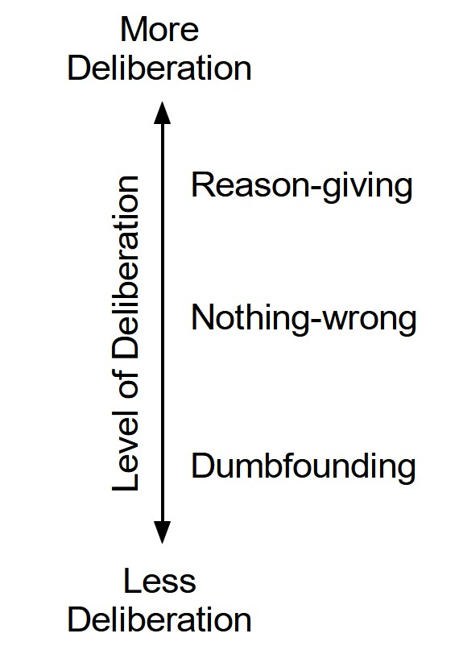

```{r Introsetup, include=FALSE}
knitr::opts_chunk$set(echo = FALSE, include = FALSE)
# knitr::opts_chunk$set(eval = TRUE, echo = TRUE)
#knitr::opts_chunk$set(include = FALSE)
```


```{r introload_libraries_cogload}
rm(list = ls())
library(citr)
#install.packages("sjstats")
library(plyr)
library(foreign)
library(car)
library(desnum)
library(ggplot2)
library(extrafont)
#devtools::install_github("crsh/papaja")
library(papaja)
#library("dplyr")
library("afex")
library("tibble")
library(scales)
#install.packages("metap")
library(metap)
library(pwr)
library(lsr)
#install.packages("sjstats")
library(sjstats)
library(DescTools)
#inatall.packages("ggstatsplot")
#library(ggstatsplot)
library(VGAM)
library(nnet)
library(mlogit)
library(reshape2)
#install.packages("powerMediation")
library("powerMediation")


#source("load_all_data.R")

#devtools::install_github("benmarwick/wordcountaddin")
#library(wordcountaddin)
#wordcountaddin::text_stats("cogload_1to5_25Sept19.Rmd")


#library("papaja")
#library("wordcountaddin")
#wordcountaddin::word_count("Introduction.Rmd")
#devtools::install_github("benmarwick/wordcountaddin", type = "source", dependencies = TRUE)
```


Moral dumbfounding occurs when people defend a moral judgment even though they cannot provide a reason in support of this judgment [Haidt et al., -@haidt_moral_2000; @haidt_emotional_2001; see also McHugh, et al., -@mchugh_searching_2017a; -@mchugh_reasons_2020]. It has traditionally been seen as evidence for intuitionist and dual-process theories of moral judgment [e.g., @crockett_models_2013; @cushman_multisystem_2010; @cushman_action_2013; @greene_secret_2008; @haidt_emotional_2001; @prinz_passionate_2005; though this narrative has been contested, e.g., @guglielmo_unfounded_2018; Royzman et al., -@royzman_curious_2015]. Despite the influence of moral dumbfounding on the morality literature, the phenomenon is not well understood. Here we present a pre-registered test of one prediction of a dual-process explanation of moral dumbfounding.

# Moral Dumbfounding: A Dual-Process Perspective
Drawing on dual-process theories of reasoning and moral judgment [e.g., @greene_secret_2008; @cushman_action_2013; @brand_dualprocess_2016; @bago_intuitive_2019], we propose that moral dumbfounding occurs as a result of a conflict in dual-processes [@bonner_conflict_2010; @deneys_bias_2012; @deneys_conflict_2008; @evans_resolution_2007; see also @deneys_logic_2019]. In classic dual-process reasoning accounts, conflicts occur when a habitual/intuitive response is different from a response that results from deliberation [@bonner_conflict_2010]. Examples of such conflicts include base rate neglect problems [@bonner_conflict_2010; @deneys_bias_2012; @deneys_conflict_2008; @evans_resolution_2007], the conjunction fallacy [@deneys_bias_2012; @tversky_extensional_1983], and perhaps most relevant to the current discussion, a seemingly irrational but persistent unwillingness to contact various symbolically “contaminated” objects, despite assurances these items are sanitary [e.g., items believed to have had prior contact with: an AIDS victim, someone who had been in a car accident, or a murderer, see @rozin_sensitivity_1994 @lerner_when_1999]. We note that the original, unpublished dumbfounding manuscript included tasks closely resembling this final example [Haidt et al., -@haidt_moral_2000]. 

In line with the above, we propose that dumbfounding occurs when a habitual (moral judgment) response is in conflict with a deliberative response. In studies of moral dumbfounding, following an initial judgment, there are typically three responses available to participants: (1) providing a reason or justification for a judgment (henceforth reason-giving); (2) accepting  counter-arguments and rating particular behaviors as “not wrong” (nothing-wrong); (3) maintaining a judgment without justification or reasons (dumbfounding). Both reason-giving and nothing-wrong can be accounted for by existing approaches to moral judgment [e.g., @cushman_action_2013], and while reason-giving is the most common response, dumbfounding is reliably observed [see @mchugh_searching_2017a; @mchugh_reasons_2020] and remains an anomaly.

Drawing on existing theorizing [@cushman_action_2013; @haidt_emotional_2001; McHugh et al., -@mchugh_moral_2022], we assume that making a moral judgment is an intuitive/habitual response involving relatively little deliberation, while reason-giving requires greater deliberation (a deliberative response). In this view, conflict occurs when deliberation fails to identify reasons for a judgment, and its resolution depends on the availability of cognitive resources for deliberation – further deliberation may identify relevant reasons. Alternatively, participants may resolve the conflict by accepting the arguments presented and changing their judgment (nothing-wrong). We propose that dumbfounding is observed when this conflict cannot be resolved. We hypothesize that nothing-wrong involves more deliberation than dumbfounding but less deliberation than reason-giving. The hypothesized relative amounts of deliberation for each response are outlined in Figure 1. We note that this explanation is not unique to dual-process approaches, but is also consistent with a unimodal [@kruglanski_intuitive_2011] or categorization [@mchugh_moral_2022] approaches, both of which predict that lower processing capacity reduces reason-giving, and increases dumbfounding.


{ width=250 margin=auto }


This account of moral dumbfounding affords a clear testable hypothesis: under manipulations that affect the availability of resources for deliberation, responses in the moral dumbfounding paradigm should evidence variation in frequency of deliberative versus habitual responses. Cognitive load manipulations – such as completing an attention/memory task simultaneously with a primary task – have been shown to inhibit deliberative responding [@deneys_conflict_2008; @evans_rapid_2005; @evans_dualprocess_2013; @schmidt_effects_2016]. We have identified reason-giving as involving more deliberation than alternative responses in the dumbfounding paradigm. Thus, we predict that a cognitive load manipulation should inhibit reason-giving in a moral dumbfounding task, leading to an increase in habitual responding, such as dumbfounding or nothing-wrong.


