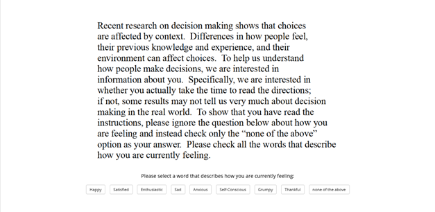
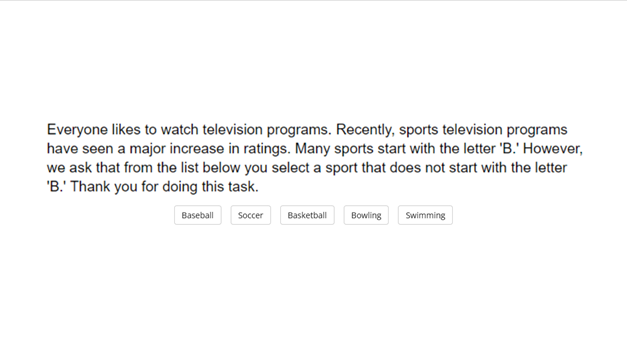

# Supplementary Materials

## Scenarios
### Julie and Mark
Julie and Mark, who are brother and sister are travelling together in France. They are both on summer vacation from college. One night they are staying alone in a cabin near the beach. They decide that it would be interesting and fun if they tried making love. At very least it would be a new experience for each of them. Julie was already taking birth control pills, but Mark uses a condom too, just to be safe. They both enjoy it, but they decide not to do it again. They keep that night as a special secret between them, which makes them feel even closer to each other.

### Jennifer
Jennifer works in a medical school pathology lab as a research assistant. The lab prepares human cadavers that are used to teach medical students about anatomy. The cadavers come from people who had donated their body to science for research. One night Jennifer is leaving the lab when she sees a body that is going to be discarded the next day. Jennifer was a vegetarian, for moral reasons. She thought it was wrong to kill animals for food. But then, when she saw a body about to be cremated, she thought it was irrational to waste perfectly edible meat. So she cut off a piece of flesh, and took it home and cooked it. The person had died recently of a heart attack, and she cooked the meat thoroughly, so there was no risk of disease.

### Trolley
A Trolley is hurtling down a track towards five people. It will kill them all on impact. Paul is on a bridge under which it will pass. He can stop it by putting something very heavy in front of it. As it happens, there is a very fat man next to him. Paul's only way to stop the trolley is to push him over the bridge and onto the track, killing him to save five. Paul decides to push the man.

### Heinz
In Europe, a woman was near death from a very bad disease, a special kind of cancer. There was one drug that the doctors thought might save her. It was a form of radium for which a Druggist was charging ten times what the drug cost him to make. The sick woman's husband, Heinz, went to everyone he knew to borrow the money, but he could only get together about half of what it cost. He told the Druggist that his wife was dying, and asked him to sell it cheaper or let him pay later. But the Druggist said, 'No, I discovered the drug and I'm going to make money from it.' So, Heinz got desperate and broke into the man's store to steal the drug for his wife. The Druggist had Heinz arrested and charge.

## Measures

### Julie and Mark
- How would you rate the behaviour of Julie and Mark? (1 = Morally Wrong; and 7 = Morally Right)
- How confident are you about your judgement? (1 = Not at all Confident; 7 = Extremely Confident)
- Do you agree that any concerns regarding reproductive complications are eased by their using of two forms of contraception? (Yes/No)
- And do you accept that they are both consenting adults, and that they both consented and enjoyed it? (Yes/No)
- And do you concede that nobody else was affected by their actions? (Yes/No)
- Julie and Mark's behaviour did not harm anyone or negatively affect anyone. How can there be anything wrong with what they did?

### Jennifer
- How would you rate the behaviour of Jennifer? (1 = Morally Wrong; 7 = Morally Right)
- How confident are you about your judgement? (1 = Not at all Confident; 7 = Extremely Confident)
- The body had been donated for research, it was to be discarded the next day. You must agree then that it had obviously fulfilled its purpose?
- Do you accept that the body was already dead?
- And do you accept that there was no risk of disease?
- Jennifer's actions did not harm anyone, or negatively affect anyone. How can there be anything wrong with what she did?

### Trolley
- How would you rate the actions of Paul? (1 = Morally Wrong; and 7 = Morally Right)
- How confident are you about your judgement? (1 = Not at all Confident; 7 = Extremely Confident)
- Do you accept that five people would have died if Paul didn't push the man?
- And this man is the only way available to stop the trolley? (Paul does not weigh enough)
- Do you agree that in stopping the trolley Paul saved the lives of five people?
- Paul's actions saved the lives of five people! How can saving lives be wrong?

### Heinz
- How would you rate the actions of the Druggist?(1 = Morally Wrong; and 7 = Morally Right)
- How confident are you about your judgement?(1 = Not at all Confident; 7 = Extremely Confident)
- Do you agree that the druggist has to make a living?
- And do you accept that Heinz broke into the druggist’s store?
- And do you accept that he stole from him?
- The druggist was only protecting his livelihood. How can that be wrong? 

&nbsp;

\newpage

## Attention Checks

&nbsp;

&nbsp;

&nbsp;

{ width=600 margin=auto }

{ width=500 margin=auto }

&nbsp;

\newpage

&nbsp;

