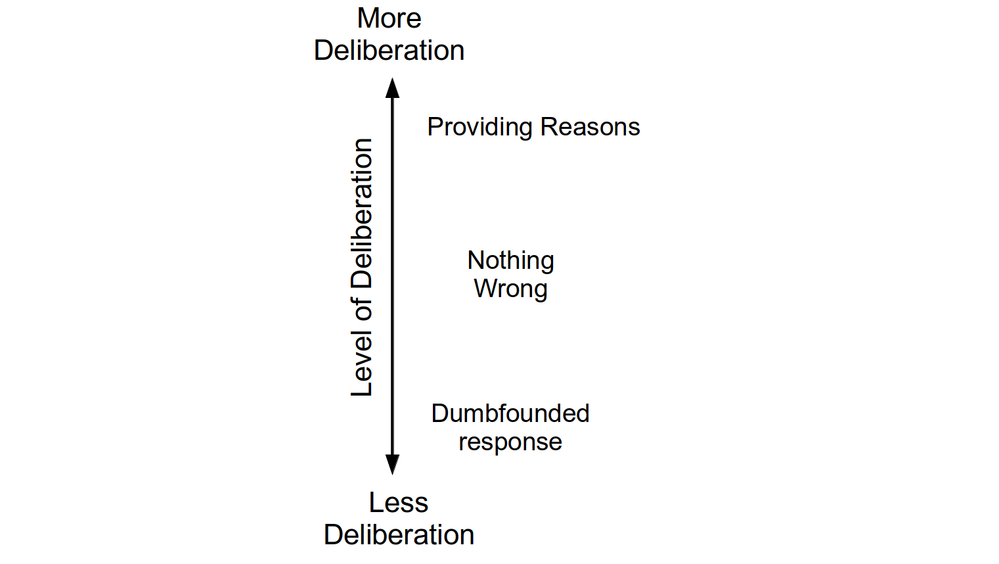

```{r Introsetup, include=FALSE}
knitr::opts_chunk$set(echo = FALSE, include = FALSE)
# knitr::opts_chunk$set(eval = TRUE, echo = TRUE)
#knitr::opts_chunk$set(include = FALSE)
```


```{r introload_libraries_cogload}
rm(list = ls())
library(citr)
#install.packages("sjstats")
library(plyr)
library(foreign)
library(car)
library(desnum)
library(ggplot2)
library(extrafont)
#devtools::install_github("crsh/papaja")
library(papaja)
#library("dplyr")
library("afex")
library("tibble")
library(scales)
#install.packages("metap")
library(metap)
library(pwr)
library(lsr)
#install.packages("sjstats")
library(sjstats)
library(DescTools)
#inatall.packages("ggstatsplot")
#library(ggstatsplot)
library(VGAM)
library(nnet)
library(mlogit)
library(reshape2)
#install.packages("powerMediation")
library("powerMediation")


#source("load_all_data.R")

#devtools::install_github("benmarwick/wordcountaddin")
#library(wordcountaddin)
#wordcountaddin::text_stats("cogload_1to5_25Sept19.Rmd")


#library("papaja")
#library("wordcountaddin")
#wordcountaddin::word_count("Introduction.Rmd")
#devtools::install_github("benmarwick/wordcountaddin", type = "source", dependencies = TRUE)
```


Moral dumbfounding occurs Moral dumbfounding occurs when people defend a moral judgment even though they cannot provide a reason in support of this judgment [Haidt et al., -@haidt_moral_2000; @haidt_emotional_2001; see also McHugh, et al., -@mchugh_searching_2017a; -@mchugh_reasons_2020]. It has traditionally been seen as evidence for intuitionist and dual-process theories of moral judgment [e.g., @crockett_models_2013; @cushman_multisystem_2010; @cushman_action_2013; @greene_secret_2008; @haidt_emotional_2001; @prinz_passionate_2005; though this narrative has been contested, e.g., @guglielmo_unfounded_2018; @royzman_curious_2015]. Despite the influence of moral dumbfounding on the morality literature, the phenomenon is not well understood. We test two predictions of a conflict in dual-processes explanation of moral dumbfounding across six studies. Using three different cognitive load manipulations we show that dumbfounded responses are more likely when participants are engaged in a secondary task (Studies 1, 2, 3, and 6; though this effect was not observed for Studies 4 and 5), and that this effect is not limited to a single scenario (Study 6). We also found that individual differences in need for cognition [@cacioppo_need_1982; @petty_efficient_1984; Petty et al., -@petty_dispositional_1996; @forsterlee_examination_1999] weakly predict responses in the dumbfounding paradigm, with aggregate analysis (Studies 1-5) showing that participants who score higher in need for cognition more likely to provide reasons and less likely to present as dumbfounded.

# Moral Dumbfounding: A Dual-Process Perspective
Drawing on dual-process theories of moral judgment [e.g., @greene_secret_2008; @cushman_action_2013; @brand_dualprocess_2016; @bago_intuitive_2019], we hypothesize that moral dumbfounding occurs as a result of a conflict in dual-processes [@bonner_conflict_2010; @deneys_bias_2012; @deneys_conflict_2008; @evans_resolution_2007; see also @deneys_logic_2019]. Dual-Process conflict occurs when a habitual/intuitive response is different from a response that results from deliberation. Examples of such conflicts include, base rate neglect problems [@bonner_conflict_2010; @deneys_bias_2012; @deneys_conflict_2008; @evans_resolution_2007], the conjunction fallacy [@deneys_bias_2012; @tversky_extensional_1983], and perhaps most relevant to the current discussion, a seemingly irrational but persistent unwillingness to contact various symbolically "contaminated" objects, despite assurances these items are sanitary [e.g., items believed to have had prior contact with: an AIDS victim, someone who had been in a car accident, or a murderer, see @rozin_sensitivity_1994 @lerner_when_1999]. This final example closely resembles the non-moral tasks described in the original unpublished dumbfounding manuscript [Haidt et al., -@haidt_moral_2000]. 




To understand moral dumbfounding as a conflict in dual-processes, we classified the responses in the dumbfounding paradigm as involving more or less deliberation. There are typically three responses in the dumbfounding paradigm: (1) the providing of reasons (reason); (2) accepting the counter-arguments and rating the behavior as “not wrong” (nothing wrong); or (3) a dumbfounded response (dumbfounding). Drawing on existing theorizing [e.g., @cushman_action_2013; @haidt_emotional_2001; McHugh et al., -@mchugh_moral_2021] we hypothesize that making a judgment involves an intuitive/habitual response, involving relatively little deliberation, while providing reasons for judgment requires more deliberation (a deliberative response). We propose that dumbfounding occurs when the habitual response (the judgment) is in conflict with the deliberative response (providing reasons for the judgment). The dumbfounding paradigm additionally involves a third response, where participants may accept the counter-arguments and change their judgment, we hypothesize that this response involves more deliberation than a dumbfounded response but less deliberation than providing reasons. The hypothesized relative amounts of deliberation for each response are outlined in Figure 1.

# Influences on Moral Dumbfounding

One prediction of explaining dumbfounding as conflict in dual-processes is that under specific manipulations, responses in the moral dumbfounding paradigm should vary in predictable ways.  In addition to external manipulation, a second prediction of this conflict in dual-processes explanation is that responses in the moral dumbfounding paradigm may display variability that can be linked to specific individual difference variables.  The studies described here aim to investigate both of these possibilities.

Cognitive load has been shown to inhibit deliberative responding [e.g., @deneys_dual_2006; @evans_rapid_2005; @evans_dualprocess_2013; @schmidt_effects_2016].  Above, we identified providing reasons as involving more deliberation than alternative responses in the dumbfounding paradigm.  This implies that cognitive load should inhibit the identification of reasons for a judgment, leading to an increase in dumbfounded responding or an increase in accepting the counter-arguments and revising the judgment made.

A second prediction is that responses in the dumbfounding paradigm will vary depending on individual differences. One individual difference variable linked to dual-process approaches to cognition, therefore may be related to susceptibility to dumbfounding is Need for Cognition [@cacioppo_need_1982; @petty_efficient_1984; @petty_dispositional_1996; @forsterlee_examination_1999]. The Need for Cognition Scale (NFC) is a measure of an individual’s tendency "to engage in and enjoy effortful analytic activity" [@forsterlee_examination_1999, p. 471; see also @cacioppo_need_1982], or a tendency to engage in deliberation [@evans_dualprocess_2013]. We hypothesize that people who score high in NFC will be more likely to provide reasons for their judgment. Related to this, people who score low on the NFC are likely to fail to identify reasons for their judgment (or provide a dumbfounded response).

# The Current Studies
The studies described here aim to investigate test two predictions of a conflict in dual-process explanation of moral dumbfounding.  To test the first prediction we experimentally manipulated cognitive load. We predict that a cognitive load manipulation will inhibit people's ability to provide reasons for their judgment, leading to greater habitual responses (either nothing wrong or dumbfounding or both) The second prediction is that a person’s tendency to provide reasons will be related to their score on the Need for Cognition scale [@cacioppo_need_1982; @petty_efficient_1984].  We hypothesize that as NFC increases people will be less likely to present as dumbfounded.  We conducted six studies to assess these predictions.[^2]^,^[^3]


```{r apriori_power_analyses_reporting}

large <- pwr.chisq.test(w=.35,df=(3-1),sig.level = .05, power=.8)
med   <- pwr.chisq.test(w=.21,df=(3-1),sig.level = .05, power=.8)
small <- pwr.chisq.test(w=.07,df=(3-1),sig.level = .05, power=.8)

round(large$N)
# https://www.real-statistics.com/chi-square-and-f-distributions/effect-size-chi-square/

```

[^2]: A priori power analysis indicated that, for the primary research question (the influence of cognitive load on dumbfounded responding), in order to detect a large effect size (*V* = .35) with 80% power, a sample of *N* = `r round(large$N)` participants was required; in order to detect a medium effect size (*V* = .21) with 80% power a sample of *N* = `r round(med$N)` participants was required; in order to detect a small effect size (*V* = .07) with 80% power a sample of *N* = `r round(small$N)` was required.  This means that studies 1-5 are likely under-powered.  To account for this we conducted pre-registered sixth study with a large sample size, and additionally we conducted mini meta-analyses, along with a combined analysis of all studies.

```{r apriori_logit}
small <- powerMediation::SSizeLogisticCon(.2,(1.49), .05, .8)
med <- powerMediation::SSizeLogisticCon(.2,(3.45), .05, .8)
large <- powerMediation::SSizeLogisticCon(.2,(9), .05, .8)

```

[^3]: A priori power analysis indicated that, for the secondary research question (the relationship between dumbfounded responding and Need for Cognition), in order to detect a large effect size (*OR* = 9) with 80% power, a sample of *N* = `r round(large)` participants was required; in order to detect a medium effect size (*OR* = 3.45) with 80% power a sample of *N* = `r round(med)` participants was required; in order to detect a small effect size (*OR* = 1.49) with 80% power a sample of *N* = `r round(small)` was required.  Again, the studies described here are likely under-powered and we conclude with a combined analysis of all studies.


