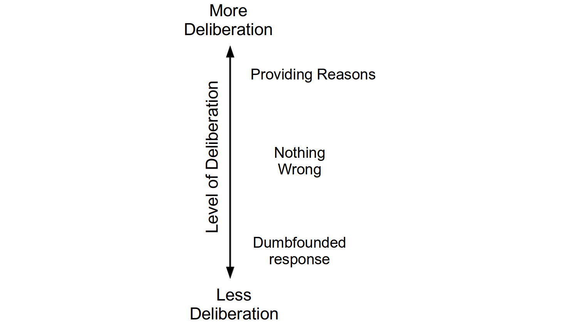

Moral dumbfounding occurs Moral dumbfounding occurs when people defend a moral judgment even though they cannot provide a reason in support of this judgment [Haidt et al., -@haidt_moral_2000; @haidt_emotional_2001; see also McHugh, et al., -@mchugh_searching_2017a; -@mchugh_reasons_2020]. It has traditionally been seen as evidence for intuitionist and dual-process theories of moral judgment [e.g., @crockett_models_2013; @cushman_multisystem_2010; @cushman_action_2013; @greene_secret_2008; @haidt_emotional_2001; @prinz_passionate_2005; though this narrative has been contested, e.g., @guglielmo_unfounded_2018; @royzman_curious_2015]. Despite the influence of moral dumbfounding on the morality literature, the phenomenon is not well understood. We test two predictions of a conflict in dual-processes explanation of moral dumbfounding across six studies. Using three different cognitive load manipulations we show that dumbfounded responses are more likely when participants are engaged in a secondary task (Studies 1, 2, 3, and 6; though this effect was not observed for Studies 4 and 5), and that this effect is not limited to a single scenario (Study 6). We also found that individual differences in need for cognition [@cacioppo_need_1982; @petty_efficient_1984; Petty et al., -@petty_dispositional_1996; @forsterlee_examination_1999] weakly predict responses in the dumbfounding paradigm, with aggregate analysis (Studies 1-5) showing that participants who score higher in need for cognition more likely to provide reasons and less likely to present as dumbfounded.

# Moral Dumbfounding: A Dual-Process Perspective
Drawing on dual-process theories of moral judgment [e.g., @greene_secret_2008; @cushman_action_2013; @brand_dualprocess_2016; @bago_intuitive_2019], we hypothesize that moral dumbfounding occurs as a result of a conflict in dual-processes [@bonner_conflict_2010; @deneys_bias_2012; @deneys_conflict_2008; @evans_resolution_2007; see also @deneys_logic_2019]. Dual-Process conflict occurs when a habitual/intuitive response is different from a response that results from deliberation. Examples of such conflicts include, base rate neglect problems [@bonner_conflict_2010; @deneys_bias_2012; @deneys_conflict_2008; @evans_resolution_2007], the conjunction fallacy [@deneys_bias_2012; @tversky_extensional_1983], and perhaps most relevant to the current discussion, a seemingly irrational but persistent unwillingness to contact various symbolically "contaminated" objects, despite assurances these items are sanitary [e.g., items believed to have had prior contact with: an AIDS victim, someone who had been in a car accident, or a murderer, see @rozin_sensitivity_1994 @lerner_when_1999]. This final example closely resembles the non-moral tasks described in the original unpublished dumbfounding manuscript [Haidt et al., -@haidt_moral_2000]. 

To understand moral dumbfounding as a conflict in dual-processes, we classified the responses in the dumbfounding paradigm as involving more or less deliberation. There are typically three responses in the dumbfounding paradigm: (1) the providing of reasons (reason); (2) accepting the counter-arguments and rating the behavior as “not wrong” (nothing wrong); or (3) a dumbfounded response (dumbfounding). Drawing on existing theorizing [e.g., @cushman_action_2013; @haidt_emotional_2001; McHugh et al., -@mchugh_moral_2021] we hypothesize that making a judgment involves an intuitive/habitual response, involving relatively little deliberation, while providing reasons for judgment requires more deliberation (a deliberative response). We propose that dumbfounding occurs when the habitual response (the judgment) is in conflict with the deliberative response (providing reasons for the judgment). The dumbfounding paradigm additionally involves a third response, where participants may accept the counter-arguments and change their judgment, we hypothesize that this response involves more deliberation than a dumbfounded response but less deliberation than providing reasons. The hypothesized relative amounts of deliberation for each response are outlined in Figure 1.

# Influences on Moral Dumbfounding

One prediction of explaining dumbfounding as conflict in dual-processes is that under specific manipulations, responses in the moral dumbfounding paradigm should vary in predictable ways.  In addition to external manipulation, a second prediction of this conflict in dual-processes explanation is that responses in the moral dumbfounding paradigm may display variability that can be linked to specific individual difference variables.  The studies described here aim to investigate both of these possibilities.

Cognitive load has been shown to inhibit deliberative responding [e.g., @deneys_dual_2006; @evans_rapid_2005; @evans_dualprocess_2013; @schmidt_effects_2016].  Above, we identified providing reasons as involving more deliberation than alternative responses in the dumbfounding paradigm.  This implies that cognitive load should inhibit the identification of reasons for a judgment, leading to an increase in dumbfounded responding or an increase in accepting the counter-arguments and revising the judgment made.

A second prediction is that responses in the dumbfounding paradigm will vary depending on individual differences. One individual difference variable linked to dual-process approaches to cognition, therefore may be related to susceptibility to dumbfounding is Need for Cognition [@cacioppo_need_1982; @petty_efficient_1984; @petty_dispositional_1996; @forsterlee_examination_1999]. The Need for Cognition Scale (NFC) is a measure of an individual’s tendency "to engage in and enjoy effortful analytic activity" [@forsterlee_examination_1999, p. 471; see also @cacioppo_need_1982], or a tendency to engage in deliberation [@evans_dualprocess_2013]. We hypothesize that people who score high in NFC will be more likely to provide reasons for their judgment. Related to this, people who score low on the NFC are likely to fail to identify reasons for their judgment (or provide a dumbfounded response).

# The Current Studies
The studies described here aim to investigate test two predictions of a conflict in dual-process explanation of moral dumbfounding.  To test the first prediction we experimentally manipulated cognitive load. We predict that a cognitive load manipulation will inhibit people's ability to provide reasons for their judgment, leading to greater habitual responses (either nothing wrong or dumbfounding or both) The second prediction is that a person’s tendency to provide reasons will be related to their score on the Need for Cognition scale [@cacioppo_need_1982; @petty_efficient_1984].  We hypothesize that as NFC increases people will be less likely to present as dumbfounded.  We conducted six studies to assess these predictions.[^2]^,^[^3]

[^2]: A priori power analysis indicated that, for the primary research question (the influence of cognitive load on dumbfounded responding), in order to detect a large effect size (*V* = .35) with 80% power, a sample of *N* = 79 participants was required; in order to detect a medium effect size (*V* = .21) with 80% power a sample of *N* = 218 participants was required; in order to detect a small effect size (*V* = .07) with 80% power a sample of *N* = 1966 was required.  This means that studies 1-5 are likely under-powered.  To account for this we conducted pre-registered sixth study with a large sample size, and additionally we conducted mini meta-analyses, along with a combined analysis of all studies.

[^3]: A priori power analysis indicated that, for the secondary research question (the relationship between dumbfounded responding and Need for Cognition), in order to detect a large effect size (*OR* = 9) with 80% power, a sample of *N* = 11 participants was required; in order to detect a medium effect size (*OR* = 3.45) with 80% power a sample of *N* = 32 participants was required; in order to detect a small effect size (*OR* = 1.49) with 80% power a sample of *N* = 309 was required.  Again, the studies described here are likely under-powered and we conclude with a combined analysis of all studies.

# Study 1 - College Sample
The aim of Study 1 was to investigate if a cognitive load manipulation influenced participants' ability to justify their judgement. We also measured Need for Cognition [@cacioppo_need_1982; Petty et al., -@petty_efficient_1984] as a potential moderator variable.

## Study 1: Method
### Study 1: Participants and design
Study 1 was a between subjects design.  The dependent variable was rates of providing reasons/dumbfounding (measured using to the critical slide with 3 response options: 1: providing reasons; 2: there is nothing wrong; 3: dumbfounded response - admission).  The independent variable was cognitive load with two levels: present and absent.  Cognitive load was manipulated by presenting participants with an eight digit number letter string to be memorized.  Need for Cognition [@cacioppo_need_1982; Petty et al., -@petty_efficient_1984] was included as an additional potential predictor variable. 

A total sample of 66 participants (55 female, 11 male; *M*~age~ = 22.42, min = 18, max = 57, *SD* = 6.86) took part.  Participants in this sample were undergraduate students, postgraduate students, and alumni from Mary Immaculate College (MIC), and University of Limerick (UL).  Participation was voluntary and participants were not reimbursed for their participation.

### Study 1: Procedure and materials
Data were collected using an online questionnaire. Data collection took place in a designated computer laboratory in MIC.  The experimenter remained in the laboratory for the duration of the study. Participants were first presented with an information sheet and consent form.  The main study proceeded when participants had signed the consent form.

Participants in the experimental condition were presented with an eight digit number/letter string and asked to memorise the sequence.  After 30 seconds, the experiment progressed to the next slide. Participants had the option to click "ok" and progress to the next slide after 15 seconds.

Participants were then presented with the "Julie and Mark" (*Incest*) vignette [@haidt_moral_2000].  Participants rated on a 7-point Likert scale how right or wrong the behaviour of Julie and Mark was (where, 1 = *Morally wrong*; 4 = *neutral*; 7 = *Morally right*), and were given an opportunity to provide reasons for their judgement. Following this, participants were presented with a series of counter-arguments, which refuted commonly used justifications for rating the behaviour as "wrong".

Dumbfounding was measured using the critical slide [McHugh et al., -@mchugh_searching_2017a].  This contained a statement defending the behaviour and a question as to how the behaviour could be wrong ("Julie and Mark's behaviour did not harm anyone, how can there be anything wrong with what they did?").  There were three possible answer options: (a) "There is nothing wrong"; (b) an admission of not having reasons ("It's wrong but I can't think of a reason"); and finally a judgement with accompanying justification (c) "It's wrong and I can provide a valid reason".  The order of these response options was randomised. Participants who selected (c) were prompted to type a reason.  The selecting of option (b), the admission of not having reasons, was taken to be a dumbfounded response. We note that this measure provides a conservative measure of dumbfounded responding [see McHugh et al., -@mchugh_searching_2017a for discussion].

Following the critical slide, participants in the experimental condition were required to reproduce the eight digit number-letter string sequence presented previously.  Following this a post-discussion questionnaire in which participants rated their response to the scenario across various dimensions [@haidt_moral_2000].

Need for Cognition was measured using the short form of the Need for Cognition scale [@cacioppo_need_1982; Petty et al., -@petty_efficient_1984].  This is an 18 item scale containing questions relating to motivation to engage in thinking (e.g., "I would prefer complex to simple problems"). Responses were recorded on a -4 to +4 Likert-type scale, where -4 = *very strong disagreement* and +4 = *very strong agreement*.

## Study 1: Results
Forty six participants (69.70%) rated the behavior of Julie and Mark as wrong initially, and forty one participants (62.12%) rated the behavior as wrong at the end of the task. Initial ratings (*M* = 2.38, *SD* = 1.87) were significantly more severe than revised ratings (*M* = 2.82, *SD* = 1.91), *t*(65) = -3.03, *p* = .004; *d* = 0.37. Inspection of the binned judgments revealed that twelve participants changed the valence of their judgments, and all but one of these involved included a "neutral" response for either the initial judgment or revised judgment (see Supplementary materials Table XX). 

Participants who selected the admission of not having reasons on the critical slide were identified as dumbfounded.  Thirteen participants (19.70%) selected "It's wrong but I can't think of a reason".  Thirty three participants (50%) selected “It's wrong and I can provide a valid reason”; and twenty participants (30.30%) selected “There is nothing wrong”.

 

Regarding the cognitive load manipulation, nine participants (27.27%) successfully remembered the sequence of numbers and letters in full, and five participants (15.15%) indicated they found the memory task easy. Of these, four participants both found the task easy and got the answer right.  All participants correctly remembered at least two digits, indicating at least some level of engagement with the cognitive load manipulation. There were no differences in initial judgement, *t*(63.90) = 1.26, *p* = .214; *d* = 0.31, or revised judgment, *t*(63.99) = 1.16, *p* = .250; *d* = 0.29, depending on cognitive load.

To test our main hypotheses we conducted a chi-squared test for independence which revealed a significant association between experimental condition and response to the critical slide, $\chi$^2^(2, *N* = 66) = 7.53, *p* = .023, *V* = 0.34, the observed power was 0.69.  Under cognitive load fewer participants (12; 36.36%) provided reasons than in the control condition (21; 63.64%).  Similarly, under cognitive load more participants (15; 45.45%) selected "There is nothing wrong" than in the control group (5; 15.15%).  The responses to the critical slide for the experimental group (*N* = 33) and the control group (*N* = 33) are displayed in Figure\ \@ref(fig:S1S1fig2criticalcondition).  The observed counts, expected counts and standardised residuals are displayed in Table\ \@ref(tab:S1tab1dumb).  

\begin{table}[tbp]

\begin{center}
\begin{threeparttable}

\caption{\label{tab:S1tab1dumb}Study 1 – Observed counts, expected counts, and standardised residuals for each response to the critical slide depending on cognitive load}

\begin{tabular}{llcc}
\toprule
 & \multicolumn{1}{c}{} & \multicolumn{1}{c}{Cognitive Load} & \multicolumn{1}{c}{Control}\\
\midrule
Observed count & Reasons & 12 & 21\\
 & Dumbfounded & 6 & 7\\
 & Nothing Wrong & 15 & 5\\
Expected count & Reasons & 16.5 & 16.5\\
 & Dumbfounded & 6.5 & 6.5\\
 & Nothing Wrong & 10 & 10\\
Standardised residuals & Reasons & -2.22* & 2.22*\\
 & Dumbfounded & -0.31 & 0.31\\
 & Nothing Wrong & 2.68* & -2.68*\\
\bottomrule
\addlinespace
\end{tabular}

\begin{tablenotes}[para]
\normalsize{\textit{Note.} * = sig. at \emph{p} < .05; ** = sig. at \emph{p} < .001}
\end{tablenotes}

\end{threeparttable}
\end{center}

\end{table}

A multinomial logistic regression revealed no significant association between Need for Cognition and response to the critical slide, $\chi$^2^(2, *N* = 66) = 4.86, *p* = .088, the observed power was 0.49.

# Study 2 - Online Replication 1

Study 1 demonstrated interesting variability in responses to the critical slide depending on cognitive load. The aim of Study 2 was to assess the replicability of the results of Study 1, using an online sample. In Study 1, the experimenter was in the room with the participants. This made it more difficult for participants to cheat on the memory task. This is not possible with an online sample. An alternative cognitive load manipulation was taken from De Neys and Schaeken [@deneys_when_2007], whereby a dot pattern is briefly presented to participants, and participants are required to reproduce the dot pattern at a later stage.

## Study 2: Method
### Study 2: Participants and design
Study 2 was a between subjects design.  The dependent variable was response to the critical slide.  The independent variable was cognitive load with two levels: high and low.  Need for Cognition [@cacioppo_need_1982; @petty_efficient_1984] was included as a potential correlate and moderator variable. 

A total sample of 100 participants (56 female, 44 male; *M*~age~ = 38.38, min = 19, max = 72, *SD* = 12.41) took part.  Participants in this sample were recruited using Amazon's MTurk [@amazonwebservicesinc._amazon_2016].  Participants were paid $0.50 for their participation.  Participants were recruited from English speaking countries or from countries where residents generally have a high level of English (e.g., The Netherlands, Denmark, Sweden).

### Study 2: Procedure and materials
Data were collected using an online questionnaire. Materials were largely the same as in Study 1, with a change to the cognitive load manipulation. Cognitive load was manipulated using a dot-pattern memory task [@deneys_when_2007].

Participants were presented with a 3 x 3 grid containing a dot pattern. This image disappeared after one second. Participants then answered a question relating to the moral judgement task. Following this, participants were asked to reproduce the dot-pattern. All participants took part in the memory task, and cognitive load was manipulated by varying the complexity of the patterns presented [@deneys_when_2007]. The control group were presented with simple patterns, containing three dots in a line, while the experimental group were presented with more complex dot patterns containing 4 dots, see Figure\ \@ref(fig:S2dotpattern).

 

Study 2 proceeded in much the same way as Study 1. There were four target questions during which participants were engaged in the memory task. A different pattern was presented before each of the following: the initial judgement, the initial opportunity to provide reasons, the critical slide, and the revised judgement. After each of these questions participants were required to reproduce the pattern. As in Study 1, dumbfounding was measured using the critical slide.

## Study 2: Results
Seventy seven participants (77%) rated the behavior of Julie and Mark as wrong initially, and seventy participants (70%) rated the behavior as wrong at the end of the task. Initial ratings (*M* = 2.13, *SD* = 1.54) were significantly more severe than revised ratings (*M* = 2.35, *SD* = 1.65), *t*(99) = -2.85, *p* = .005; *d* = 0.28. Inspection of the binned judgments revealed that ten participants changed the valence of their judgments, and all but one of these involved one judgment that was neutral (see Supplementary materials Table XX). 

Participants who selected the admission of not having reasons on the critical slide were identified as dumbfounded.  Twenty six participants (26%) selected "It's wrong but I can't think of a reason".  Fifty participants (50%) selected “It's wrong and I can provide a valid reason”; and twenty four participants (24%) selected “There is nothing wrong”.

A chi-squared test for independence revealed no association between experimental condition and response to the critical slide, $\chi$^2^(2, *N* = 100) = 0.74, *p* = .690, *V* = 0.09, the observed power was 0.11.  The responses to the critical slide for the experimental group (*N* = 51) and the control group (*N* = 49) are displayed in Figure\ \@ref(fig:S2figboth).  

 

It is possible that the difference in results observed between Study 1 and  Study 2 is due to the alternative manipulation of cognitive load employed. In Study 1, the control group did not engage in any task, however, adopting De Neys and Shaeken's procedure [-@deneys_when_2007], participants in the control group of Study 2 engaged in a memory task.  It is possible that simply engaging in a memory task led to differences in responses, and that level of difficulty (the manipulation that was employed) was irrelevant. Indeed, the responding to the critical slide in the control group in Study 2 is more similar to the responding in the experimental group in 1 than to the control group in Study 1. Furthermore, rates of successful reproduction of the dot patterns in Study 2 were much lower than reported by De Neys and Shaeken [-@deneys_when_2007]. It is likely that engagement with the memory task in Study 2 was not comparable to that observed by De Neys and Shaeken [-@deneys_when_2007], and this impacted the results. We propose that not engaging appropriately with the memory task undermines its efficacy as a cognitive load manipulation, and hypothesized that the effect of the cognitive load manipulation is related to the degree to which people engage with the manipulation. 

\begin{table}[tbp]

\begin{center}
\begin{threeparttable}

\caption{\label{tab:S2S2tab1dumb}Study 2 – Observed counts, expected counts, and standardised residuals for each response to the critical slide depending on cognitive load}

\begin{tabular}{llcc}
\toprule
 & \multicolumn{1}{c}{} & \multicolumn{1}{c}{Engaged} & \multicolumn{1}{c}{Not Engaged}\\
\midrule
Observed count & Reasons & 23 & 27\\
 & Dumbfounded & 20 & 6\\
 & Nothing Wrong & 13 & 11\\
Expected count & Reasons & 28 & 22\\
 & Dumbfounded & 14.56 & 11.44\\
 & Nothing Wrong & 13.44 & 10.56\\
Standardised residuals & Reasons & -2.01* & 2.01*\\
 & Dumbfounded & 2.5* & -2.5*\\
 & Nothing Wrong & -0.21 & 0.21\\
\bottomrule
\addlinespace
\end{tabular}

\begin{tablenotes}[para]
\normalsize{\textit{Note.} * = sig. at \emph{p} < .05; ** = sig. at \emph{p} < .001}
\end{tablenotes}

\end{threeparttable}
\end{center}

\end{table}

To test this claim we developed a measure of engagement with the memory task. The memory task involved correctly placing dots in a 3 x 3 grid. For the scoring of this task, each of the nine places in the grid could be marked/not marked correctly or incorrectly, making 9 the total possible number of correct responses. If a person misplaced one dot in the pattern this would count for 2 incorrect places in the grid: the mark in the incorrect place, and the absence of a mark in the place it should have been. A participant who received a score of 7, could reasonably be taken to have engaged with the task, and simply made a slip. As such, this was taken as the cut-off point for identifying engagement.  This resulted in 56 participants being identified as engaging with the memory task, and 44 being identified as not engaging with the task.

Using this engagement threshold, we tested if responses to the critical were associated with engagement with the memory task. A chi-squared test for independence revealed an association between engagement in the memory task and response to the critical slide, $\chi$^2^(2, *N* = 100) = 6.68, *p* = .035, *V* = 0.26, the observed power was 0.11.  The responses to the critical slide for the experimental group (*N* = 51) and the control group (*N* = 49) are displayed in Figure\ \@ref(fig:S2figboth).  The observed counts, expected counts and standardized residuals are displayed in Table\ \@ref(tab:S2S2tab1dumb).

A multinomial logistic regression revealed no significant association between Need for Cognition and response to the critical slide, $\chi$^2^(2, *N* = 100) = 2.19, *p* = .334, the observed power was 0.24 (see supplementary Figure XX for relative probabilities of selecting each response depending on Need for Cognition).

# Study 3 - Online Replication 2

In Study 2 the role of engagement with the memory task emerged as an important moderator of the effectiveness of the cognitive load manipulation. Study 3 was conducted in order to test if cognitive load affects participants' ability to identify reasons for their judgement, when accounting for engagement with the memory task. We therefore only included participants in our analysis who engaged with the memory task while completing the critical slide (evidenced by a score of 7 or higher). As above, our hypothesis is that participants engaging in this memory task will be less likely to provide reasons than participants in the control group.

## Study 3: Methods

### Study 3: Participants and Design

Study 3 was a between subjects design. The dependent variable was response to the critical slide. The independent variable was cognitive load with two levels: present and absent.  Need for Cognition [@cacioppo_need_1982; @petty_efficient_1984] was included as a potential correlate and moderator variable. 

Following the elimination of 34 participants who scored less than 7 on the memory task we were left with a final sample of 129 participants (74 female, 55 male; *M*~age~ = 40.26, min = 20, max = 72, *SD* = 13.04). Participants in this sample were recruited through MTurk (under the same conditions as Study 2). 

### Study 3: Procedure and Materials

Study 3 was the same as Study 2 with two changes. The control group did not take part in a memory task, and to avoid task fatigue, in the dot patterns presented to the experimental group, the dot patterns presented alternated between the easy 3-dot patterns and the complex 4-dot patterns.

A score of 7 or higher on the memory task that accompanied the critical slide was selected as the measure of engagement with the memory task. Only participants who engaged with the task were eligible for analysis. Other than the two changes described above, Study 3 was the same as Study 2.

## Study 3: Results

Ninety five participants (73.64%) rated the behavior of Julie and Mark as wrong initially, and ninety four participants (72.87%) rated the behavior as wrong at the end of the task. Initial ratings (*M* = 2.27, *SD* = 1.75) were significantly more severe than revised ratings (*M* = 2.35, *SD* = 1.74), *t*(128) = -1.15, *p* = .253; *d* = 0.10. Inspection of the binned judgments revealed that thirteen participants changed the valence of their judgments, and all but three of these involved one judgment that was neutral (see Supplementary materials Table XX). 

Turning to responses to the critical slide, twenty two participants (17.05%) selected "It's wrong but I can't think of a reason".  Seventy seven participants (59.69%) selected “It's wrong and I can provide a valid reason”; and thirty participants (23.26%) selected “There is nothing wrong”.

\newpage

 

\begin{table}[tbp]

\begin{center}
\begin{threeparttable}

\caption{\label{tab:S3S3tab1dumb}Study 3 – Observed counts, expected counts, and standardised residuals for each response to the critical slide depending on cognitive load}

\begin{tabular}{llcc}
\toprule
 & \multicolumn{1}{c}{} & \multicolumn{1}{c}{Cognitive Load} & \multicolumn{1}{c}{Control}\\
\midrule
Observed count & Reasons & 36 & 41\\
 & Dumbfounded & 17 & 5\\
 & Nothing Wrong & 15 & 15\\
Expected count & Reasons & 40.59 & 36.41\\
 & Dumbfounded & 11.6 & 10.4\\
 & Nothing Wrong & 15.81 & 14.19\\
Standardised residuals & Reasons & -1.65 & 1.65\\
 & Dumbfounded & 2.53* & -2.53*\\
 & Nothing Wrong & -0.34 & 0.34\\
\bottomrule
\addlinespace
\end{tabular}

\begin{tablenotes}[para]
\normalsize{\textit{Note.} * = sig. at \emph{p} < .05; ** = sig. at \emph{p} < .001}
\end{tablenotes}

\end{threeparttable}
\end{center}

\end{table}

A chi-squared test for independence revealed a significant association between experimental condition and response to the critical slide, $\chi$^2^(2, *N* = 129) = 6.51, *p* = .039, *V* = 0.22, the observed power was 0.62.  The responses to the critical slide for the experimental group (*N* = 68) and the control group (*N* = 61) are displayed in Figure\ \@ref(fig:S3ch5S3fig2criticalcondition).  The observed counts, expected counts and standardised residuals are displayed in Table\ \@ref(tab:S3S3tab1dumb). 

\newpage

A multinomial logistic regression revealed a significant association between Need for Cognition and response to the critical slide, $\chi$^2^(2, *N* = 129) = 6.43, *p* = .040, the observed power was 0.62.  Need for Cognition explained between 2.80% (Cox and Snell R square) and 3.78% (Nadelkerke R squared) of the variance in responses to the critical slide. As Need for Cognition increased, participants were significantly more likely to provide reasons than to present as dumbfounded, Wald = 6.08, *p* = .014, odds ratio = 0.69, 95% CI [0.51, 0.93] (see Supplementary Analyses Figure XX for relative probabilities of selecting each response depending on Need for Cognition).

 

# Study 4 - Online Replication 3

Study 3 found a significant relationship between cognitive load and response to the critical slide and a significant relationship between Need for Cognition and response to the critical slide.  The aim of Study 4 was to replicate these findings.  In addition Study 4 included a manipulation check to assess the effectiveness of the cognitive load manipulation employed.

## Study 4: Method
### Study 4: Participants and Design

Study 4 was a between subjects design. The dependent variable was response to the critical slide. The independent variable was cognitive load with two levels: present and absent.  Need for Cognition [@cacioppo_need_1982; @petty_efficient_1984] was included as a potential correlate and moderator variable. 

Following the elimination of 29 participants who scored less than 7 on the memory task we were left with a final sample of 127 participants (84 female, 43 male; *M*~age~ = 41.19, min = 21, max = 74, *SD* = 13.91). Participants in this sample were recruited through
MTurk (under the same conditions as Studies 2 and 3).

### Study 4: Procedure and Materials
Study 4 was the same as Study 3 with one change, the inclusion of a manipulation check. A prose paragraph was included after participants made their revised judgements. Participants were then asked three comprehension questions relating to the prose paragraph. It was expected that participants in the control group would perform better at this task than participants under cognitive load [@just_capacity_1992].

## Study 4: Results

Ninety eight participants (77.17%) rated the behavior of Julie and Mark as wrong initially, and ninety two participants (72.44%) rated the behavior as wrong at the end of the task. Initial ratings (*M* = 2.09, *SD* = 1.62) were significantly more severe than revised ratings (*M* = 2.31, *SD* = 1.79), *t*(126) = -3.14, *p* = .002; *d* = 0.28. Inspection of the binned judgments revealed that thirteen participants changed the valence of their judgments, and all but two of these involved one judgment that was neutral (see Supplementary materials Table XX). 

 

Investigation of the responses to the manipulation check questions revealed no difference in the number of correct answers to these questions between the cognitive load group and the control group  *t*(123.91) = 0.57, *p* = .569; *d* = 0.10. There was also no difference in time taken to read the vignette between the groups  *t*(63.40) = 1.62, *p* = .111; *d* = 0.28.

On the critical slide, twenty participants (15.75%) selected "It's wrong but I can't think of a reason".  Seventy six participants (59.84%) selected “It's wrong and I can provide a valid reason”; and thirty one participants (24.41%) selected “There is nothing wrong”.

\begin{table}[tbp]

\begin{center}
\begin{threeparttable}

\caption{\label{tab:S4tab1dumb}Study 4 – Observed counts, expected counts, and standardised residuals for each response to the critical slide depending on cognitive load}

\begin{tabular}{llcc}
\toprule
 & \multicolumn{1}{c}{} & \multicolumn{1}{c}{Cognitive Load} & \multicolumn{1}{c}{Control}\\
\midrule
Observed count & Reasons & 35.00 & 41.00\\
 & Dumbfounded & 10.00 & 10.00\\
 & Nothing Wrong & 19.00 & 12.00\\
Expected count & Reasons & 38.30 & 37.70\\
 & Dumbfounded & 10.08 & 9.92\\
 & Nothing Wrong & 15.62 & 15.38\\
Standardised residuals & Reasons & -1.19 & 1.19\\
 & Dumbfounded & -0.04 & 0.04\\
 & Nothing Wrong & 1.40 & -1.40\\
\bottomrule
\addlinespace
\end{tabular}

\begin{tablenotes}[para]
\normalsize{\textit{Note.} * = sig. at \emph{p} < .05; ** = sig. at \emph{p} < .001}
\end{tablenotes}

\end{threeparttable}
\end{center}

\end{table}

A chi-squared test for independence revealed no significant association between experimental condition and response to the critical slide, $\chi$^2^(2, *N* = 127) = 2.05, *p* = .359, *V* = 0.13, the observed power was 0.23.  The responses to the critical slide for the experimental group (*N* = 64) and the control group (*N* = 63) are displayed in Figure\ \@ref(fig:ch5S4fig2criticalcondition).  The observed counts, expected counts and standardised residuals are displayed in Table\ \@ref(tab:S4tab1dumb).  

A multinomial logistic regression revealed no statistically significant association between Need for Cognition and response to the critical slide, $\chi$^2^(2, *N* = 127) = 1.5, *p* = .472,  the observed power was 0.18 (see Supplamentary Figure XX for relative probabilities of selecting each response depending on Need for Cognition).

# Study 5 - College Sample revisited
Given the inconclusive results across studies 1-4, Study 5 was to an attempt at a direct replication of Study 1, using a larger sample.

## Study 5: Method
### Study 5: Participants and Design
Study 5 was a between subjects design.  The dependent variable was response to the critical slide.  The independent variable was cognitive load with two levels: present and absent.  Need for Cognition [@cacioppo_need_1982; @petty_efficient_1984] was included as a potential correlate and moderator variable. 

A total sample of 204 participants (144 female, 59 male; *M*~age~ = 20.56, min = 18, max = 48, *SD* = 3.86) took part.  Participants in this sample were undergraduate students, postgraduate students, and alumni from Mary Immaculate College (MIC), and University of Limerick (UL).  Participation was voluntary and participants were not reimbursed for their participation.

### Study 5: Procedure and Materials
Data were collected using an online questionnaire. Data collection took place in a designated computer laboratory in MIC. The experimenter remained in the laboratory for the duration of the study. Participants were first presented with an information sheet and consent form. 

There were two sections of the online survey: the moral judgement task, and the Need for Cognition scale.  The order of presentation of these was randomised.  At the beginning of the moral judgement task, participants in the experimental condition were presented with an eight digit number/letter string and asked to memorise the sequence. After 30 seconds, the experiment progressed to the next slide. Participants had the option to click "ok" and progress to the next slide after 15 seconds.

Participants were then presented with the "Julie and Mark" (*Incest*) vignette [@haidt_moral_2000].  Participants rated how right or wrong the behaviour of Julie and Mark was, and were given an opportunity to provide reasons for their judgement. Following this, participants were presented with a series of counter-arguments, which refuted commonly used justifications for rating the behaviour as "wrong".  Dumbfounding was measured using the critical slide.  Following the revised judgement participants were required to reproduce the number/letter string.

## Study 5: Results

One hundred and sixty-five participants (80.88%) rated the behavior of Julie and Mark as wrong initially, and one hundred fifty nine participants (77.94%) rated the behavior as wrong at the end of the task. Initial ratings (*M* = 2.01, *SD* = 1.82) were significantly more severe than revised ratings (*M* = 2.20, *SD* = 1.77), *t*(203) = -3.42, *p* < .001; *d* = 0.24. Inspection of the binned judgments revealed that eleven participants changed the valence of their judgments, and all but two of these involved one judgment that was neutral (see Supplementary materials Table XX). 

 

\begin{table}[tbp]

\begin{center}
\begin{threeparttable}

\caption{\label{tab:S5tab1dumb}Study 5 – Observed counts, expected counts, and standardised residuals for each response to the critical slide depending on cognitive load}

\begin{tabular}{llcc}
\toprule
 & \multicolumn{1}{c}{} & \multicolumn{1}{c}{Cognitive Load} & \multicolumn{1}{c}{Control}\\
\midrule
Observed count & Reasons & 51.00 & 68.00\\
 & Dumbfounded & 25.00 & 20.00\\
 & Nothing Wrong & 22.00 & 18.00\\
Expected count & Reasons & 57.17 & 61.83\\
 & Dumbfounded & 21.62 & 23.38\\
 & Nothing Wrong & 19.22 & 20.78\\
Standardised residuals & Reasons & -1.75 & 1.75\\
 & Dumbfounded & 1.14 & -1.14\\
 & Nothing Wrong & 0.98 & -0.98\\
\bottomrule
\addlinespace
\end{tabular}

\begin{tablenotes}[para]
\normalsize{\textit{Note.} * = sig. at \emph{p} < .05; ** = sig. at \emph{p} < .001}
\end{tablenotes}

\end{threeparttable}
\end{center}

\end{table}

Next we examined responses to the critical slide.  Forty five participants (22.06%) selected "It's wrong but I can't think of a reason".  one hundred Nineteen participants (58.33%) selected “It's wrong and I can provide a valid reason”; and forty participants (19.61%) selected “There is nothing wrong”.

Initial check of responses to the memory task revealed that 42 participants (42.86%) successfully remembered the sequence of numbers and letters. Responses to the manipulation check question revealed that 22 participants (22.45%) found the memory task easy. Of these, 20 participants both found the task easy and got the answer right.  All participants correctly remembered at least two digits suggesting engagement with the manipulation.

The cognitive load manipulation took place before the presenting of the vignette describing the behaviour to be judged. This allowed for the possibility that participants under cognitive load may not have engaged fully with the vignette when compared to the control group. An independent samples t-test revealed no significant difference in initial rating in the cognitive load group, (*M* = 2.15, *SD* = 1.97), and the control group, (*M* = 2.05, *SD* = 1.66), *t*(191.10) = 1.04 , *p* = 0.30; *d* = 0.15. An independent samples t-test revealed no significant difference in initial confidence in the cognitive load group, (*M* = 5.51, *SD* = 1.55), and the control group, (*M* = 5.83, *SD* = 1.49), *t*(199.05) = -1.50 , *p* = 0.14; *d* = 0.21. In view of this, it was concluded that both groups engaged equally with the task.

To test our hypothesis we conducted a chi-squared test for independence that revealed no significant association between experimental condition and response to the critical slide, $\chi$^2^(2, *N* = 204) = 3.08, *p* = .215, *V* = 0.12, the observed power was 0.33.  The predicted relationship between cognitive load and dumbfounded responding was not observed in Study 5.  The responses to the critical slide for the experimental group (*N* = 98) and the control group (*N* = 106) are displayed in Figure\ \@ref(fig:ch5S5fig2criticalcondition).  The observed counts, expected counts and standardised residuals are displayed in Table\ \@ref(tab:S5tab1dumb).  

A multinomial logistic regression revealed no significant association between Need for Cognition and response to the critical slide, $\chi$^2^(2, *N* = 204) = 5.83, *p* = .054, The observed
 power was 0.57.

# Study 6 - Pre-registered Replication
In response to the mixed findings in Studies 1-5, the aim of Study 6 was to test if cognitive load influences participants' ability to justify their judgments in high-powered, large sample study. Study 6 was pre-registered (see [https://aspredicted.org/XZP_UHW](https://aspredicted.org/XZP_UHW)).

## Study 6: Method
### Study 6: Participants and design
Study 6 was a between subjects design.  The dependent variable was rates of providing reasons/dumbfounding (measured using to the critical slide as in previous studies).  The primary independent variable was cognitive load with two levels: present and absent. To manipulate cognitive load, a stream of numbers scrolled across the screen above the question text, and participants were required to pay attention to how many times they saw a given number. Scenario served as a secondary independent variable, we used four scenarios: *Julie and Mark (Incest)*, *Jennifer (Cannibal)*, *Trolley*, *Heinz*.

A total sample of 1899 participants (984 female, 876 male, 17 non-binary, 1 other, 5 prefer not to say; *M*~age~ = 43.22, min = 18, max = 84, *SD* = 15.85) started the survey.  Participants in this sample were recruited from Prolific (*n~UK~* = 963, *n~US~* = 936).

Participants who failed both manipulation checks (*n* = 7) or who had missing data for the measures of interest were removed, leaving a total sample of 1686 participants (867 female, 799 male, 14 non-binary, 1 other, 5 prefer not to say; *M*~age~ = 43.81, min = 18, max = 83, *SD* = 15.76), *n~UK~* = 842, *n~US~* = 844.

### Study 6: Procedure and materials
Data were collected using an online questionnaire developed with jsPsych and distributed with cognition.run. Participants were presented with one of four moral scenarios (*Julie and Mark*, *Jennifer*, *Trolley*, *Heinz*, see supplementary materials for full wording), previously used in studies of moral dumbfounding [McHugh et al., -@mchugh_searching_2017a]. The sequence of responses was similar to previous studies, but with content of questions and counter arguments updated to match the relevant scenarios (see supplementary materials).

To manipulate cognitive load manipulation in Study 6, drawing on @greene_cognitive_2008 we included a video stream of numbers scrolling above the question text. The video was wide enough to display 3 numbers at a time, and the numbers scrolled past at a speed of 2 numbers per second. Participants were asked to attend to and report (on a subsequent page) how many times a particular number appeared in the stream, while answering the target question. Following an initial training task, the video was presented while participants made their initial judgments, while they responded to the critical slide, and while they were providing their revised judgments.

Two attention check tasks were included for all participants, these included a brief paragraph of text where instructions for the correct response were embedded within the text. The wording of the text was misleading such that if participants skimmed or only read some of the text they would likely provide an incorrect response. In order to keep the survey short to facilitate the recruiting of a large sample, we did not record Need for Cognition in Study 6.

Participants clicked on the survey link and were randomly assigned to either the experimental condition or the control condition, within which they were randomly presented with one of the four scenarios. The study was complete within 5 minutes.

## Study 6: Results
One thousand three hundred sixty-five participants (80.96%) rated the behavior described as wrong initially, and one thousand three hundred forty three participants (79.66%) rated the behavior as wrong at the end of the task. Initial ratings (*M* = 2.26, *SD* = 1.63) were significantly more severe than revised ratings (*M* = 2.34, *SD* = 1.66), *t*(1685) = -2.69, *p* = .007; *d* = 0.07. Inspection of the binned judgments revealed that two hundred (11.86%) participants changed the valence of their judgments, breakdown of the changes in judgments is in Table XX (full sample) and Table XX (by scenario) in the supplementary materials.

A 2 $\times$ 2 factorial ANOVA revealed significant differences in initial judgments depending on both condition *F*(1, 1678) = 26.65, *p* < .001, partial $\eta$^2^ = .016, and scenario *F*(3, 1678) = 69.30, *p* < .001, partial $\eta$^2^ = .110. Participants under cognitive load were significantly (*p* < .001) less harsh in their judgments (*M* = 2.46, *SD* = 1.75) than those in the control condition (*M* = 2.07, *SD* = 1.49). Participants rated *Jennifer* as the most wrong (*M* = 1.53, *SD* = 1.13), followed by *Julie and Mark* (*M* = 2.05, *SD* = 1.65, *p* < .001), then *Heinz* (*M* = 2.49, *SD* = 1.65, *p* < .001), with *Trolley* receiving the least severe judgment (*M* = 2.98, *SD* = 1.69, *p* < .001). There was no significant condition $\times$ scenario interaction *F*(3, 1678) = 0.46, *p* = .708, partial $\eta$^2^ < .001.

A 2 $\times$ 2 factorial ANOVA revealed significant differences in revised judgments depending on both condition *F*(1, 1678) = 12.82, *p* < .001, partial $\eta$^2^ = .008, and scenario *F*(3, 1678) = 80.69, *p* < .001, partial $\eta$^2^ = .126. Participants under cognitive load were significantly (*p* < .001) less harsh in their judgments (*M* = 2.47, *SD* = 1.71) than those in the control condition (*M* = 2.20, *SD* = 1.59). Participants rated *Jennifer* as the most wrong (*M* = 1.54, *SD* = 1.12), followed by *Julie and Mark* (*M* = 2.15, *SD* = 1.73, *p* < .001), then *Heinz* (*M* = 2.52, *SD* = 1.58, *p* = .003), with *Trolley* receiving the least severe judgment (*M* = 3.14, *SD* = 1.72, *p* < .001). There was no significant condition $\times$ scenario interaction *F*(3, 1678) = 1.34, *p* = .260, partial $\eta$^2^ = .002.

Dumbfounding was recorded using the critical slides, participants who selected the admission of not having reasons on the critical slide were identified as dumbfounded.  Four hundred and seventeen participants (24.73%) selected "It's wrong but I can't think of a reason". One thousand and thirty-two participants (61.21%) selected “It's wrong and I can provide a valid reason”; and two hundred and thirty-seven participants (14.06%) selected “There is nothing wrong”.

A chi-squared test for independence revealed a significant association between experimental condition and response to the critical slide, $\chi$^2^(2, *N* = 1686) = 25.48, *p* < .001, *V* = 0.12, the observed power was 0.997.  As predicted, under cognitive load fewer participants (458; 55.45%) provided reasons than in the control condition (574; 66.74%), and more participants (245; 29.66%) selected "It's wrong but I can't think of a reason." than in the control group (172; 20%).  The responses to the critical slide for the experimental group (*N* = 826) and the control group (*N* = 860) are displayed in Figure\ \@ref(fig:S6ch5S6fig1criticalconditionb).  The observed counts, expected counts and standardised residuals are displayed in Table\ \@ref(tab:S6tab1dumb).  

\newpage

 

\begin{table}[tbp]

\begin{center}
\begin{threeparttable}

\caption{\label{tab:S6tab1dumb}Study 6 – Observed counts, expected counts, and standardised residuals for each response to the critical slide depending on cognitive load (full sample)}

\begin{tabular}{llcc}
\toprule
 & \multicolumn{1}{c}{} & \multicolumn{1}{c}{Cognitive Load} & \multicolumn{1}{c}{Control}\\
\midrule
Observed count & Reasons & 458 & 574\\
 & Dumbfounded & 245 & 172\\
 & Nothing Wrong & 123 & 114\\
Expected count & Reasons & 505.59 & 526.41\\
 & Dumbfounded & 204.3 & 212.7\\
 & Nothing Wrong & 116.11 & 120.89\\
Standardised residuals & Reasons & -4.76** & 4.76**\\
 & Dumbfounded & 4.6** & -4.6**\\
 & Nothing Wrong & 0.97 & -0.97\\
\bottomrule
\addlinespace
\end{tabular}

\begin{tablenotes}[para]
\normalsize{\textit{Note.} * = sig. at \emph{p} < .05; ** = sig. at \emph{p} < .001}
\end{tablenotes}

\end{threeparttable}
\end{center}

\end{table}

\newpage

This pattern was observed for all scenarios individually with the exception of *Julie and Mark*, which showed no association between experimental condition and cognitive load,  $\chi$^2^(2, *N* = 418) = 0.49, *p* = .783, *V* = 0.25, power = 0.601. The association was significant for *Jennifer*  $\chi$^2^(2, *N* = 418) = 17.33, *p* < .001, *V* = 0.24, power = 0.623, *Trolley*  $\chi$^2^(2, *N* = 418) = 10.95, *p* = .004, *V* = 0.25, power = 0.614, and Heinz,  $\chi$^2^(2, *N* = 418) = 7.16, *p* = .028, *V* = 0.25, power = 0.608, see Figure\ \@ref(fig:S6ch5S6fig2criticalconditionb). Supplementary Tables XX-XX show the direction of the effect for each scenario. Under cognitive load, fewer participants provided reasons and more participants provided a dumbfounded response for *Jennifer*, *Trolley*, and *Heinz*

 

A chi-squared test for independence revealed a significant association between scenario and response to the critical slide, $\chi$^2^(6, *N* = 1686) = 61.34, *p* < .001, *V* = 0.19, the observed power was 1. Participants were significantly more likely to select "There is nothing wrong" for *Julie and Mark* (*p* = .002), more likely to provide reasons (*p* = .002) and less likely to select "There is nothing wrong" (*p* < .001) for Jennifer, and more likely to be dumbfounded by *Trolley* (*p* = .031).

A multinomial logistic regression was conducted to test the effects of cognitive load and scenario on dumbfounded responding. Overall the model was significant, $\chi$^2^(8, *N* = 1686) = 95.9, *p* < .001, and explained between 6.07% (Cox and Snell R square) and 7.22% (Nadelkerke R squared) of the variance in responses to the critical slide, the observed power was 1. Participants in the control condition were significantly less likely to provide a dumbfounded response than to provide reasons, Wald = 25.04, *p* < .001, *OR* = 0.55, 95% CI [0.44, 0.70], in addition, participants in the control condition were also signifcantly less likely to select "There is nothing wrong", than to provide reasons, Wald = 5.23, *p* = .022, *OR* = 0.71, 95% CI [0.54, 0.95]. For *Jennifer*, participants were significantly less likely to select "There is nothing wrong" than to provide a reason, Wald = 30.87, *p* < .001, *OR* = 0.23, 95% CI [0.13, 0.38]; while for *Trolley* participants were significantly more likely to present as dumbfounded than to provide a reason, Wald = 6.89, *p* = .009, *OR* = 1.55, 95% CI [1.12, 2.14].

# Combined Analyses

The combined results for Studies 1-6 are displayed in Figures\ \@ref(fig:ch5Sallfig2criticalcondition) and \ \@ref(fig:ch5figall). When engagement with the memory task was accounted for (*N* = 2312; 1145 experimental, 1167 control), a significant association between cognitive load and responses to the critical slide was found, $\chi$^2^(2, *N* = 2312) = 39.78, *p* < .001, *V* = 0.13, the observed power was 1.00.  The observed counts, expected counts, and standardised residuals are displayed in Table\ \@ref(tab:Salltab1dumb).

\newpage

\begin{table}[tbp]

\begin{center}
\begin{threeparttable}

\caption{\label{tab:Salltab1dumb}Studies 1-6 – Observed counts, expected counts, and standardised residuals for each response depending on cognitive load}

\begin{tabular}{llcc}
\toprule
 & \multicolumn{1}{c}{} & \multicolumn{1}{c}{Cognitive Load} & \multicolumn{1}{c}{Control}\\
\midrule
Observed count & Reasons & 615 & 772\\
 & Dumbfounded & 323 & 220\\
 & Nothing Wrong & 207 & 175\\
Expected count & Reasons & 686.9 & 700.1\\
 & Dumbfounded & 268.92 & 274.08\\
 & Nothing Wrong & 189.18 & 192.82\\
Standardised residuals & Reasons & -6.1** & 6.1**\\
 & Dumbfounded & 5.31** & -5.31**\\
 & Nothing Wrong & 2* & -2*\\
\bottomrule
\addlinespace
\end{tabular}

\begin{tablenotes}[para]
\normalsize{\textit{Note.} * = sig. at \emph{p} < .05; ** = sig. at \emph{p} < .001}
\end{tablenotes}

\end{threeparttable}
\end{center}

\end{table}

A mini meta-analysis was conducted and found that cognitive load significantly influenced responding across all studies  $\chi$^2^(12) = 52.37, *p* < .001 (Fisher’s method); or when weighting for sample size, *z* = 5.373, *p* < .001 (Stouffer's Z-score method).

 

\newpage

 

\newpage

A multinomial logistic regression revealed a statistically significant association between Need for Cognition and response to the critical slide, $\chi$^2^(2, *N* = 654) = 12.15, *p* = .002, The observed
 power was 0.89. Need for Cognition explained between 1.95% (Cox and Snell R square) and 2.62% (Nadelkerke R squared) of the variance in responses to the critical slide. As Need for Cognition increased, participants were significantly more likely to provide reasons than to present as dumbfounded, Wald = 11.01, *p* < .001, odds ratio = 0.79, 95% CI [0.69, 0.91]. As Need for Cognition increased, participants were also significantly more likely to select there is nothing wrong than present as dumbfounded  Wald = 0, *p* = 1.000, odds ratio = 1.00, 95% CI [0.87, 1.15].  The relative probabilities of selecting each response depending on Need for Cognition are displayed in Figure\ \@ref(fig:ggplotlogitall).
 
\newpage

&nbsp;

 

\newpage

\newpage

# Discussion
Across six studies we tested two predictions of a conflict in dual-process explanation of moral dumbfounding, and found mixed support for both. First, we hypothesized that under cognitive load, participants would be less likely to provide reasons, and more likely to present as dumbfounded (or to select "there is nothing wrong"). Evidence for this prediction was found in Studies 1, 2, 3, and 6 (overall, and for three out of four scenarios individually), while the results of Studies 4, 5 and the *Julie and Mark* dilemma in Study 6 did not support this prediction. However, the mini meta-analyses provided further support for this prediction, as did the combined analyses, which indicated that under cognitive load participants are significantly less likely to provide reasons and significantly more likely to either present as dumbfounded or select "There is nothing wrong", consistent with our predictions.

Second, we hypothesized that responses in the dumbfounding paradigm would be related to need for cognition. The combined analyses provided evidence in support of this hypothesis, with participants scoring higher in need for cognition more likely to provide reasons for their judgments, and participants scoring lower on need for cognition more likely to present as dumbfounded. This relationship was only observed in the combined samples, and for Study 3. This is suggests the sample sizes for each study individually were too small to provide a sufficiently powered test to detect the small effect.

## Implications
Overall, the results of the studies described here provide some support for a conflict in dual-processes explanation of moral dumbfounding. Future research should identify and test alternative predictions of this explanation, e.g., testing experimental manipulations that may reduce instances of dumbfounded responding.

We note, however, the inconsistencies across the studies suggests that moral dumbfounding is more complex than classic examples of conflict in dual-processes. Indeed, this greater complexity is evident in the number of available responses in the dumbfounding paradigm, which includes three response options (reasons, dumbfounding, nothing wrong) compared to classic dual-process which typically involve two responses; e.g., base-rate neglect problems involve a single (incorrect) intuitive response and a single (correct) deliberative response.

Interestingly, inconsistencies were observed for each load manipulation, while Study 6 additionally showed variability between the scenarios. It may be possible to attribute this inconsistency to lack of statistical power to detect a small effect. However is also possible that these results provide evidence that the conflict in dual-process explanation tested here is only part of the story, illustrating that moral dumbfounding [as with moral judgment more generally, see McHugh et al., -@mchugh_moral_2021] displays high variability and context dependency. It is also possible that responses in the dumbfounding paradigm involve competing intuitions. For example, participants may have intuitions relating to the nature of moral knowledge, such as *moral judgments should be justifiable by reasons*, that may become salient during the course of the study. This means that, in addition to experiencing a conflict between between habitual and deliberative responding, participants may also experience competing intuitions.

## Limitations and Future Directions
A key limitation with the studies presented here is the inconsistency in results across and within studies. In an attempt to address the inconsistency across Studies 1-5, we conducted a pre-registered, high powered sixth study, involving an alternative manipulation and an alternative participant pool. In general, the results of Study 6 supported our hypothesis, though some inconsistency remained. Thus, while we find a pattern of results that generally supports a conflict in dual-process explanation of moral dumbfounding, more work is required to explain the observed inconsistencies, and to provide a better understanding of the phenomenon of moral dumbfounding.

Regarding the link between need for cognition and dumbfounded responding, we found very weak evidence for this relationship. Furthermore, we only assessed need for cognition in Studies 1-5, and these studies used the *Julie and Mark* scenario only, so it is not clear if the observed relationship generalizes to other scenarios, or is specific to the *Julie and Mark* scenario. Future research should test this, along with investigating other individual difference variables that might predict dumbfounded responding.

# Conclusion
Using three different cognitive load manipulations, we found evidence that cognitive load reduces reason giving in a moral dumbfounding task, leading to greater rates of both dumbfounded responding and selecting "There is nothing wrong". We also found a weak relationship between individual differences in need for cognition and dumbfounded responding. These findings provide some support a conflict in dual-processes explanation of moral dumbfounding, though more research is needed to better understand the phenomenon.

# Accessibility Statement
All data and analysis code are publicly available on this project's OSF page at [https://osf.io/juq4t/?view_only=d365253e233747aab9669f892093c69e](https://osf.io/juq4t/?view_only=d365253e233747aab9669f892093c69e). Materials are also available including the full text of the jsPsych script for Study 6.

\newpage

# References

