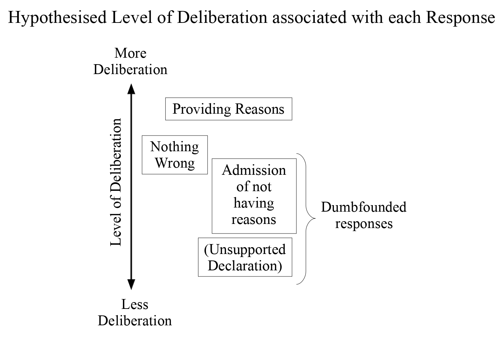

# Sample Analysis

Below is a sample analysis for cognitive load Study 6.

```{r setup, include=FALSE}
#knitr::opts_chunk$set(echo = FALSE)
knitr::opts_chunk$set(eval = TRUE, echo = TRUE)
#knitr::opts_chunk$set(include = FALSE)
```


```{r load_libraries_cogload}
rm(list = ls())
library(citr)
#install.packages("sjstats")
library(plyr)
library(foreign)
library(car)
library(desnum)
library(ggplot2)
library(extrafont)
#devtools::install_github("crsh/papaja")
library(papaja)
#library("dplyr")
library("afex")
library("tibble")
library(scales)
#install.packages("metap")
library(metap)
library(pwr)
library(lsr)
#install.packages("sjstats")
library(sjstats)
library(DescTools)
#inatall.packages("ggstatsplot")
#library(ggstatsplot)
library(VGAM)
library(nnet)
library(mlogit)
library(reshape2)
#install.packages("powerMediation")
library("powerMediation")


#source("load_all_data.R")

#devtools::install_github("benmarwick/wordcountaddin")
#library(wordcountaddin)
#wordcountaddin::text_stats("cogload_1to5_25Sept19.Rmd")
getwd()
```


```{r apriori_power_analyses_cogload}

pwr.chisq.test(w=.35,df=(3-1),sig.level = .05, power=.8)
pwr.chisq.test(w=.21,df=(3-1),sig.level = .05, power=.8)
pwr.chisq.test(w=.07,df=(3-1),sig.level = .05, power=.8)
 
# https://www.real-statistics.com/chi-square-and-f-distributions/effect-size-chi-square/

```

```{r apriori_power_analyses_NFC}

powerMediation::SSizeLogisticCon(.5,exp(.405))

powerMediation::SSizeLogisticCon(.2,(1.49), .05, .8)
powerMediation::SSizeLogisticCon(.2,(3.45), .05, .8)
powerMediation::SSizeLogisticCon(.2,(9), .05, .8)

 
# https://rdrr.io/cran/powerMediation/man/powerLogisticCon.html
# http://core.ecu.edu/psyc/wuenschk/docs30/EffectSizeConventions.pdf small 1.49, med 3.45, large 9

```


Moral dumbfounding occurs when people defend a moral judgement even though they cannot provide a reason in support of this judgement [@haidt_moral_2000; @haidt_emotional_2001; see also  McHugh, McGann, Igou, \& Kinsella, -@mchugh_searching_2017a; -@mchugh_reasons_2020].  It is seen as evidence for the intuitive nature of moral judgements and has been cited as support for both intuitionist and dual-process theories of moral judgement [e.g., @cameron_morality_2013; @crockett_models_2013; @cushman_multisystem_2010; @cushman_action_2013; @greene_secret_2008; @haidt_emotional_2001; @prinz_passionate_2005].  Despite the influence of moral dumbfounding on the morality literature, the phenomenon is not well understood. Until recently [e.g., @royzman_curious_2015; @mchugh_searching_2017a; @mchugh_reasons_2020], empirical evidence testing the phenomenon was limited to a single study with a final sample of *N* = 30, unpublished in peer-reviewed form.  The dumbfounding paradigm involves presenting participants with a moral scenario, and asking them to judge the behaviour in the scenario.  Participants are then asked to provide reasons for their judgement.  Typically the scenarios in the dumbfounding paradigm depict "harmless taboos" [@haidt_social_2008, p. 196].  @mchugh_searching_2017a, building on the original work by @haidt_moral_2000, identified two measurable responses that may be taken as indicators of moral dumbfounding.  Firstly, people may explicitly admit to not having reasons for their judgement.  Secondly, people may use unsupported declarations ("it's just wrong") or tautological reasons ("because it's incest") as justifications for a judgement.  The current research uses the methods developed by @mchugh_searching_2017a to test one potential explanation of moral dumbfounding.

# Moral Dumbfounding: A Dual-Process Perspective
Drawing on dual-process theories of moral judgement [e.g., @greene_secret_2008; @cushman_action_2013; @brand_dualprocess_2016; @bago_intuitive_2019], the studies presented here aim to test the hypothesis that moral dumbfounding can be explained as a result of a dual-process conflict [@bonner_conflict_2010; @deneys_bias_2012; @deneys_conflict_2008; @evans_resolution_2007; see also @deneys_logic_2019].  Conflicts occur when a habitual/intuitive response is different from a response that results from deliberation. Examples of  such conflicts include, base rate neglect problems [@bonner_conflict_2010; @deneys_bias_2012; @deneys_conflict_2008; @evans_resolution_2007], the conjunction fallacy [@deneys_bias_2012; @tversky_extensional_1983], and the persistence of apparently "irrational" behaviours [@evans_resolution_2007], and compulsive behaviours [e.g. overeating, smoking, or gambling, @evans_dualprocessing_2008]. 

Another example of this kind of dual-process conflict is identified by @lerner_when_1999, discussing a study by @rozin_sensitivity_1994.  In this study, @rozin_sensitivity_1994 found that people reported reduced willingness to contact various items that they believed had prior contact with (i) an AIDS victim, (ii) someone who had been in a car accident, or (iii) a murderer.  This unwillingness persisted despite assurances that these items are sanitary [@rozin_sensitivity_1994].  The original unpublished moral dumbfounding study [@haidt_moral_2000] included a similar task; in addition to three moral judgement tasks, @haidt_moral_2000 included two non-moral tasks.  As part of one of the non-moral tasks, the experimenter dipped a sterilised cockroach in a glass of juice.  Participants were then asked to drink from the glass. Much like the study by @rozin_sensitivity_1994, participants were unwilling to drink from the glass [@haidt_moral_2000].

@haidt_moral_2000 present this response as equivalent to dumbfounded responding in a moral task; in both tasks participants reject a given action (either performing it in the case of the drink, or accepting it in the case of the moral vignettes) despite the context removing the typical reasons given for doing so.  This parity suggests that the cognitive processes that lead to this unwillingness to contact items seen as *contaminated* [identified as dual-process conflict by @lerner_when_1999] may similarly lead to moral dumbfounding.  It is possible that dumbfounded responding may also be explained as the result of dual-process conflict, where the making of a moral judgement is a habitual/intuitive response, and identifying reasons involves deliberation.  According to this interpretation, conflict occurs when deliberation fails to identify reasons for an intuitive judgement, and this results in a dumbfounded response.  We aim to test this explanation here.

## Dual-Processes in the Dumbfounding Paradigm
Normal cases of conflict can be resolved either by (a) the over-riding of the habitual response or (b) the ignoring of the inconsistent information from deliberation.  Consider the following problem [taken from @deneys_bias_2012, p. 29]:

>A psychologist wrote thumbnail descriptions of a sample of 1000 participants consisting of 995 females and 5 males. The description below was chosen at random from the 1,000 available descriptions.

>Jo is 23 years old and is finishing a degree in engineering. On Friday nights, Jo likes to go out cruising with friends while listening to loud music and drinking beer. Which one of the following two statements is most likely?

>(i) Jo is a man

>(ii) Jo is a woman

Jo appears to present as stereotypically male, and so the intuitive/habitual response is (i): Jo is a man.  Deliberation (and attending to the make up of the sample) reveals that Jo is 199 times more likely to be a woman (99.5%) than to be a man (0.5%).  In this case there is a clear conflict between the intuitive/habitual response and the deliberative response.  This conflict can resolved if a person accepts that their intuition was incorrect and adopts the deliberative response.  Alternatively a person may choose to ignore the inconsistent information that resulted from deliberation and maintain their initial judgement.

In the dumbfounding paradigm, conflict cannot be as easily resolved using these strategies.  Firstly, regarding an attempt to over-ride the intuitive/habitual moral judgement, there is considerable evidence suggesting that people are unwilling to over-ride habitual responses, or revise their intuitive judgements, on certain issues, and this is particularly true for moral issues [@abelson_conviction_1988; @kruglanski_motivated_1996a; @kruglanski_motivated_1993; @mcgregor_offensive_2006; @mcgregor_zeal_2006; @mcgregor_compensatory_2001].  This robustness of the habitual/intuitive response means that resolving conflict requires either the identification of reasons that are consistent with the initial judgement, or ignoring the inconsistent information.  If further reasons cannot be identified, and inconsistencies cannot be resolved (e.g., because of direct questioning) a person may maintain their judgement while also acknowledging that they cannot provide supporting reasons for it (i.e., presenting as dumbfounded).

Two types of dumbfounded responses were identified by @mchugh_searching_2017a: (a) unsupported declarations and (b) admissions of not having reasons.  The salience of inconsistent information is much greater when a person admits to not having reasons than when they simply provide an unsupported declaration.  As such, an unsupported declaration is likely a much more attractive response than admitting to not having reasons for a judgement.  Indeed, @mchugh_searching_2017a provide some suggestive evidence for this: when dumbfounding was measured as the selecting of an unsupported declaration, rates of dumbfounding were much higher than in other studies.  In the absence of explicit reminders that deliberation did not provide reasons to support their judgement, participants appeared to readily dismiss inconsistencies between their initial judgement and the outcome of deliberation.

## Intuitive and Deliberative Responding
In traditional dual-process conflict studies there are generally two responses: a correct response and an incorrect response; and two types of responses: logical (deliberative) and intuitive (habitual).  This binary correct/incorrect, logical/intuitive classification means that the dependent variables in these studies can be operationalised relatively easily, a response is either correct or incorrect. The correct response always maps onto the logical (deliberative) and various manipulations can frame the intuitive response as either correct or incorrect.

In contrast, there is no clear correct or incorrect answer in moral judgement tasks.  In addition to this, the study of moral dumbfounding (in the common case of an initial judgement that the target behaviour is wrong) involves at least three different responses (1) the providing of reasons (reason); (2) accepting the counter-arguments and rating the behaviour as “not wrong” (nothing wrong); or (3) a dumbfounded response (dumbfounding). The positioning of these responses options in terms of habitual or deliberative responses may vary from person to person or from situation to situation.

The nature of the dumbfounding paradigm, which involves explicit arguments against the most common judgements, requires that participants engage in some deliberation.  This means that all responses are likely the result of some level of deliberation in order to support (or attempt to support) an initial intuition.  A simplistic view of the possible responses identified above would identify (1) reason as the successful alignment of deliberation and intuition. (2) Nothing wrong is the over-riding of intuition by deliberation, while (3) dumbfounding is the failure of deliberation to rationalise an intuition. This view however presumes that there is only one intuition at play, and participants’ deliberations are an attempt to provide reasons for this single intuition.

At least one other intuition that may become salient as part of the dumbfounding paradigm has been identified.  Participants may have intuitions relating to the nature of moral knowledge, for example that *moral judgements should be justifiable by reasons*.  During the course of the study, this intuition (or alternative intuitions) may become salient.  The emergence of this intuition appears consistent with what has been observed in studies of moral dumbfounding, whereby people appear to be motivated to identify reasons for their judgement [@royzman_curious_2015; @mchugh_searching_2017a]. This means that people experience more than a conflict between habitual and deliberative responding, they may also experience competing intuitions. The emergence of these competing intuitions may be attributed to deliberation, however, it is also possible that their emergence occurs as a result of the nature of the dumbfounding paradigm independently of level of deliberation; participants are asked to provide reasons for their judgements. The need for judgements to be justifiable by reasons may be made salient by simply asking participants to provide justifications for their judgements.

Three possible types of responses in the dumbfounding paradigm are listed above, (1) reason; (2) nothing wrong; and (3) dumbfounding.  In addition, two classes of (3) dumbfounding have been identified: admissions of not having reasons, and unsupported declaration (e.g., "It's just wrong!" or "Incest is wrong.").  To reflect this, response (3) dumbfounding may be described as (3a) admission and (3b) unsupported declaration . The discussion below attempts to describe each of the responses 1-3 in terms of the varying roles of deliberation and intuition, where at least two relevant (competing) intuitions have been identified.

It is likely that (1) a reason response is the most desirable, it involves successfully resolving the conflicting intuitions and providing reasons for a judgement.  However, a reason response also requires that deliberation is "successful", that is, deliberation results in successfully identifying a reason for a judgement.  In the dumbfounding paradigm this is made particularly difficult because commonly identified reasons for judgements are refuted during the course of the study.  This means that successfully identifying a reason requires identifying a reason beyond the refuted reasons, or identifying shortcomings in the refutations.

It is also likely that (3b) unsupported declaration requires the least deliberation.  Defending a judgement with a restatement of the judgement can be done without deliberation. Furthermore, in restating a judgement and affirming a position, the salience of inconsistent intuitions may be reduced.  This response may be likened to the "seizing and freezing" behaviours described by @kruglanski_motivated_1996a.

This leaves (2) nothing wrong and (3a) admission.  It is probable that changing a judgement requires more deliberation than admitting to not having a reason for it; in changing a judgement a person would likely deliberate the strength of the counter-arguments.  It has also been shown that both types of dumbfounded response are more similar to each other than to either (1) a reason response or (2) nothing wrong.[^1]  It is likely that the observed similarity between both dumbfounded responses would extend to levels of deliberation.  As such, dumbfounded responding is hypothesised to involve the least amount of deliberation, and providing reasons requires the most amount of deliberation, with changing judgement involving more deliberation than dumbfounded responding, but not as much deliberation as successfully providing reasons.  The hypothesised relationship between responses in the dumbfounding paradigm and level of deliberation is illustrated in Figure 1.



[^1]: This is based on the analysis of non-verbal behaviours such as laughing, smiling, silence; see @mchugh_searching_2017a

### Competing Intuitions
The only response that can be positioned as habitual or deliberative with any confidence is (1) a reason response, which is certainly deliberative, as it illustrates successful deliberation such that two competing intuitions may be aligned.  The relative roles of intuition and deliberation in each of the other responses are less clear.  There are at least two competing intuitions that may give rise to the remaining responses: (i) that the behaviour is wrong, and (ii) that moral judgements should be grounded in reasons.

Furthermore, (3b) unsupported declaration is a clear endorsing of the first intuition (i) that the behaviour is wrong over the second intuition (ii) that moral judgements should be grounded in reasons.  Arriving at this response is possible without deliberation. If a person does not see a need for judgements to be justified by reasons, they are unlikely to engage in a deliberative search for reasons.

The remaining responses (2) nothing wrong and (3a) admission, may be viewed as instances of selecting one of the competing intuitions following deliberation. Providing response (2) nothing wrong, may also be viewed as selecting one of the competing intuitions based on, and informed by deliberation, acknowledging the value of this deliberation process.  For this reason it is possible that response (2) nothing wrong, may, in some cases, involve slightly more deliberation than (3a) an admission.  The relative level of deliberation involved in (2) nothing wrong and (3a) admission, may vary depending on the individual.  Some people may readily change their judgement based on new information, while others may not see the need to justify their judgement by reasons.

In view of the above discussion, the responses may be (tentatively) ranked in order of the relative role of deliberation. Beginning with the highest level of deliberation and ending with the lowest, the responses may be ranked as follows: (i) providing reasons (successful deliberation), (ii) accepting the counter-arguments and rating the behaviour as "not wrong" (failed deliberation/deliberation over-riding an initial intuition), (iii) an admission of not having reasons (failed deliberation/rejection of value of deliberation) and, (iv) an unsupported declaration (failed deliberation/rejection of value of deliberation/deliberation absent).  As noted previously, providing reasons is the only response for which claims regarding the relative role of deliberation and intuition can be made with any degree of certainty.  

# Influences on Moral Dumbfounding

One prediction of explaining dumbfounding as conflict in dual-processes is that under specific manipulations, responses in the moral dumbfounding paradigm should vary in predictable ways.  In addition to external manipulation, a second prediction of this conflict in dual-processes explanation is that responses in the moral dumbfounding paradigm may display variability that can be linked to specific individual difference variables.  The studies described here aim to investigate both of these possibilities.

## Influencing Moral Dumbfounding through Experimental Manipulation
Cognitive load has been shown to inhibit deliberative responding [e.g., @deneys_dual_2006; @evans_rapid_2005; @evans_dualprocess_2013; @schmidt_effects_2016].  Above, we identified providing reasons as involving more deliberation than alternative responses in the dumbfounding paradigm.  This implies that cognitive load should inhibit the identification of reasons for a judgement, leading to an increase in dumbfounded responding or an increase in accepting the counter-arguments and revising the judgement made.

According to @greene_cognitive_2008, cognitive load reduces the likelihood of utilitarian judgements but not deontological judgements. The judgements in dumbfounding paradigms are typically deontological; the moral violations described in the scenarios in studies of moral dumbfounding are violations of widely accepted deontic propositions.  Changing a judgement in the dumbfounding paradigm means rejecting a deontological judgement in favour of a judgement informed by a utilitarian position (the counter-arguments highlight the lack of harm in the scenarios). Drawing on @greene_cognitive_2008, who showed that utilitarian judgements are negatively influenced by cognitive load, it is expected that cognitive load should led to more dumbfounded responding, rather than changing of judgements. This prediction is also purported to be supported by @haidt_moral_2000.  In the opening note of the original @haidt_moral_2000 report, they report that they conducted a second study in which they manipulated cognitive load. They report that they found that cognitive load led to increased levels of dumbfounding but did not influence judgements made. Beyond a brief mention in the opening note, this cognitive load and moral dumbfounding study is not reported in full in @haidt_moral_2000 or elsewhere.

An investigation of the dumbfounding under cognitive load can test two predictions of dual-process models of moral judgement. Firstly, it is hypothesised that deliberative responding generally will be inhibited by cognitive load, leading to less identification of reasons for judgements. This inhibition may result in higher rates of selecting "there is nothing wrong" or higher rates of dumbfounded responding (or both). However, adopting the work by @greene_cognitive_2008 suggests that the inhibition of deliberation should result in higher rates of dumbfounded responding only.

Again, there are three possible responses in the dumbfounding paradigm: (1) providing reasons; (2) a change in judgement; and (3) a dumbfounded response. Providing reasons has been identified as requiring more deliberation than the other responses, and as such the introduction of a cognitive load manipulation should reduce the providing of reasons in favour of one of the other responses. It is not clear whether participants would be more likely to revise their judgement or provide a dumbfounded response.

## Individual Differences in Moral Dumbfounding
As noted above, it is likely that responses in the dumbfounding paradigm will vary depending on individual differences. One individual difference variable linked to dual-process approaches to cognition, therefore may be related to susceptibility to dumbfounding is Need for Cognition [@cacioppo_need_1982; @petty_efficient_1984; @petty_dispositional_1996; @forsterlee_examination_1999]. The Need for Cognition Scale (NFC) is a measure of an individual’s tendency "to engage in and enjoy effortful analytic activity" [@forsterlee_examination_1999, p. 471; see also @cacioppo_need_1982].  In other words, it measures a tendency to engage in deliberation [@evans_dualprocess_2013].  It is also related to a person’s need to understand and make sense of the world [@forsterlee_examination_1999]. It is hypothesised that people who score highly on the NFC will be more likely to provide reasons for their judgement. Related to this, people who score low on the NFC are likely to fail to identify reasons for their judgement. That NFC is related to a need to understand and make sense of the world suggests that of the people who fail to identify reasons for their judgement, the people who revise their judgement will likely score higher on the NFC than people who provide a dumbfounded response.

# The Current Studies
The studies described here aim to investigate test three predictions of a conflict in dual-process explanation of moral dumbfounding.  To test the first two predictions we experimentally manipulated cognitive load.  Our primary prediction is that a cognitive load manipulation will inhibit people's ability to provide reasons for their judgement, leading to greater habitual responses (either nothing wrong or dumbfounding or both).  A second prediction, informed by @greene_cognitive_2008, that a cognitive load manipulation will inhibit people's ability to provide reasons for their judgement, leading to greater dumbfounding specifically will also be tested.  The third prediction that will be tested is that a person’s tendency to provide reasons will be related to their score on the Need for Cognition scale [@cacioppo_need_1982; @petty_efficient_1984].  We hypothesise that as NFC increases people will be less likely to present as dumbfounded.  We conducted five studies to assess these predictions.[^2]^,^[^3]  In all five studies, we report all measures, manipulations and exclusions.


```{r apriori_power_analyses_reporting}

large <- pwr.chisq.test(w=.35,df=(3-1),sig.level = .05, power=.8)
med   <- pwr.chisq.test(w=.21,df=(3-1),sig.level = .05, power=.8)
small <- pwr.chisq.test(w=.07,df=(3-1),sig.level = .05, power=.8)

round(large$N)
# https://www.real-statistics.com/chi-square-and-f-distributions/effect-size-chi-square/

```

[^2]: A priori power analysis indicated that, for the primary research question (the influence of cognitive load on dumbfounded responding), in order to detect a large effect size (*V* = .35) with 80% power, a sample of *N* = `r round(large$N)` participants was required; in order to detect a medium effect size (*V* = .21) with 80% power a sample of *N* = `r round(med$N)` participants was required; in order to detect a small effect size (*V* = .07) with 80% power a sample of *N* = `r round(small$N)` was required.  This means that the studies described here are likely underpowered.  To account for this we conclude with a combined analysis of all studies which includes mini meta-analyses.

```{r apriori_logit}
small <- powerMediation::SSizeLogisticCon(.2,(1.49), .05, .8)
med <- powerMediation::SSizeLogisticCon(.2,(3.45), .05, .8)
large <- powerMediation::SSizeLogisticCon(.2,(9), .05, .8)

```

[^3]: A priori power analysis indicated that, for the secondary research question (the relationship between dumbfounded responding and Need for Cognition), in order to detect a large effect size (*OR* = 9) with 80% power, a sample of *N* = `r round(large)` participants was required; in order to detect a medium effect size (*OR* = 3.45) with 80% power a sample of *N* = `r round(med)` participants was required; in order to detect a small effect size (*OR* = 1.49) with 80% power a sample of *N* = `r round(small)` was required.  Again, the studies described here are likely underpowered and we conclude with a combined analysis of all studies.


# Study 1 - College Sample
The aim of Study 1 was to investigate if a cognitive load manipulation influenced participants' ability to justify their judgement. We also measured Need for Cognition [@cacioppo_need_1982; @petty_efficient_1984] as a potential moderator variable.

```{r load data set Study 1}

rm(list = ls())

load("loaded_data/one.RData")
df3 <- study_1

df4 <- df3[which(df3$condition=="cog_load"),]
df5 <- df3[which(df3$condition=="control"),]


```

## Study 1: Method
### Participants and design
Study 1 was a between subjects design.  The dependent variable was rates of providing reasons/dumbfounding (measured using to the critical slide with 3 response options: 1: providing reasons; 2: there is nothing wrong; 3: dumbfounded response - admission).  The independent variable was cognitive load with two levels: present and absent.  Cognitive load was manipulated by presenting participants with an eight digit number letter string to be memorised.  Need for Cognition [@cacioppo_need_1982; @petty_efficient_1984] was included as a potential correlate and moderator variable. 

A total sample of `r length(df3$InCS)` participants (`r sum(df3$gender=="Female")` female, `r sum(df3$gender=="Male")` male; *M*~age~ = `r round(mean(df3$age),digits=2)`, min = `r min(df3$age)`, max = `r max(df3$age)`, *SD* = `r round(sd(df3$age),digits=2)`) took part.  Participants in this sample were undergraduate students, postgraduate students, and alumni from Mary Immaculate College (MIC), and University of Limerick (UL).  Participation was voluntary and participants were not reimbursed for their participation.

### Procedure and materials
Data were collected using an online questionnaire. Data collection took place in a designated computer laboratory in MIC.  The experimenter remained in the laboratory for the duration of the study. Participants were first presented with an information sheet and consent form.  The main study proceeded when participants had signed the consent form.

Participants in the experimental condition were presented with an eight digit number/letter string and asked to memorise the sequence.  After 30 seconds, the experiment progressed to the next slide. Participants had the option to click "ok" and progress to the next slide after 15 seconds.

Participants were then presented with the "Julie and Mark" (*Incest*) vignette [@haidt_moral_2000].  Participants rated on a 7-point Likert scale how right or wrong the behaviour of Julie and Mark was (where, 1 = *Morally wrong*; 4 = *neutral*; 7 = *Morally right*), and were given an opportunity to provide reasons for their judgement. Following this, participants were presented with a series of counter-arguments, which refuted commonly used justifications for rating the behaviour as "wrong".

Dumbfounding was measured using the critical slide [@mchugh_searching_2017a].  This contained a statement defending the behaviour and a question as to how the behaviour could be wrong ("Julie and Mark's behaviour did not harm anyone, how can there be anything wrong with what they did?").  There were three possible answer options: (a) "There is nothing wrong"; (b) an admission of not having reasons ("It's wrong but I can't think of a reason"); and finally a judgement with accompanying justification (c) "It's wrong and I can provide a valid reason".  The order of these response options was randomised. Participants who selected (c) were prompted to type a reason.  The selecting of option (b), the admission of not having reasons, was taken to be a dumbfounded response. Following the critical slide, participants in the experimental condition were required to reproduce the eight digit number-letter string sequence presented previously.  Following this a post-discussion questionnaire in which participants rated their response to the scenario across various dimensions [@haidt_moral_2000].

Need for Cognition was measured using the short form of the Need for Cognition scale [@cacioppo_need_1982; @petty_efficient_1984].  This is an 18 item scale containing questions relating to motivation to engage in thinking (e.g., "I would prefer complex to simple problems"). Responses were recorded on a -4 to +4 Likert-type scale, where -4 = *very strong disagreement* and +4 = *very strong agreement*.


```{r s1change in judgement}

# create variables for reporting t.tests
t <- t.test(df3$InJu1,df3$InJu2, paired = TRUE)

#chisquare test function

custom_chi <- function(x,y){
  a <- length(x)
  b <- length(y)
  c <- rep(1, a)
  d <- rep(2, b)
  e <- c(c,d)
  f <- c(x, y)
  
  g <- data.frame(e,f)
  h <- table(g$e,g$f)
  suppressWarnings(chisq.test(h))
}

c <- suppressWarnings(custom_chi(df3$InJu1,df3$InJu2))

changed_num <- function(x, judgement_1, judgement_2){
  b <- b <- x[which(x$Ju1_bin==judgement_1 & x$Ju2_bin==judgement_2),]
  length(b$Ju1_bin)
  
}

tot_changed_num <- function(x, query){
  
  c <- cbind.data.frame(x$Ju1_bin[which(x$Ju1_bin!=x$Ju2_bin)],x$Ju2_bin[which(x$Ju1_bin!=x$Ju2_bin)])
  colnames(c) <- c("initial_judgement","revised_judgement")
  
  c
  if(query == "table") print(c)
  if(query == "total") print(length(c$initial_judgement))}

```


```{r checkingchanges1}

sum(df3$InCS!="There is nothing wrong."&df3$Ju1_bin!="wrong")

t_j1 <- t.test(college$InJu1 ~ college$condition)
d_j1 <- cohensD(college$InJu1 ~ college$condition)

t_paragraph(college$InJu1, college$condition, "initial judgement")
#t_paragraph(one$InJu1, one$condition, "initial judgement")
#t_paragraph(two$InJu1, two$condition, "initial judgement")
#t_paragraph(three$InJu1, three$condition, "initial judgement")

#

c <- chisq.test(table(df3$InCS,df3$condition))
w <- sqrt(c[]$statistic/length(df3$gender))
pw <- pwr.chisq.test(w=w,N=length(df3$InCS),df=(3-1),sig.level = .05)


```

## Study 1: Results
`r numbers2words_cap1(length(df3$Ju1_bin[df3$Ju1_bin=="wrong"]))` participants (`r round(((length(df3$Ju1_bin[df3$Ju1_bin=="wrong"])/length(df3$Ju1_bin))*100), digits=2)`%) rated the behaviour of Julie and Mark as wrong initially.  The mean initial rating of the behaviour was,  *M* = `r round(mean(df3$InJu1), digits = 2)`, *SD* = `r round(sd(df3$InJu1), digits = 2)`.  There was no difference in initial judgement depending on cognitive load, *t*(`r t_j1$parameter`) = `r t_j1$statistic`, *p* `r paste(p_report(t_j1$p.value))`; *d* = `r round(d_j1, digits=2)`.

```{r prepS1fig2}


y <- table(df3$condition,df3$InCS)
y <- as.data.frame(y)
colnames(y) <- c("condition","InCS","Freq")

z <- as.data.frame(table(df3$condition,df3$InCS)/length(df3$gender)*2)
perc <- z$Freq
test <- cbind(y,perc)
test$condition
test


y <- table(df3$condition,df3$Dumb_incl_string)
y <- as.data.frame(y)
colnames(y) <- c("condition","InCS","Freq")


ab_graph <- function(){
  a <- df3[which(df3$condition==levels(as.factor(df3$condition))[1]),]
  b <- df3[which(df3$condition==levels(as.factor(df3$condition))[2]),]
  #levels(as.factor(df3$condition))[1]
  
  ay <- as.data.frame(table(a$InCS,a$condition))
  by <- as.data.frame(table(b$InCS,b$condition))
  
  aperc <- ay$Freq/length(a$gender)
  ay <- cbind(ay,aperc)
  colnames(ay) <- c("InCS","condition","Freq","perc")
  
  bperc <- by$Freq/length(b$gender)
  by <- cbind(by,bperc)
  colnames(by) <- c("InCS","condition","Freq","perc")
  
  c <- rbind(ay,by)
  
  c
}

test <- ab_graph()

rm(y)
```


```{r S1fig2criticalcondition, fig.cap="Study 1: Responses to critical slide and for the experimental group (*N* = 33) and the control group (*N* = 33)", include=TRUE}


ggplot(test, aes(x=InCS, y=perc, fill=factor(condition,labels=c("Cognitive load","Control")))) +
  scale_y_continuous(limits = c(-.03,1),
                     labels = percent_format()
  )+ 
  geom_col(position = "dodge",
           color="black",
           size=.2
  )+
  geom_text(family = "Times", size=4.2,
            aes( label = scales::percent(test$perc),
                 y= perc ),
            stat= "identity",
            vjust = -.5,
            position = position_dodge(.9),
            fontface='plain'
            )+
  geom_text(family = "Times", size=4.2,
            aes(label = format(Freq),
                y= -3*(..count../100)/(..count..)),
            stat= "count",
            position = position_dodge(0.9),
            #vjust = -.05,
            fontface='plain'
            ) +
  xlab("Response to Critical Slide") +
  ylab("Percentage of participants selecting each response")+
  scale_x_discrete(labels=c("Nothing Wrong", "Dumbfounded","Reasons")) +
  scale_fill_grey(start = .5, end = .8) +
  labs(fill="Condition") +
  
  geom_text(family = "Times", size=4.2,
            aes( label = scales::percent(test$perc),
                 y= test$perc ),
            stat= "identity",
            vjust = -.5,
            position = position_dodge(.9),
            fontface='plain'
            )+
  #theme_apa() +
  theme_bw() +
  theme(plot.title=element_text(family="Times",
                                size=12
                                ),
        legend.text=element_text(family="Times",
                                 size=8
                                 ),
          legend.title=element_text(family="Times",
                                    size=10
                                    ),
          axis.text=element_text(family="Times",
                                 colour = "black",
                                 size=8
                                 ),
          axis.ticks.x = element_blank(),
          axis.title=element_text(family="Times",
                                  size=12
                                  ),
          strip.text=element_text(family = "Times",
                                  size = 12
                                  ),
          strip.background = element_rect(fill = "white"),
          legend.position="right")


```


```{r preptableS1}
c <- chisq.test(table(df3$InCS,df3$condition))
rownames(rbind(c$observed,c$expected,c$stdres))


ps <- function(y){
  if(as.numeric(sqrt( y*y) ) >3.3) print(paste0(y,"**"), quote = FALSE)
  else if(as.numeric(sqrt( y*y) ) >1.96) print(paste0(y,"*"), quote = FALSE)
  else print(y)}


x <- c$stdres
x <- round(x, digits = 2)

lapply(x, ps)

#c$stdres <- round(c$stdres,digits=3)
#c$stdres <- ps(c$stdres)

ps(x[1])
ps(x[2])
ps(x[3])

x <- `colnames<-`(
  cbind.data.frame(c(ps(x[1]),ps(x[2]),ps(x[3])),
                   c(ps(x[4]),ps(x[5]),ps(x[6]))),
  c("cog_load","control")
)

rownames(x) <- row.names(c$observed)  

y <- rbind(round(c$observed), round(c$expected, digits = 2))

c(c$stdres[1])


res <- cbind(c("Observed count","","","Expected count","","","Standardised residuals","",""),
      c("Nothing Wrong","Dumbfounded","Reasons",
        "Nothing Wrong","Dumbfounded","Reasons",
        "Nothing Wrong","Dumbfounded","Reasons"),
      rbind(y,x)
      
      )

row.names(res) <- NULL
colnames(res) <- c("","","Cognitive Load","Control")


```

```{r S1tab1dumb,results = 'asis', include=TRUE}


apa_table(
   res
   , align = c("l", "l", "c", "c", "c")
   , caption = "Study 1 – Observed counts, expected counts, and standardised residuals for each response to the critical slide depending on cognitive load"
   #, added_stub_head = "Response to critical slide"
   #, col_spanners = makespanners()
   , note = "* = sig. at \\emph{p} < .05; ** = sig. at \\emph{p} < .001"
   , escape = FALSE
   
)

```

Participants who selected the admission of not having reasons on the critical slide were identified as dumbfounded.  `r numbers2words_cap1(length(df3$InCS[which(df3$InCS=="It's wrong but I can't think of a reason.")]))` participants (`r round((length(df3$InCS[which(df3$InCS=="It's wrong but I can't think of a reason.")])/(length(df3$InCS)))*100, digits=2)`%) selected "It's wrong but I can't think of a reason".  `r numbers2words_cap1(length(df3$InCS[which(df3$InCS=="It's wrong and I can provide a valid reason.")]))` participants (`r round((length(df3$InCS[which(df3$InCS=="It's wrong and I can provide a valid reason.")])/(length(df3$InCS)))*100,digits=2)`%) selected “It's wrong and I can provide a valid reason”; and `r numbers2words(length(df3$InCS[which(df3$InCS=="There is nothing wrong.")]))` participants (`r round((length(df3$InCS[which(df3$InCS=="There is nothing wrong.")])/(length(df3$InCS)))*100,digits=2)`%) selected “There is nothing wrong”.


```{r ch5cognitive load manipulationS1, include=FALSE}


df_a <- df3[which(df3$cog_right=="right"&df3$cog_M_ch_bin=="easy"),]
table(df_a$InCS)
numbers2words(sum(df_a$InCS=="There is nothing wrong."))
numbers2words(sum(df_a$InCS=="It's wrong but I can't think of a reason."))
numbers2words(sum(df_a$InCS=="It's wrong and I can provide a valid reason."))


df4 <- df3[which(df3$condition=="cog_load"),]
df5 <- df3[which(df3$condition=="control"),]
c <- chisq.test(table(df3$InCS,df3$condition))
#table(df3$InCS,df3$condition)

descriptives(df4$cog_number_right)
table(df4$cog_number_right)
table(df4$cog_M_ch_bin)
table(df4$cog_M_ch_bin,df4$cog_number_right)
numbers2words(min(df4$cog_number_right))

cbind(
  df4$cog_right,
  df4$cog_number_right
)
sum(df4$cog_number_right==0)

#c
```

### Cognitive load manipulation check
Analysis of the responses to the cognitive load manipulation revealed that `r as_word(length(df3$cog_number_right[df3$cog_number_right==8]))` participants (`r round((length(df3$cog_number_right[df3$cog_number_right==8])/length(df3$condition[df3$condition=="cog_load"]))*100, digits=2)`%) successfully remembered the sequence of numbers and letters in full. Responses to the manipulation check question revealed that `r as_word(length(df3$cog_M_ch_bin[df3$cog_M_ch_bin=="easy"]))` participants (`r round((length(df3$cog_M_ch_bin[df3$cog_M_ch_bin=="easy"])/length(df3$condition[df3$condition=="cog_load"]))*100, digits=2)`%) found the memory task easy. Of these, `r as_word(length(df3$cog_number_right[df3$cog_number_right==8&df3$cog_M_ch_bin=="easy"]))` participants both found the task easy and got the answer right.  All participants correctly remembered at least two digits, indicating at least some level of engagement with the cognitive load manipulation.

```{r ch5cognitive load and engagement with the taskS1, include=FALSE}

#tapply(df3$InCf1, df3$condition, descriptives)
#t.test(df3$InCf1~df3$condition)
t <- t.test(InJu1~condition, data=df3)
t1 <- t.test(InCf1~condition, data=df3)

d <- cohensD(InJu1~condition, data=df3)
d1 <- cohensD(InCf1~condition, data=df3)
```

We tested for differences between the cognitive load group and the control group for *Initial Judgement* and *Initial Confidence*.  An independent samples t-test revealed no significant difference in initial rating in the cognitive load group, (*M* = `r round(mean(df4$InJu1), digits = 2)`, *SD* = `r round(sd(df4$InJu1), digits = 2)`), and the control group, (*M* = `r round(mean(df5$InJu2), digits = 2)`, *SD* = `r round(sd(df5$InJu2), digits = 2)`), *t*(`r round(t$parameter, digits=2)`) = `r round(t$statistic, digits=3)` , *p* = `r round(t$p.value, digits=3)`; *d* = `r round(d, digits=2)`. An independent samples t-test revealed no significant difference in initial confidence in the cognitive load group, (*M* = `r round(mean(df4$InCf1), digits = 2)`, *SD* = `r round(sd(df4$InCf1), digits = 2)`), and the control group, (*M* = `r round(mean(df5$InCf1), digits = 2)`, *SD* = `r round(sd(df5$InCf1), digits = 2)`), *t*(`r round(t1$parameter, digits=2)`) = `r round(t1$statistic, digits=3)` , *p* = `r round(t1$p.value, digits=3)`; *d* = `r round(d1, digits=2)`. In view of this, we assume that both groups engaged equally with the task.

### Cognitive load and dumbfounded responding
A chi-squared test for independence revealed a significant association between experimental condition and response to the critical slide, $\chi$^2^(`r c$parameter`, *N* = `r length(df3$Ju1_bin)`) = `r round(c$statistic, digits=3)`, *p* `r paste(p_report(c$p.value))`, *V* = `r w`, the observed power was `r pw$power`.  Under cognitive load fewer participants (`r sum(df4$InCS=="It's wrong and I can provide a valid reason.")`; `r sum(df5$InCS=="It's wrong and I can provide a valid reason.")/length(df4$gender)*100`%) provided reasons than in the control condition (`r sum(df5$InCS=="It's wrong and I can provide a valid reason.")`; `r sum(df4$InCS=="It's wrong and I can provide a valid reason.")/length(df4$gender)*100`%).  Similarly, under cognitive load more participants (`r sum(df4$InCS=="There is nothing wrong.")`; `r sum(df4$InCS=="There is nothing wrong.")/length(df4$gender)*100`%) selected "There is nothing wrong" than in the control group (`r sum(df5$InCS=="There is nothing wrong.")`; `r sum(df5$InCS=="There is nothing wrong.")/length(df4$gender)*100`%).  The responses to the critical slide for the experimental group (*N* = `r sum(college$condition=="cog_load")`) and the control group (*N* = `r sum(college$condition=="control")`) are displayed in Figure\ \@ref(fig:S1fig2criticalcondition).  The observed counts, expected counts and standardised residuals are displayed in Table\ \@ref(tab:S1tab1dumb).  


```{r logit1b}

df3$InCS <- relevel(df3$InCS, ref = 2)

df3a <- mlogit.data(df3, choice = "InCS", shape = "wide")
InCSModel<-mlogit(InCS ~ 1 | condition+NFC, data = df3a, reflevel = "It's wrong and I can provide a valid reason."
                  )

summary_InCS_model <- summary(InCSModel)
summary_InCS_model$lratio$parameter
summary_InCS_model$lratio$statistic
summary_InCS_model$lratio$p.value

InCSModel$coefficients[3]
InCSModel$coefficients[4]

cox <- PseudoR2(multinom(InCS~condition+NFC,df3), "all")

cox[3]
cox[4]
#PseudoR2(x, "all")
#summary_InCS_model


wald1 <- 
  summary_InCS_model$CoefTable[3]^2 /
  summary_InCS_model$CoefTable[7]^2

wald2 <- 
  summary_InCS_model$CoefTable[4]^2 /
  summary_InCS_model$CoefTable[8]^2


summary_InCS_model
summary_InCS_model$coefficients[3]
data.frame(exp(InCSModel$coefficients))

exp(InCSModel$coefficients)[3]


a <- exp(confint(InCSModel))
c(a[3],a[7])

residuals(InCSModel)
fitted(InCSModel, outcome = F)

c <- summary_InCS_model$lratio$statistic
w <- sqrt(c/length(df3$gender))
pw <- pwr.chisq.test(w=w,N=length(df3$InCS),df=(2),sig.level = .05)

pw$power

revised_PseudoR2s <- function(LogModel) {
  dev <- LogModel$deviance
  nullDev <- LogModel$null.deviance
  modelN <- length(LogModel$fitted.values)
  R.l <- 1 - dev / nullDev
  R.cs <- 1- exp ( -(nullDev - dev) / modelN)
  R.n <- R.cs / ( 1 - ( exp (-(nullDev / modelN))))
  
  all <- list(hosmer_and_lemeshow = as.numeric(R.l), mcfadden = NA, cox_and_snell = as.numeric(R.cs), nagelkerke = as.numeric(R.n))
  all
}

logits_rsquared <- glm(InCS~NFC,df3, family = binomial(link = "logit"))
cox <- revised_PseudoR2s(logits_rsquared)

```

```{r logit1}

df3$InCS <- relevel(df3$InCS, ref = 2)

df3a <- mlogit.data(df3, choice = "InCS", shape = "wide")
InCSModel<-mlogit(InCS ~ 1 | NFC, data = df3a, reflevel = "It's wrong and I can provide a valid reason.")

summary_InCS_model <- summary(InCSModel)
summary_InCS_model$lratio$parameter
summary_InCS_model$lratio$statistic
summary_InCS_model$lratio$p.value

InCSModel$coefficients[3]
InCSModel$coefficients[4]

cox <- PseudoR2(multinom(InCS~NFC,df3), "all")

cox[3]
cox[4]
#PseudoR2(x, "all")
#summary_InCS_model


wald1 <- 
  summary_InCS_model$CoefTable[3]^2 /
  summary_InCS_model$CoefTable[7]^2

wald2 <- 
  summary_InCS_model$CoefTable[4]^2 /
  summary_InCS_model$CoefTable[8]^2


summary_InCS_model
summary_InCS_model$coefficients[3]
data.frame(exp(InCSModel$coefficients))

exp(InCSModel$coefficients)[3]


a <- exp(confint(InCSModel))
c(a[3],a[7])

residuals(InCSModel)
fitted(InCSModel, outcome = F)

c <- summary_InCS_model$lratio$statistic
w <- sqrt(c/length(df3$gender))
pw <- pwr.chisq.test(w=w,N=length(df3$InCS),df=(2),sig.level = .05)

pw$power

revised_PseudoR2s <- function(LogModel) {
  dev <- LogModel$deviance
  nullDev <- LogModel$null.deviance
  modelN <- length(LogModel$fitted.values)
  R.l <- 1 - dev / nullDev
  R.cs <- 1- exp ( -(nullDev - dev) / modelN)
  R.n <- R.cs / ( 1 - ( exp (-(nullDev / modelN))))
  
  all <- list(hosmer_and_lemeshow = as.numeric(R.l), mcfadden = NA, cox_and_snell = as.numeric(R.cs), nagelkerke = as.numeric(R.n))
  all
}

logits_rsquared <- glm(InCS~NFC,df3, family = binomial(link = "logit"))
cox <- revised_PseudoR2s(logits_rsquared)

```

```{r fullcombinedtestlogit, include=FALSE}
# taken from https://stats.idre.ucla.edu/r/dae/multinomial-logistic-regression/
#ml$prog2 <- relevel(ml$prog, ref = "academic")
df3 <- df3[which(is.na(df3$NFC)==FALSE),]
df3$InCS <- relevel(df3$InCS, ref = 3)

test <- multinom(InCS ~ condition + NFC, data = df3)
summary(test)
z <- summary(test)$coefficients/summary(test)$standard.errors
z
p <- (1 - pnorm(abs(z), 0, 1)) * 2
p

exp(coef(test))
head(pp <- fitted(test))

## different order from here, be careful

dses <- data.frame(condition = c("cog_load", "control" ), NFC = mean(df3$NFC))
predict(test, newdata = dses, "probs")

dwrite <- data.frame(condition = rep(c("cog_load", "control" ), each = 41), NFC = rep(c(30:70),
    2))

## store the predicted probabilities for each value of ses and write
pp.write <- cbind(dwrite, predict(test, newdata = dwrite, type = "probs", se = TRUE))

## calculate the mean probabilities within each level of ses
by(pp.write[, 3:5], pp.write$condition, colMeans)

lpp <- melt(pp.write, id.vars = c("condition", "NFC"), value.name = "probability")
head(lpp)

ggplot(lpp, aes(x = NFC, y = probability, colour = variable)) + geom_line() + facet_grid(. ~ condition, scales = "free")

```


### Need for Cognition
A multinomial logistic regression revealed no significant association between Need for Cognition and response to the critical slide, $\chi$^2^(`r summary_InCS_model$lratio$parameter`, *N* = `r length(df3$gender)`) = `r round(summary_InCS_model$lratio$statistic, digits=2)`, *p* `r paste(p_report(summary_InCS_model$lratio$p.value))`, the observed power was `r round(pw$power,digits=2)`.[^5]

[^5]: As noted previously the studies presented here are likely underpowered.  We conclude with a combined analysis.  The relative probabilities of selecting each response depending on Need for Cognition for each study are presented in Appendix D.  See Figure\ \@ref(fig:ggplotlogit1) for Study 1.


```{r prepplottinglogit1}

df3 <- df3[which(is.na(df3$NFC)==FALSE),]

x <- df3$NFC
y <- as.numeric(df3$InCS)

m1 <- multinom(y ~ x)
# summary(m1)
newdata <- data.frame(x = seq(min(x), max(x), length.out = 100))
p1 <- predict(m1, newdata, type = "class")
p2 <- predict(m1, newdata, type = "probs")


logit_plot <- cbind.data.frame(newdata,p2)

logit_plot <- `colnames<-`(logit_plot, c("x","one_l","two_l","three_l"))
logit_plot <- melt(logit_plot, id="x")

```


```{r ggplotlogit1, fig.cap="Study 1: Probability of selecting each response to the critical slide depending on Need for Cognition", include=FALSE}


ggplot(logit_plot,
       aes(x=x, y=value,
           #color=factor(variable,labels=c("dumb","reason","nothing"))
           linetype=factor(variable,labels=c("dumb","reason","nothing"))
           )) +
  geom_line()+
  xlab("Need for Cognition") + ylab("Predicted Probability") +
  scale_y_continuous(limits = c(0, 1)) + 
  #scale_color_discrete(name="Response to \nCritical Slide", labels=c("Dumbfounded","Nothing Wrong","Reasons"))+
  scale_linetype_discrete(name="Response to \nCritical Slide", labels=c("Dumbfounded","Nothing Wrong","Reasons"))+
  theme_bw() +
  theme(plot.title=element_text(family="Times",
                                size=12
  ),
  legend.text=element_text(family="Times",
                           size=8
  ),
  legend.title=element_text(family="Times",
                            size=10
  ),
  axis.text=element_text(family="Times",
                         colour = "black",
                         size=8
  ),
  axis.ticks.x = element_blank(),
  axis.title=element_text(family="Times",
                          size=12
  ),
  strip.text=element_text(family = "Times",
                          size = 12
  ),
  strip.background = element_rect(fill = "white"),
  legend.position="right")


```

## Study 1: Discussion
The aim of the Study 1 was to investigate if dumbfounded responding was influenced by cognitive load. Specifically, adopting a dual-systems model of moral judgement, it was hypothesised that cognitive load would lead to reduced levels of deliberative responding, and that a reduction in rates of successfully identifying reasons for judgements would be observed.  This may lead to (a) increased levels of dumbfounding, or (b) increased selecting of the "nothing wrong" response. As predicted we found lower rates of providing reasons in the cognitive load group than in the control group.  This led to higher rates of selecting "there is nothing wrong" in the cognitive load group.

As discussed above, we hypothesised that moral dumbfounding occurs when people fail to resolve a conflict between an initial intuition and an intuition that emerges following deliberation. Under cognitive load a higher proportion of participants failed to provide reasons for their judgements, and a higher proportion of participants selected the “There’s nothing wrong” response.  There was no difference in rates of dumbfounding between the cognitive load group and the control group. It appears that when faced with an inability to justify a judgement with reasons, it is  preferable to revise the judgement than to acknowledge the inconsistencies in the form of a dumbfounded response.

# Study 2 - Online Replication

Study 1 demonstrated interesting variability in responses to the critical slide depending on cognitive load. The aim of Study 2 was to assess the replicability of the results of Study 1, using an online sample. In Study 1, the experimenter was in the room with the participants. This made it more difficult for participants to cheat on the memory task. This is not possible with an online sample. An alternative cognitive load manipulation was taken from De Neys and Schaeken [@deneys_when_2007], whereby a dot pattern is briefly presented to participants, and participants are required to reproduce the dot pattern at a later stage.

```{r load data set Study 2}
#### load data set 1 ####

rm(list = ls())

load("loaded_data/two.RData")
df3 <- study_2


```

## Study 2: Method
### Participants and design
Study 2 was a between subjects design.  The dependent variable was response to the critical slide.  The independent variable was cognitive load with two levels: high and low.  Need for Cognition [@cacioppo_need_1982; @petty_efficient_1984] was included as a potential correlate and moderator variable. 

A total sample of `r length(df3$InCS)` participants (`r sum(df3$gender=="Female")` female, `r sum(df3$gender=="Male")` male; *M*~age~ = `r round(mean(df3$age),digits=2)`, min = `r min(df3$age)`, max = `r max(df3$age)`, *SD* = `r round(sd(df3$age),digits=2)`) took part.  Participants in this sample were recruited using Amazon's MTurk [@amazonwebservicesinc._amazon_2016].  Participants were paid $0.50 for their participation.  Participants were recruited from English speaking countries or from countries where residents generally have a high level of English (e.g., The Netherlands, Denmark, Sweden).

### Procedure and materials
Data were collected using an online questionnaire. Materials were largely the same as in Study
1, with a change to the cognitive load manipulation. Cognitive load was
manipulated using a dot-pattern memory task [@deneys_when_2007].

Participants were presented with a 3 x 3 grid containing a dot pattern.
This image disappeared after one second. Participants then answered a
question relating to the moral judgement task. Following this, participants were asked to reproduce the
dot-pattern. All participants took part in the memory task, and
cognitive load was manipulated by varying the complexity of the patterns
presented [@deneys_when_2007]. The control group were presented with simple patterns,
containing three dots in a line, while the experimental group were
presented with more complex dot patterns containing 4 dots, see Figure\ \@ref(fig:dotpattern).


```{r dotpattern,fig.cap="Sample dot patterns - more simple for the control group (a) and higher complexity for the experimental condition (b)",include=TRUE,fig.height=2, fig.width=6}

x <- c(10,20,30,30)
y <- c(10,30,10,20)
x <- x - 5
y <- y - 5


#rbind(x,y)
z <- cbind.data.frame(x,y)
z$diff <- rep("b",length=length(z$x))

x <- c(10,10,10)
y <- c(10,20,30)
x <- x - 5
y <- y - 5


#rbind(x,y)
z2 <- cbind.data.frame(x,y)
z2$diff <- rep("a",length=length(z2$x))

z3 <- rbind(z,z2)
#z3
#rm(g)
ggplot(z3, aes(x=x,y=y)) +
 geom_point(size=8) +
 xlab(NULL) + ylab(NULL) + 
 scale_x_continuous(breaks = c(10,20),
                            labels = NULL, limits = c(1, 29)) +
#g <- g + scale_x_continuous(breaks = c(0,10,20,30), labels = NULL, limits = c(0, 30))
 scale_y_continuous(breaks = c(10,20),
                            labels = NULL, limits = c(1, 29))+
  facet_grid(.~diff,switch = 'x')+
 theme(plot.title=element_text(family="Times", size=12),
               legend.text=element_text(family="Times", size=8),
               legend.title=element_text(family="Times", size=12),
               axis.text=element_text(family="Times", size=8),
               axis.title=element_text(family="Times", size=12),
               panel.background = element_rect(fill = "white",
                                               colour = NA),
               panel.border = element_rect(fill = NA, size = 1,
                                           colour = "black"),
               panel.grid.major = element_line(colour = "black"),
               panel.grid.minor = element_line(colour = "white",
                                               size = 0.25),
               axis.ticks.length = unit(0,"cm"),
       plot.margin = NULL,
       strip.background = element_rect(fill = NA, size = 1,
                                           colour = "white"),
       strip.text = element_text(family = "Times",size = 16),
       panel.spacing = unit(4, "lines"))


```

Study 2 proceeded in much the same way as Study 1. There were four target questions during which
participants were engaged in the memory task. A different pattern was
presented before each of the following: the initial judgement, the
initial opportunity to provide reasons, the critical slide, and the
revised judgement. After each of these questions participants were
required to reproduce the pattern. As in Study 1, dumbfounding was measured using the critical slide.

## Study 2: Results

```{r checkingchanges2}

sum(df3$InCS!="There is nothing wrong."&df3$Ju1_bin!="wrong")

t_j1 <- t.test(df3$InJu1 ~ df3$condition)
d_j1 <- cohensD(df3$InJu1 ~ df3$condition)
#t_j1 <- t.test(college$InJu1 ~ college$condition)
#t_paragraph(college$InJu1, college$condition, "initial judgement")
#t_paragraph(one$InJu1, one$condition, "initial judgement")
#t_paragraph(two$InJu1, two$condition, "initial judgement")
#t_paragraph(three$InJu1, three$condition, "initial judgement")

#

c <- chisq.test(table(df3$InCS,df3$condition))
w <- sqrt(c[]$statistic/length(df3$gender))
pw <- pwr.chisq.test(w=w,N=length(df3$InCS),df=(3-1),sig.level = .05)


```

`r numbers2words_cap1(length(df3$Ju1_bin[df3$Ju1_bin=="wrong"]))` participants (`r round(((length(df3$Ju1_bin[df3$Ju1_bin=="wrong"])/length(df3$Ju1_bin))*100), digits=2)`%) rated the behaviour of Julie and Mark as wrong initially.  The mean initial rating of the behaviour was,  *M* = `r round(mean(df3$InJu1), digits = 2)`, *SD* = `r round(sd(df3$InJu1), digits = 2)`.  There was no difference in initial judgement depending on cognitive load, *t*(`r t_j1$parameter`) = `r t_j1$statistic`, *p* `r paste(p_report(t_j1$p.value))`; *d* = `r round(d_j1, digits=2)`.

Participants who selected the admission of not having reasons on the critical slide were identified as dumbfounded.  `r numbers2words_cap1(length(df3$InCS[which(df3$InCS=="It's wrong but I can't think of a reason.")]))` participants (`r round((length(df3$InCS[which(df3$InCS=="It's wrong but I can't think of a reason.")])/(length(df3$InCS)))*100, digits=2)`%) selected "It's wrong but I can't think of a reason".  `r numbers2words_cap1(length(df3$InCS[which(df3$InCS=="It's wrong and I can provide a valid reason.")]))` participants (`r round((length(df3$InCS[which(df3$InCS=="It's wrong and I can provide a valid reason.")])/(length(df3$InCS)))*100,digits=2)`%) selected “It's wrong and I can provide a valid reason”; and `r numbers2words(length(df3$InCS[which(df3$InCS=="There is nothing wrong.")]))` participants (`r round((length(df3$InCS[which(df3$InCS=="There is nothing wrong.")])/(length(df3$InCS)))*100,digits=2)`%) selected “There is nothing wrong”.

### Cognitive load and dumbfounded responding
A chi-squared test for independence revealed no association between experimental condition and response to the critical slide, $\chi$^2^(`r c$parameter`, *N* = `r length(df3$Ju1_bin)`) = `r round(c$statistic, digits=3)`, *p* `r paste(p_report(c$p.value))`, *V* = `r w`, the observed power was `r pw$power`.  The responses to the critical slide for the experimental group (*N* = `r sum(df3$condition=="cog_load")`) and the control group (*N* = `r sum(df3$condition=="control")`) are displayed in Figure\ \@ref(fig:ch5S2fig2criticalcondition).  

```{r prepch5S2fig2}


y <- table(df3$InCS,df3$condition)
#y <- table(df3$InCS,df3$engaged)
y <- as.data.frame(y)
#colnames(y) <- c("condition","InCS","Freq")
colnames(y) <- c("InCS","condition","Freq")

z <- as.data.frame(table(df3$condition,df3$InCS)/length(df3$gender)*2)

z <- rbind(as.data.frame(table(df3$InCS[which(df3$condition=="cog_load")])/
                           length(df3$InCS[which(df3$condition=="cog_load")])),
           as.data.frame(table(df3$InCS[which(df3$condition=="control")])/
                           length(df3$InCS[which(df3$condition=="control")])))


perc <- z$Freq
test <- cbind(y,perc)


# 
# y <- table(df3$condition,df3$Dumb_incl_string)
# y <- as.data.frame(y)
 colnames(y) <- c("InCS","condition","Freq")

# z <- as.data.frame(table(df3$condition,df3$Dumb_incl_string)/length(df3$gender)*2)
# perc <- z$Freq
# test <- cbind(y,perc)
# test$condition
# test
 


ab_graph <- function(){
  a <- df3[which(df3$condition==levels(as.factor(df3$condition))[1]),]
  b <- df3[which(df3$condition==levels(as.factor(df3$condition))[2]),]
  #levels(as.factor(df3$condition))[1]
  
  ay <- as.data.frame(table(a$InCS,a$condition))
  by <- as.data.frame(table(b$InCS,b$condition))
  
  aperc <- ay$Freq/length(a$gender)
  ay <- cbind(ay,aperc)
  colnames(ay) <- c("InCS","condition","Freq","perc")
  
  bperc <- by$Freq/length(b$gender)
  by <- cbind(by,bperc)
  colnames(by) <- c("InCS","condition","Freq","perc")
  
  c <- rbind(ay,by)
  
  c
}

test <- ab_graph()


rm(x,y)
```

```{r ch5S2fig2criticalcondition, fig.cap="Study 2: Responses to critical slide for the experimental group (*N* = 51) and the control group (*N* = 49)", include=TRUE}


ggplot(test, aes(x=InCS, y=perc, fill=factor(condition,labels=c("Cognitive load","Control")))) +
  scale_y_continuous(limits = c(-.03,1),
                     labels = percent_format()
  )+ 
  geom_col(position = "dodge",
           color="black",
           size=.2
  )+
  geom_text(family = "Times", size=4.2,
            aes( label = scales::percent(test$perc),
                 y= perc ),
            stat= "identity",
            vjust = -.5,
            position = position_dodge(.9),
            fontface='plain'
            )+
  geom_text(family = "Times", size=4.2,
            aes(label = format(Freq),
                y= -3*(..count../100)/(..count..)),
            stat= "count",
            position = position_dodge(0.9),
            #vjust = -.05,
            fontface='plain'
            ) +
  xlab("Response to Critical Slide") +
  ylab("Percentage of participants selecting each response")+
  scale_x_discrete(labels=c("Nothing Wrong", "Dumbfounded","Reasons")) +
  scale_fill_grey(start = .5, end = .8) +
  labs(fill="Condition") +
  
  geom_text(family = "Times", size=4.2,
            aes( label = scales::percent(test$perc),
                 y= test$perc ),
            stat= "identity",
            vjust = -.5,
            position = position_dodge(.9),
            fontface='plain'
            )+
  #theme_apa() +
  theme_bw() +
  theme(plot.title=element_text(family="Times",
                                size=12
                                ),
        legend.text=element_text(family="Times",
                                 size=8
                                 ),
          legend.title=element_text(family="Times",
                                    size=10
                                    ),
          axis.text=element_text(family="Times",
                                 colour = "black",
                                 size=8
                                 ),
          axis.ticks.x = element_blank(),
          axis.title=element_text(family="Times",
                                  size=12
                                  ),
          strip.text=element_text(family = "Times",
                                  size = 12
                                  ),
          strip.background = element_rect(fill = "white"),
          legend.position="right")


#rm(a,b,c)
# 
# g <- ggplot(df3, aes(x=InCS, fill=factor(condition,labels=c("Cognitive load","Control"))))
# g <- g + geom_bar(aes(y=..count..), position = position_dodge(), color="black")
# g <- g + xlab("Response to critical slide")
# #g <- g + ggtitle("Dumbfounding and Cognitive load")
# g <- g + scale_x_discrete(labels=c("nothing wrong", "no reason", "valid reason"))
# g <- g + scale_fill_grey(start = .5, end = .8)+ theme_bw()
# g <- g + labs(fill="Condition") 
# #grid.gedit("GRID.text",gp=gpar(fontfamily="serif"))
# g <- g + geom_text(family = "Times", aes(label = format(..count..),y= ..count.. ), stat= "count", vjust = 1.6, position = position_dodge(0.9))
# 
# g + theme(plot.title=element_text(family="Times", size=12), legend.text=element_text(family="Times", size=8), legend.title=element_text(family="Times", size=12), axis.text=element_text(family="Times", size=8), axis.title=element_text(family="Times", size=12))
# rm(g)

df4 <- df3[which(df3$engaged=="engaged"),]
df5 <- df3[which(df3$engaged=="not engaged"),]

# table(df3$InCS,df3$engaged)


```


### Engagement with the Memory Task

It is possible that the difference in results observed between Study 1 and  Study 2 is due to the alternative manipulation of cognitive load employed. In Study 1, the control group did not engage in any task, however, adopting De Neys and Shaeken's procedure [@deneys_when_2007], participants in the control group of Study 2 engaged in a memory task.  It is possible that simply engaging in a memory task led to differences in responses, and that level of difficulty (the manipulation that was employed) was irrelevant. Indeed, the responding to the critical slide in the control group in Study 2 is more similar to the responding in the experimental group in 1 than to the control group in Study 1.

```{r ch5prepengaged}

df3 <- one

#y <- table(df3$InCS,df3$condition)
y <- table(df3$InCS,df3$engaged)
y <- as.data.frame(y)
#colnames(y) <- c("condition","InCS","Freq")
colnames(y) <- c("InCS","condition","Freq")

z <- as.data.frame(table(df3$condition,df3$InCS)/length(df3$gender)*2)


z <- rbind(as.data.frame(table(df3$InCS[which(df3$engaged=="engaged")])/
                           length(df3$InCS[which(df3$engaged=="engaged")])),
           as.data.frame(table(df3$InCS[which(df3$engaged=="not engaged")])/
                           length(df3$InCS[which(df3$engaged=="not engaged")])))


perc <- z$Freq
test <- cbind(y,perc)
```

```{r ch5S2fig2criticalengaged, fig.cap="Study 2: Responses to critical slide depending on engagement (*N* = 56) or non-engagement (*N* = 44) with the memory task", include=TRUE}


ggplot(test, aes(x=InCS, y=perc, fill=factor(condition,labels=c("Engaged","Not Engaged")))) +
  scale_y_continuous(limits = c(-.03,1),
                     labels = percent_format()
  )+ 
  geom_col(position = "dodge",
           color="black",
           size=.2
  )+
  geom_text(family = "Times", size=4.2,
            aes( label = scales::percent(test$perc),
                 y= perc ),
            stat= "identity",
            vjust = -.5,
            position = position_dodge(.9),
            fontface='plain'
            )+
  geom_text(family = "Times", size=4.2,
            aes(label = format(Freq),
                y= -3*(..count../100)/(..count..)),
            stat= "count",
            position = position_dodge(0.9),
            #vjust = -.05,
            fontface='plain'
            ) +
  xlab("Response to Critical Slide") +
  ylab("Percentage of participants selecting each response")+
  scale_x_discrete(labels=c("Nothing Wrong", "Dumbfounded","Reasons")) +
  scale_fill_grey(start = .5, end = .8) +
  labs(fill="Condition") +
  
  geom_text(family = "Times", size=4.2,
            aes( label = scales::percent(test$perc),
                 y= test$perc ),
            stat= "identity",
            vjust = -.5,
            position = position_dodge(.9),
            fontface='plain'
            )+
  #theme_apa() +
  theme_bw() +
  theme(plot.title=element_text(family="Times",
                                size=12
                                ),
        legend.text=element_text(family="Times",
                                 size=8
                                 ),
          legend.title=element_text(family="Times",
                                    size=10
                                    ),
          axis.text=element_text(family="Times",
                                 colour = "black",
                                 size=8
                                 ),
          axis.ticks.x = element_blank(),
          axis.title=element_text(family="Times",
                                  size=12
                                  ),
          strip.text=element_text(family = "Times",
                                  size = 12
                                  ),
          strip.background = element_rect(fill = "white"),
          legend.position="right")


#rm(a,b,c)
# 
# g <- ggplot(df3, aes(x=InCS, fill=factor(condition,labels=c("Cognitive load","Control"))))
# g <- g + geom_bar(aes(y=..count..), position = position_dodge(), color="black")
# g <- g + xlab("Response to critical slide")
# #g <- g + ggtitle("Dumbfounding and Cognitive load")
# g <- g + scale_x_discrete(labels=c("nothing wrong", "no reason", "valid reason"))
# g <- g + scale_fill_grey(start = .5, end = .8)+ theme_bw()
# g <- g + labs(fill="Condition") 
# #grid.gedit("GRID.text",gp=gpar(fontfamily="serif"))
# g <- g + geom_text(family = "Times", aes(label = format(..count..),y= ..count.. ), stat= "count", vjust = 1.6, position = position_dodge(0.9))
# 
# g + theme(plot.title=element_text(family="Times", size=12), legend.text=element_text(family="Times", size=8), legend.title=element_text(family="Times", size=12), axis.text=element_text(family="Times", size=8), axis.title=element_text(family="Times", size=12))
# rm(g)

#(1-pnorm(3.30))*2

```


```{r preptableS2}
c <- chisq.test(table(df3$InCS,df3$engaged))
rownames(rbind(c$observed,c$expected,c$stdres))


ps <- function(y){
  if(as.numeric(sqrt( y*y) ) >3.3) print(paste0(y,"**"), quote = FALSE)
  else if(as.numeric(sqrt( y*y) ) >1.96) print(paste0(y,"*"), quote = FALSE)
  else print(y)}

x <- c$stdres
x <- round(x, digits = 2)

lapply(x, ps)

#c$stdres <- round(c$stdres,digits=3)
#c$stdres <- ps(c$stdres)

ps(x[1])
ps(x[2])
ps(x[3])

x <- `colnames<-`(
  cbind.data.frame(c(ps(x[1]),ps(x[2]),ps(x[3])),
                   c(ps(x[4]),ps(x[5]),ps(x[6]))),
  c("engaged","not engaged")
)

rownames(x) <- row.names(c$observed)  

y <- rbind(round(round(c$observed)), round(c$expected, digits = 2))

c(c$stdres[1])


res <- cbind(c("Observed count","","","Expected count","","","Standardised residuals","",""),
      c("Nothing Wrong","Dumbfounded","Reasons",
        "Nothing Wrong","Dumbfounded","Reasons",
        "Nothing Wrong","Dumbfounded","Reasons"),
      rbind(y,x)
      
      )

row.names(res) <- NULL
colnames(res) <- c("","","Engaged","Not Engaged")


```

```{r S2tab1dumb,results = 'asis', include=TRUE}


apa_table(
   res
   , align = c("l", "l", "c", "c", "c")
   , caption = "Study 2 – Observed counts, expected counts, and standardised residuals for each response to the critical slide depending on cognitive load"
   #, added_stub_head = "Response to critical slide"
   #, col_spanners = makespanners()
   , note = "* = sig. at \\emph{p} < .05; ** = sig. at \\emph{p} < .001"
   , escape = FALSE
   
)

```

Rates of successful reproduction of the dot patterns in Study 2 were much lower than reported by De Neys and Shaeken [@deneys_when_2007]. It appears that participants in Study 2 did not engage with the memory task in the same way as participants in De Neys and Shaeken's studies [@deneys_when_2007].  We hypothesised that the effectiveness of the cognitive load manipulation may be moderated by the degree to which people engage with the manipulation.

The memory task involved correctly placing dots in a 3 x 3 grid. For the scoring of this task, each of the nine places in the grid could be marked/not marked correctly or incorrectly, making 9 the total possible number of correct responses. If a person misplaced one dot in the pattern this would count for 2 incorrect places in the grid: the mark in the incorrect place, and the absence of a mark in the place it should have been. A participant who received a score of 7, could reasonably be taken to have engaged with the task, and simply made a slip. As such, this was taken as the cut-off point for identifying engagement.  This resulted in 56 participants being identified as engaging with the memory task, and 44 being identified as not engaging with the task.

```{r ch5S2dumbfoundingengaged}
c <- chisq.test(table(df3$InCS,df3$engaged))

w <- sqrt(c[]$statistic/length(df3$gender))
#w <- sqrt(2.464856/120)
pwr.chisq.test(w=w,df=(3-1),N=length(df3$InCS),sig.level = .05)
c[]$stdres
c[]

```
Responses to critical slide for participants who engaged with the memory task and participants who did not engage with the memory task were analysed separately (see Figure\ \@ref(fig:ch5S2fig2criticalengaged)). A chi-squared test for independence revealed an association between engagement in the memory task and response to the critical slide, $\chi$^2^(`r c$parameter`, *N* = `r length(df3$Ju1_bin)`) = `r round(c$statistic, digits=3)`, *p* `r paste(p_report(c$p.value))`, *V* = `r w`, the observed power was `r pw$power`.  The responses to the critical slide for the experimental group (*N* = `r sum(df3$condition=="cog_load")`) and the control group (*N* = `r sum(df3$condition=="control")`) are displayed in Figure\ \@ref(fig:ch5S2fig2criticalengaged).  The observed counts, expected counts and standardised residuals are displayed in Table\ \@ref(tab:S2tab1dumb).


```{r logit2}

df3$InCS <- relevel(df3$InCS, ref = 2)

df3a <- mlogit.data(df3, choice = "InCS", shape = "wide")
InCSModel<-mlogit(InCS ~ 1 | NFC, data = df3a, reflevel = "It's wrong and I can provide a valid reason.")

summary_InCS_model <- summary(InCSModel)
summary_InCS_model$lratio$parameter
summary_InCS_model$lratio$statistic
summary_InCS_model$lratio$p.value

InCSModel$coefficients[3]
InCSModel$coefficients[4]

cox <- PseudoR2(multinom(InCS~NFC,df3), "all")

cox[3]
cox[4]
#PseudoR2(x, "all")
#summary_InCS_model


wald1 <- 
  summary_InCS_model$CoefTable[3]^2 /
  summary_InCS_model$CoefTable[7]^2

wald2 <- 
  summary_InCS_model$CoefTable[4]^2 /
  summary_InCS_model$CoefTable[8]^2


summary_InCS_model
summary_InCS_model$coefficients[3]
data.frame(exp(InCSModel$coefficients))

exp(InCSModel$coefficients)[3]


a <- exp(confint(InCSModel))
c(a[3],a[7])

residuals(InCSModel)
fitted(InCSModel, outcome = F)

c <- summary_InCS_model$lratio$statistic
w <- sqrt(c/length(df3$gender))
pw <- pwr.chisq.test(w=w,N=length(df3$InCS),df=(2),sig.level = .05)

pw$power

revised_PseudoR2s <- function(LogModel) {
  dev <- LogModel$deviance
  nullDev <- LogModel$null.deviance
  modelN <- length(LogModel$fitted.values)
  R.l <- 1 - dev / nullDev
  R.cs <- 1- exp ( -(nullDev - dev) / modelN)
  R.n <- R.cs / ( 1 - ( exp (-(nullDev / modelN))))
  
  all <- list(hosmer_and_lemeshow = as.numeric(R.l), mcfadden = NA, cox_and_snell = as.numeric(R.cs), nagelkerke = as.numeric(R.n))
  all
}

logits_rsquared <- glm(InCS~NFC,df3, family = binomial(link = "logit"))
cox <- revised_PseudoR2s(logits_rsquared)


```


### Need for Cognition
A multinomial logistic regression revealed no significant association between Need for Cognition and response to the critical slide, $\chi$^2^(`r summary_InCS_model$lratio$parameter`, *N* = `r length(df3$gender)`) = `r round(summary_InCS_model$lratio$statistic, digits=2)`, *p* `r paste(p_report(summary_InCS_model$lratio$p.value))`, the observed power was `r round(pw$power,digits=2)`.[^6]

[^6]:  See Appendix D Figure\ \@ref(fig:ggplotlogit2) for relative probabilities of selecting each response depending on Need for Cognition.


```{r prepplottinglogit2}

df3 <- df3[which(is.na(df3$NFC)==FALSE),]

x <- df3$NFC
y <- as.numeric(df3$InCS)

m1 <- multinom(y ~ x)
# summary(m1)
newdata <- data.frame(x = seq(min(x), max(x), length.out = 100))
p1 <- predict(m1, newdata, type = "class")
p2 <- predict(m1, newdata, type = "probs")


logit_plot <- cbind.data.frame(newdata,p2)

logit_plot <- `colnames<-`(logit_plot, c("x","one_l","two_l","three_l"))
logit_plot <- melt(logit_plot, id="x")

```


```{r ggplotlogit2, fig.cap="Study 2: Probability of selecting each response to the critical slide depending on Need for Cognition", include=FALSE}


ggplot(logit_plot,
       aes(x=x, y=value,
           #color=factor(variable,labels=c("dumb","reason","nothing"))
           linetype=factor(variable,labels=c("dumb","reason","nothing"))
           )) +
  geom_line()+
  xlab("Need for Cognition") + ylab("Predicted Probability") +
  scale_y_continuous(limits = c(0, 1)) + 
  #scale_color_discrete(name="Response to \nCritical Slide", labels=c("Dumbfounded","Nothing Wrong","Reasons"))+
  scale_linetype_discrete(name="Response to \nCritical Slide", labels=c("Dumbfounded","Nothing Wrong","Reasons"))+
  theme_bw() +
  theme(plot.title=element_text(family="Times",
                                size=12
  ),
  legend.text=element_text(family="Times",
                           size=8
  ),
  legend.title=element_text(family="Times",
                            size=10
  ),
  axis.text=element_text(family="Times",
                         colour = "black",
                         size=8
  ),
  axis.ticks.x = element_blank(),
  axis.title=element_text(family="Times",
                          size=12
  ),
  strip.text=element_text(family = "Times",
                          size = 12
  ),
  strip.background = element_rect(fill = "white"),
  legend.position="right")


```

## Study 2: Discussion

The aim of Study 2 was to replicate Study 1. As a replication it failed.  However, interesting variability was observed when engagement with the memory task was accounted for.  As predicted, under cognitive load (engagement with the memory task) rates of providing reasons were reduced.  In contrast to Study 1, the reduced rates of providing reasons led to higher rates of dumbfounded responding (rather than increased rates of selecting "There is nothing wrong").

Two problems with the cognitive load manipulation were identified.  Firstly, the control did not serve as an appropriate control.  Secondly, (and unsurprisingly) the manipulation is only effective if participants engage with the memory task. A follow-up study addresses each of these, using no task as the control for the cognitive load manipulation [e.g., @drolet_rationalizing_2004], and assessing the responses to the memory task to ensure participants adequately engaged with the load manipulation.

# Study 3 - Revised Online Replication


```{r load data set Study 3}
#### load data set 2 ####
rm(list = ls())

load("loaded_data/three.RData")
df3 <- study_3

a <- sum(df3$engaged==F)

df3 <- df3[which(df3$engaged==T),]
two_e <- df3

```


In Study 2 the role of engagement with the memory task emerged as an important moderator of the effectiveness of the cognitive load manipulation. Study 3 was conducted in order to test if cognitive load affects participants' ability to identify reasons for their judgements, when accounting for engagement with the memory task.

## Study 3: Methods

### Participants and Design

Study 3 was a between subjects design. The dependent variable was response to the critical slide. The independent variable was cognitive load with two levels: present and absent.  Need for Cognition [@cacioppo_need_1982; @petty_efficient_1984] was included as a potential correlate and moderator variable. 

Following the elimination of `r a` participants who scored less than 7 on the memory task we were left with a final sample of `r length(df3$InCS)` participants (`r sum(df3$gender=="Female")` female, `r sum(df3$gender=="Male")` male; *M*~age~ = `r round(mean(df3$age),digits=2)`, min = `r min(df3$age)`, max = `r max(df3$age)`, *SD* = `r round(sd(df3$age),digits=2)`). Participants in this sample were recruited through MTurk (under the same conditions as Study 2). 

### Procedure and Materials

Study 3 was the same as Study 2 with two changes. The control group did not take part in a memory task, and to avoid task fatigue, in the dot patterns presented to the experimental group, the dot patterns presented alternated between the easy 3-dot patterns and the complex 4-dot patterns.

A score of 7 or higher on the memory task that accompanied the critical slide was selected as the measure of engagement with the memory task. Only participants who engaged with the task were eligible for analysis. Other than the two changes described above, Study 3 was the same as Study 2.

## Study 3: Results

```{r prepch5S3fig2}
#df3 <- df3[which(df3$cog_load_CS_num>7|df3$condition=="control"),]
y <- table(df3$InCS,df3$condition)
y <- as.data.frame(y)
y
#colnames(y) <- c("condition","InCS","Freq")
colnames(y) <- c("InCS","condition","Freq")

#z <- as.data.frame(table(df3$condition,df3$InCS)/length(df3$gender)*2)

z <- rbind(as.data.frame(table(df3$InCS[which(df3$condition=="cog_load")])/
                           length(df3$InCS[which(df3$condition=="cog_load")])),
           as.data.frame(table(df3$InCS[which(df3$condition=="control")])/
                           length(df3$InCS[which(df3$condition=="control")])))


perc <- z$Freq
test <- cbind(y,perc)

# z <- as.data.frame(table(df3$condition,df3$Dumb_incl_string)/length(df3$gender)*2)
# perc <- z$Freq
# test <- cbind(y,perc)
# test$condition
# test

df3 <- two_e


ab_graph <- function(){
  a <- df3[which(df3$condition==levels(as.factor(df3$condition))[1]),]
  b <- df3[which(df3$condition==levels(as.factor(df3$condition))[2]),]
  #levels(as.factor(df3$condition))[1]
  
  ay <- as.data.frame(table(a$InCS,a$condition))
  by <- as.data.frame(table(b$InCS,b$condition))
  
  aperc <- ay$Freq/length(a$gender)
  ay <- cbind(ay,aperc)
  colnames(ay) <- c("InCS","condition","Freq","perc")
  
  bperc <- by$Freq/length(b$gender)
  by <- cbind(by,bperc)
  colnames(by) <- c("InCS","condition","Freq","perc")
  
  c <- rbind(ay,by)
  
  c
}

test <- ab_graph()

rm(x,y)
```


```{r ch5S3fig2criticalcondition, fig.cap="Study 3: Responses to critical slide for the cognitive load group (*N* = 68) and the control group (*N* = 61)", include=TRUE}


ggplot(test, aes(x=InCS, y=perc, fill=factor(condition,labels=c("Cognitive load","Control")))) +
  scale_y_continuous(limits = c(-.03,1),
                     labels = percent_format()
  )+ 
  geom_col(position = "dodge",
           color="black",
           size=.2
  )+
  geom_text(family = "Times", size=4.2,
            aes( label = scales::percent(test$perc),
                 y= perc ),
            stat= "identity",
            vjust = -.5,
            position = position_dodge(.9),
            fontface='plain'
            )+
  geom_text(family = "Times", size=4.2,
            aes(label = format(Freq),
                y= -3*(..count../100)/(..count..)),
            stat= "count",
            position = position_dodge(0.9),
            #vjust = -.05,
            fontface='plain'
            ) +
  xlab("Response to Critical Slide") +
  ylab("Percentage of participants selecting each response")+
  scale_x_discrete(labels=c("Nothing Wrong", "Dumbfounded","Reasons")) +
  scale_fill_grey(start = .5, end = .8) +
  labs(fill="Condition") +
  
  geom_text(family = "Times", size=4.2,
            aes( label = scales::percent(test$perc),
                 y= test$perc ),
            stat= "identity",
            vjust = -.5,
            position = position_dodge(.9),
            fontface='plain'
            )+
  #theme_apa() +
  theme_bw() +
  theme(plot.title=element_text(family="Times",
                                size=12
                                ),
        legend.text=element_text(family="Times",
                                 size=8
                                 ),
          legend.title=element_text(family="Times",
                                    size=10
                                    ),
          axis.text=element_text(family="Times",
                                 colour = "black",
                                 size=8
                                 ),
          axis.ticks.x = element_blank(),
          axis.title=element_text(family="Times",
                                  size=12
                                  ),
          strip.text=element_text(family = "Times",
                                  size = 12
                                  ),
          strip.background = element_rect(fill = "white"),
          legend.position="right")


#rm(a,b,c)
# 
# g <- ggplot(df3, aes(x=InCS, fill=factor(condition,labels=c("Cognitive load","Control"))))
# g <- g + geom_bar(aes(y=..count..), position = position_dodge(), color="black")
# g <- g + xlab("Response to critical slide")
# #g <- g + ggtitle("Dumbfounding and Cognitive load")
# g <- g + scale_x_discrete(labels=c("nothing wrong", "no reason", "valid reason"))
# g <- g + scale_fill_grey(start = .5, end = .8)+ theme_bw()
# g <- g + labs(fill="Condition") 
# #grid.gedit("GRID.text",gp=gpar(fontfamily="serif"))
# g <- g + geom_text(family = "Times", aes(label = format(..count..),y= ..count.. ), stat= "count", vjust = 1.6, position = position_dodge(0.9))
# 
# g + theme(plot.title=element_text(family="Times", size=12), legend.text=element_text(family="Times", size=8), legend.title=element_text(family="Times", size=12), axis.text=element_text(family="Times", size=8), axis.title=element_text(family="Times", size=12))
# rm(g)
#df3$engaged


df4 <- df3[which(df3$condition=="cog_load"),]
df5 <- df3[which(df3$condition=="control"),]

#table(df3$InCS,df3$condition)
c <- chisq.test(table(df3$InCS,df3$condition))


```


```{r preptableS3}
c <- chisq.test(table(df3$InCS,df3$condition))
rownames(rbind(round(c$observed),c$expected,c$stdres))


ps <- function(y){
  if(as.numeric(sqrt( y*y) ) >3.3) print(paste0(y,"**"), quote = FALSE)
  else if(as.numeric(sqrt( y*y) ) >1.96) print(paste0(y,"*"), quote = FALSE)
  else print(y)}


x <- c$stdres
x <- round(x, digits = 2)

lapply(x, ps)

#c$stdres <- round(c$stdres,digits=3)
#c$stdres <- ps(c$stdres)

ps(x[1])
ps(x[2])
ps(x[3])

x <- `colnames<-`(
  cbind.data.frame(c(ps(x[1]),ps(x[2]),ps(x[3])),
                   c(ps(x[4]),ps(x[5]),ps(x[6]))),
  c("cog_load","control")
)

rownames(x) <- row.names(c$observed)

y <- rbind(round(c$observed), round(c$expected, digits = 2))

c(c$stdres[1])


res <- cbind(c("Observed count","","","Expected count","","","Standardised residuals","",""),
      c("Nothing Wrong","Dumbfounded","Reasons",
        "Nothing Wrong","Dumbfounded","Reasons",
        "Nothing Wrong","Dumbfounded","Reasons"),
      rbind(y,x)
      
      )

row.names(res) <- NULL
colnames(res) <- c("","","Cognitive Load","Control")


```

```{r S3tab1dumb,results = 'asis', include=TRUE}


apa_table(
   res
   , align = c("l", "l", "c", "c", "c")
   , caption = "Study 3 – Observed counts, expected counts, and standardised residuals for each response to the critical slide depending on cognitive load"
   #, added_stub_head = "Response to critical slide"
   #, col_spanners = makespanners()
   , note = "* = sig. at \\emph{p} < .05; ** = sig. at \\emph{p} < .001"
   , escape = FALSE
   
)

```

```{r ttest}


t_j1 <- t.test(df3$InJu1 ~ df3$condition)
d_j1 <- cohensD(df3$InJu1 ~ df3$condition)


```

`r numbers2words_cap1(length(df3$Ju1_bin[df3$Ju1_bin=="wrong"]))` participants (`r round(((length(df3$Ju1_bin[df3$Ju1_bin=="wrong"])/length(df3$Ju1_bin))*100), digits=2)`%) rated the behaviour of Julie and Mark as wrong initially.  The mean initial rating of the behaviour was,  *M* = `r round(mean(df3$InJu1), digits = 2)`, *SD* = `r round(sd(df3$InJu1), digits = 2)`.  There was no difference in initial judgement depending on cognitive load, *t*(`r t_j1$parameter`) = `r t_j1$statistic`, *p* `r paste(p_report(t_j1$p.value))`; *d* = `r round(d_j1, digits=2)`.  

Participants who selected the admission of not having reasons on the critical slide were identified as dumbfounded.  `r numbers2words_cap1(length(df3$InCS[which(df3$InCS=="It's wrong but I can't think of a reason.")]))` participants (`r round((length(df3$InCS[which(df3$InCS=="It's wrong but I can't think of a reason.")])/(length(df3$InCS)))*100, digits=2)`%) selected "It's wrong but I can't think of a reason".  `r numbers2words_cap1(length(df3$InCS[which(df3$InCS=="It's wrong and I can provide a valid reason.")]))` participants (`r round((length(df3$InCS[which(df3$InCS=="It's wrong and I can provide a valid reason.")])/(length(df3$InCS)))*100,digits=2)`%) selected “It's wrong and I can provide a valid reason”; and `r numbers2words(length(df3$InCS[which(df3$InCS=="There is nothing wrong.")]))` participants (`r round((length(df3$InCS[which(df3$InCS=="There is nothing wrong.")])/(length(df3$InCS)))*100,digits=2)`%) selected “There is nothing wrong”.


```{r checkingchanges3}

sum(df3$InCS!="There is nothing wrong."&df3$Ju1_bin!="wrong")

t_j1 <- t.test(df3$InJu1 ~ df3$condition)
d_j1 <- cohensD(df3$InJu1 ~ df3$condition)

#t_j1 <- t.test(college$InJu1 ~ college$condition)
#t_paragraph(college$InJu1, college$condition, "initial judgement")
#t_paragraph(one$InJu1, one$condition, "initial judgement")
#t_paragraph(two$InJu1, two$condition, "initial judgement")
#t_paragraph(three$InJu1, three$condition, "initial judgement")

#

c <- chisq.test(table(df3$InCS,df3$condition))
w <- sqrt(c[]$statistic/length(df3$gender))
pw <- pwr.chisq.test(w=w,N=length(df3$InCS),df=(3-1),sig.level = .05)


```

### Cognitive load and dumbfounded responding
A chi-squared test for independence revealed a significant association between experimental condition and response to the critical slide, $\chi$^2^(`r c$parameter`, *N* = `r length(df3$Ju1_bin)`) = `r round(c$statistic, digits=3)`, *p* `r paste(p_report(c$p.value))`, *V* = `r w`, the observed power was `r pw$power`.  The responses to the critical slide for the experimental group (*N* = `r sum(df3$condition=="cog_load")`) and the control group (*N* = `r sum(df3$condition=="control")`) are displayed in Figure\ \@ref(fig:ch5S3fig2criticalcondition).  The observed counts, expected counts and standardised residuals are displayed in Table\ \@ref(tab:S3tab1dumb). 


```{r logit3}
# df3 <- zero_one_two_three
# df3 <- zero_one_two_three_five
# df3 <- three
#df3 <- zero_one_two_three_five
df3$InCS <- relevel(df3$InCS, ref = 2)

df3a <- mlogit.data(df3, choice = "InCS", shape = "wide")
InCSModel<-mlogit(InCS ~ 1 | NFC, data = df3a, reflevel = "It's wrong and I can provide a valid reason.")

summary_InCS_model <- summary(InCSModel)
summary_InCS_model$lratio$parameter
summary_InCS_model$lratio$statistic
summary_InCS_model$lratio$p.value

InCSModel$coefficients[3]
InCSModel$coefficients[4]

cox <- PseudoR2(multinom(InCS~NFC,df3), "all")

cox[3]
cox[4]
#PseudoR2(x, "all")
#summary_InCS_model


wald1 <- 
  summary_InCS_model$CoefTable[3]^2 /
  summary_InCS_model$CoefTable[7]^2

wald2 <- 
  summary_InCS_model$CoefTable[4]^2 /
  summary_InCS_model$CoefTable[8]^2


summary_InCS_model
summary_InCS_model$coefficients[3]
data.frame(exp(InCSModel$coefficients))

exp(InCSModel$coefficients)[3]


a <- exp(confint(InCSModel))
c(a[3],a[7])

residuals(InCSModel)
fitted(InCSModel, outcome = F)

c <- summary_InCS_model$lratio$statistic
w <- sqrt(c/length(df3$gender))
pw <- pwr.chisq.test(w=w,N=length(df3$InCS),df=(2),sig.level = .05)

pw$power


revised_PseudoR2s <- function(LogModel) {
  dev <- LogModel$deviance
  nullDev <- LogModel$null.deviance
  modelN <- length(LogModel$fitted.values)
  R.l <- 1 - dev / nullDev
  R.cs <- 1- exp ( -(nullDev - dev) / modelN)
  R.n <- R.cs / ( 1 - ( exp (-(nullDev / modelN))))
  
  all <- list(hosmer_and_lemeshow = as.numeric(R.l), mcfadden = NA, cox_and_snell = as.numeric(R.cs), nagelkerke = as.numeric(R.n))
  all
}

logits_rsquared <- glm(InCS~NFC,df3, family = binomial(link = "logit"))
cox <- revised_PseudoR2s(logits_rsquared)


```


### Need for Cognition
A multinomial logistic regression revealed no significant association between Need for Cognition and response to the critical slide, $\chi$^2^(`r summary_InCS_model$lratio$parameter`, *N* = `r length(df3$gender)`) = `r round(summary_InCS_model$lratio$statistic, digits=2)`, *p* `r paste(p_report(summary_InCS_model$lratio$p.value))`, the observed power was `r round(pw$power,digits=2)`.  Need for Cognition explained between `r round(cox$cox_and_snell*100, digits=2)`% (Cox and Snell R square) and `r round(cox$nagelkerke*100, digits=2)`% (Nadelkerke R squared) of the variance in responses to the critical slide. As Need for Cognition increased, participants were significantly more likely to provide reasons than to present as dumbfounded, Wald = `r round(wald1,digits=2)`, *p* `r paste(p_report(summary_InCS_model$CoefTable[15]))`, odds ratio = `r exp(InCSModel$coefficients)[3]`, 95% CI [`r a[3]`, `r a[7]`].[^7]

[^7]:  See Appendix D Figure\ \@ref(fig:ggplotlogit3) for relative probabilities of selecting each response depending on Need for Cognition.

 

```{r prepplottinglogit3}

df3 <- df3[which(is.na(df3$NFC)==FALSE),]

x <- df3$NFC
y <- as.numeric(df3$InCS)

m1 <- multinom(y ~ x)
# summary(m1)
newdata <- data.frame(x = seq(min(x), max(x), length.out = 100))
p1 <- predict(m1, newdata, type = "class")
p2 <- predict(m1, newdata, type = "probs")


logit_plot <- cbind.data.frame(newdata,p2)

logit_plot <- `colnames<-`(logit_plot, c("x","one_l","two_l","three_l"))
logit_plot <- melt(logit_plot, id="x")

```


```{r ggplotlogit3, fig.cap="Study 3: Probability of selecting each response to the critical slide depending on Need for Cognition", include=FALSE}


ggplot(logit_plot,
       aes(x=x, y=value,
           #color=factor(variable,labels=c("dumb","reason","nothing"))
           linetype=factor(variable,labels=c("dumb","reason","nothing"))
           )) +
  geom_line()+
  xlab("Need for Cognition") + ylab("Predicted Probability") +
  scale_y_continuous(limits = c(0, 1)) + 
  #scale_color_discrete(name="Response to \nCritical Slide", labels=c("Dumbfounded","Nothing Wrong","Reasons"))+
  scale_linetype_discrete(name="Response to \nCritical Slide", labels=c("Dumbfounded","Nothing Wrong","Reasons"))+
  theme_bw() +
  theme(plot.title=element_text(family="Times",
                                size=12
  ),
  legend.text=element_text(family="Times",
                           size=8
  ),
  legend.title=element_text(family="Times",
                            size=10
  ),
  axis.text=element_text(family="Times",
                         colour = "black",
                         size=8
  ),
  axis.ticks.x = element_blank(),
  axis.title=element_text(family="Times",
                          size=12
  ),
  strip.text=element_text(family = "Times",
                          size = 12
  ),
  strip.background = element_rect(fill = "white"),
  legend.position="right")


```

## Study 3: Discussion

Study 3 partially demonstrated the predicted relationship between engagement with a cognitive load task and response to the critical slide.  Rates of dumbfounded responding were significantly higher under cognitive load.  Surprisingly, rates of providing reasons were not significantly reduced under cognitive load.  Study 3 did not include an objective manipulation check.  As such, we conducted a follow up study that included an objective manipulation check.

Study 3 also provided some evidence that responses to the critical slide may be linked with Need for Cognition.  As predicted, participants who scored higher in Need for Cognition were more likely to provide reasons than present as dumbfounded.

# Study 4 - Online Replication with Manipulation Check
Study 3 found a significant relationship between cognitive load and response to the critical slide and a significant relationship between Need for Cognition and response to the critical slide.  The aim of Study 4 was to replicate these findings.  In addition Study 4 included a manipulation check to assess the effectiveness of the cognitive load manipulation employed.
```{r load data set Study 4}
#### load data set 3 ####


rm(list = ls())

load("loaded_data/four.RData")
df3 <- study_4


a <- sum(df3$engaged==F)
##### writing to spss #####
df3 <- df3[which(df3$engaged==T),]

```

## Study 4: Method
### Participants and Design

Study 4 was a between subjects design. The dependent variable was response to the critical slide. The independent variable was cognitive load with two levels: present and absent.  Need for Cognition [@cacioppo_need_1982; @petty_efficient_1984] was included as a potential correlate and moderator variable. 

Following the elimination of `r a` participants who scored less than 7 on the memory task we were left with a final sample of `r length(df3$InCS)` participants (`r sum(df3$gender=="Female")` female, `r sum(df3$gender=="Male")` male; *M*~age~ = `r round(mean(df3$age),digits=2)`, min = `r min(df3$age)`, max = `r max(df3$age)`, *SD* = `r round(sd(df3$age),digits=2)`). Participants in this sample were recruited through
MTurk (under the same conditions as Studies 2 and 3).


### Procedure and Materials
Study 4 was the same as Study 3 with one change, the inclusion of a manipulation check. A prose paragraph was included after participants made their revised judgements. Participants were then asked three comprehension questions relating to the prose paragraph. It was expected that participants in the control group would perform better at this task than participants under cognitive load [@just_capacity_1992].

## Study 4: Results

```{r prepch5S4fig2}
#df3 <- df3[which(df3$cog_load_CS_num>6|df3$condition=="control"),]
y <- table(df3$InCS,df3$condition)
y <- as.data.frame(y)
#colnames(y) <- c("condition","InCS","Freq")
colnames(y) <- c("InCS","condition","Freq")

z <- as.data.frame(table(df3$condition,df3$InCS)/length(df3$gender)*2)

z <- rbind(as.data.frame(table(df3$InCS[which(df3$condition=="cog_load")])/
                           length(df3$InCS[which(df3$condition=="cog_load")])),
           as.data.frame(table(df3$InCS[which(df3$condition=="control")])/
                           length(df3$InCS[which(df3$condition=="control")])))


perc <- z$Freq
test <- cbind(y,perc)

# z <- as.data.frame(table(df3$condition,df3$Dumb_incl_string)/length(df3$gender)*2)
# perc <- z$Freq
# test <- cbind(y,perc)
# test$condition
# test


ab_graph <- function(){
  a <- df3[which(df3$condition==levels(as.factor(df3$condition))[1]),]
  b <- df3[which(df3$condition==levels(as.factor(df3$condition))[2]),]
  #levels(as.factor(df3$condition))[1]
  
  ay <- as.data.frame(table(a$InCS,a$condition))
  by <- as.data.frame(table(b$InCS,b$condition))
  
  aperc <- ay$Freq/length(a$gender)
  ay <- cbind(ay,aperc)
  colnames(ay) <- c("InCS","condition","Freq","perc")
  
  bperc <- by$Freq/length(b$gender)
  by <- cbind(by,bperc)
  colnames(by) <- c("InCS","condition","Freq","perc")
  
  c <- rbind(ay,by)
  
  c
}

test <- ab_graph()


#rm(x,y)
```


```{r ch5S4fig2criticalcondition, fig.cap="Study 4: Responses to critical slide for the cognitive load group (*N* = 64) and the control group (*N* = 61)", include=TRUE}


ggplot(test, aes(x=InCS, y=perc, fill=factor(condition,labels=c("Cognitive load","Control")))) +
  scale_y_continuous(limits = c(-.03,1),
                     labels = percent_format()
  )+ 
  geom_col(position = "dodge",
           color="black",
           size=.2
  )+
  geom_text(family = "Times", size=4.2,
            aes( label = scales::percent(test$perc),
                 y= perc ),
            stat= "identity",
            vjust = -.5,
            position = position_dodge(.9),
            fontface='plain'
            )+
  geom_text(family = "Times", size=4.2,
            aes(label = format(Freq),
                y= -3*(..count../100)/(..count..)),
            stat= "count",
            position = position_dodge(0.9),
            #vjust = -.05,
            fontface='plain'
            ) +
  xlab("Response to Critical Slide") +
  ylab("Percentage of participants selecting each response")+
  scale_x_discrete(labels=c("Nothing Wrong", "Dumbfounded","Reasons")) +
  scale_fill_grey(start = .5, end = .8) +
  labs(fill="Condition") +
  
  geom_text(family = "Times", size=4.2,
            aes( label = scales::percent(test$perc),
                 y= test$perc ),
            stat= "identity",
            vjust = -.5,
            position = position_dodge(.9),
            fontface='plain'
            )+
  #theme_apa() +
  theme_bw() +
  theme(plot.title=element_text(family="Times",
                                size=12
                                ),
        legend.text=element_text(family="Times",
                                 size=8
                                 ),
          legend.title=element_text(family="Times",
                                    size=10
                                    ),
          axis.text=element_text(family="Times",
                                 colour = "black",
                                 size=8
                                 ),
          axis.ticks.x = element_blank(),
          axis.title=element_text(family="Times",
                                  size=12
                                  ),
          strip.text=element_text(family = "Times",
                                  size = 12
                                  ),
          strip.background = element_rect(fill = "white"),
          legend.position="right")


#rm(a,b,c)
# 
# g <- ggplot(df3, aes(x=InCS, fill=factor(condition,labels=c("Cognitive load","Control"))))
# g <- g + geom_bar(aes(y=..count..), position = position_dodge(), color="black")
# g <- g + xlab("Response to critical slide")
# #g <- g + ggtitle("Dumbfounding and Cognitive load")
# g <- g + scale_x_discrete(labels=c("nothing wrong", "no reason", "valid reason"))
# g <- g + scale_fill_grey(start = .5, end = .8)+ theme_bw()
# g <- g + labs(fill="Condition") 
# #grid.gedit("GRID.text",gp=gpar(fontfamily="serif"))
# g <- g + geom_text(family = "Times", aes(label = format(..count..),y= ..count.. ), stat= "count", vjust = 1.6, position = position_dodge(0.9))
# 
# g + theme(plot.title=element_text(family="Times", size=12), legend.text=element_text(family="Times", size=8), legend.title=element_text(family="Times", size=12), axis.text=element_text(family="Times", size=8), axis.title=element_text(family="Times", size=12))
# rm(g)

```

```{r checkingchanges4}

sum(df3$InCS!="There is nothing wrong."&df3$Ju1_bin!="wrong")

t_j1 <- t.test(df3$InJu1 ~ df3$condition)
d_j1 <- cohensD(df3$InJu1 ~ df3$condition)

#t_j1 <- t.test(college$InJu1 ~ college$condition)
#t_paragraph(college$InJu1, college$condition, "initial judgement")
#t_paragraph(one$InJu1, one$condition, "initial judgement")
#t_paragraph(two$InJu1, two$condition, "initial judgement")
#t_paragraph(three$InJu1, three$condition, "initial judgement")

#
chisq.test(table(df3$InCS,df3$condition),correct = FALSE)
chisq.test(table(df3$InCS,df3$condition),correct = TRUE)

#c
c <- chisq.test(table(df3$InCS,df3$condition))
w <- sqrt(c[]$statistic/length(df3$gender))
pw <- pwr.chisq.test(w=w,N=length(df3$InCS),df=(3-1),sig.level = .05)


```

`r numbers2words_cap1(length(df3$Ju1_bin[df3$Ju1_bin=="wrong"]))` participants (`r round(((length(df3$Ju1_bin[df3$Ju1_bin=="wrong"])/length(df3$Ju1_bin))*100), digits=2)`%) rated the behaviour of Julie and Mark as wrong initially.  The mean initial rating of the behaviour was,  *M* = `r round(mean(df3$InJu1), digits = 2)`, *SD* = `r round(sd(df3$InJu1), digits = 2)`.  There was no difference in initial judgement depending on cognitive load, *t*(`r t_j1$parameter`) = `r t_j1$statistic`, *p* `r paste(p_report(t_j1$p.value))`; *d* = `r round(d_j1, digits=2)`. 

Participants who selected the admission of not having reasons on the critical slide were identified as dumbfounded.  `r numbers2words_cap1(length(df3$InCS[which(df3$InCS=="It's wrong but I can't think of a reason.")]))` participants (`r round((length(df3$InCS[which(df3$InCS=="It's wrong but I can't think of a reason.")])/(length(df3$InCS)))*100, digits=2)`%) selected "It's wrong but I can't think of a reason".  `r numbers2words_cap1(length(df3$InCS[which(df3$InCS=="It's wrong and I can provide a valid reason.")]))` participants (`r round((length(df3$InCS[which(df3$InCS=="It's wrong and I can provide a valid reason.")])/(length(df3$InCS)))*100,digits=2)`%) selected “It's wrong and I can provide a valid reason”; and `r numbers2words(length(df3$InCS[which(df3$InCS=="There is nothing wrong.")]))` participants (`r round((length(df3$InCS[which(df3$InCS=="There is nothing wrong.")])/(length(df3$InCS)))*100,digits=2)`%) selected “There is nothing wrong”.


```{r ch5s9mchk}
head(df3)
df3$DsCountry <- df3$v_296=="France"
df3$DsOccupation <- df3$v_306=="philosopher, mathematician and scientist"
df3$DsYear <- df3$v_307=="1637"
df3$Ds_correct_num <- df3$DsCountry+df3$DsOccupation+df3$DsYear
df3$Ds_correct_num

df3$DsEn <- df3$cog_load_mch_num>6
ds_engaged <- df3[which(df3$cog_Mch_num>6|df3$condition=="control"),]
tapply(df3$Ds_correct_num,df3$condition,descriptives)
tapply(ds_engaged$Ds_correct_num,ds_engaged$condition,descriptives)
summary(aov(Ds_correct_num~condition,data = ds_engaged))

df4 <- df3[which(df3$condition=="cog_load"),]

variable.names(df3)
aov1 <- summary(aov(Ds_correct_num~DsEn,data = df4))
summary(aov(Ds_correct_num~DsEn,data = df4))
tapply(df4$cog_load_mch_num,df4$DsEn,descriptives)
table(df4$DsEn)

eta1 <- (aov1[[1]][["Sum Sq"]][1])/((aov1[[1]][["Sum Sq"]][1])+(aov1[[1]][["Sum Sq"]][2]))
pwr.anova.test(3,13,eta1)

cor.test(df4$Ds_correct_num,df4$cog_load_mch_num,type=pearson)
#qplot(df4$Ds_correct_num,df4$cog_load_mch_num,position_jitter(4))
#ggplot(df4,aes(Ds_correct_num,cog_load_mch_num))+geom_jitter(width=.25)

aov <- summary(aov(Ds_correct_num~condition,df3))

t_j1 <- t.test(df3$Ds_correct_num ~ df3$condition)
d_j1 <- cohensD(df3$Ds_correct_num ~ df3$condition)

table(df3$condition)
eta <- (aov[[1]][["Sum Sq"]][1])/((aov[[1]][["Sum Sq"]][1])+(aov[[1]][["Sum Sq"]][2]))
pwr.anova.test(2,127,eta)


df3$Ds_time_log <- log10(df3$Ds_time)
df3$Ds_time_sq <- df3$Ds_time*df3$Ds_time

aov1 <- summary(aov(Ds_time_sq~condition,df3))

t_j2 <- t.test(df3$Ds_time_sq ~ df3$condition)
d_j2 <- cohensD(df3$Ds_time_sq ~ df3$condition)

eta1 <- (aov1[[1]][["Sum Sq"]][1])/((aov1[[1]][["Sum Sq"]][1])+(aov1[[1]][["Sum Sq"]][2]))
pwr.anova.test(2,127,eta1)
tapply(df3$Ds_time_sq,df3$condition,descriptives)
tapply(df3$Ds_time,df3$condition,descriptives)
tapply(df3$Ds_time_log,df3$condition,descriptives)


#aov <- summary(aov(Ds_correct_num~condition,df3))
#aov1 <- summary(aov(Ds_time_sq~condition,df3))

```

The responses to the manipulation check questions were investigated. There was no difference in the number of correct answers to these questions between the cognitive load group and the control group  *t*(`r t_j1$parameter`) = `r t_j1$statistic`, *p* `r paste(p_report(t_j1$p.value))`; *d* = `r round(d_j1, digits=2)`. There was also no difference in time taken to read the vignette between the groups  *t*(`r t_j2$parameter`) = `r t_j2$statistic`, *p* `r paste(p_report(t_j2$p.value))`; *d* = `r round(d_j2, digits=2)`.


```{r preptableS4}
c <- chisq.test(table(df3$InCS,df3$condition))
rownames(rbind(round(c$observed),c$expected,c$stdres))


ps <- function(y){
  if(as.numeric(sqrt( y*y) ) >3.3) print(paste0(y,"**"), quote = FALSE)
  else if(as.numeric(sqrt( y*y) ) >1.96) print(paste0(y,"*"), quote = FALSE)
  else print(y)}


x <- c$stdres
x <- round(x, digits = 2)

lapply(x, ps)

#c$stdres <- round(c$stdres,digits=3)
#c$stdres <- ps(c$stdres)

ps(x[1])
ps(x[2])
ps(x[3])

x <- `colnames<-`(
  cbind.data.frame(c(ps(x[1]),ps(x[2]),ps(x[3])),
                   c(ps(x[4]),ps(x[5]),ps(x[6]))),
  c("cog_load","control")
)

rownames(x) <- row.names(c$observed)  

y <- rbind(round(c$observed), round(c$expected, digits = 2))

c(c$stdres[1])


res <- cbind(c("Observed count","","","Expected count","","","Standardised residuals","",""),
      c("Nothing Wrong","Dumbfounded","Reasons",
        "Nothing Wrong","Dumbfounded","Reasons",
        "Nothing Wrong","Dumbfounded","Reasons"),
      rbind(y,x)
      
      )

row.names(res) <- NULL
colnames(res) <- c("","","Cognitive Load","Control")


```

```{r S4tab1dumb,results = 'asis', include=TRUE}


apa_table(
   res
   , align = c("l", "l", "c", "c", "c")
   , caption = "Study 4 – Observed counts, expected counts, and standardised residuals for each response to the critical slide depending on cognitive load"
   #, added_stub_head = "Response to critical slide"
   #, col_spanners = makespanners()
   , note = "* = sig. at \\emph{p} < .05; ** = sig. at \\emph{p} < .001"
   , escape = FALSE
   
)

```

### Cognitive load and dumbfounded responding
A chi-squared test for independence revealed no significant association between experimental condition and response to the critical slide, $\chi$^2^(`r c$parameter`, *N* = `r length(df3$Ju1_bin)`) = `r round(c$statistic, digits=3)`, *p* `r paste(p_report(c$p.value))`, *V* = `r w`, the observed power was `r pw$power`.  The responses to the critical slide for the experimental group (*N* = `r sum(df3$condition=="cog_load")`) and the control group (*N* = `r sum(df3$condition=="control")`) are displayed in Figure\ \@ref(fig:ch5S4fig2criticalcondition).  The observed counts, expected counts and standardised residuals are displayed in Table\ \@ref(tab:S4tab1dumb).  

```{r logit4}
# df3 <- zero_one_two_three
# df3 <- zero_one_two_three_five
# df3 <- three
#df3 <- zero_one_two_three_five
df3$InCS <- relevel(df3$InCS, ref = 2)

df3a <- mlogit.data(df3, choice = "InCS", shape = "wide")
InCSModel<-mlogit(InCS ~ 1 | NFC, data = df3a, reflevel = "It's wrong and I can provide a valid reason.")

summary_InCS_model <- summary(InCSModel)
summary_InCS_model$lratio$parameter
summary_InCS_model$lratio$statistic
summary_InCS_model$lratio$p.value

InCSModel$coefficients[3]
InCSModel$coefficients[4]

cox <- PseudoR2(multinom(InCS~NFC,df3), "all")

cox[3]
cox[4]
#PseudoR2(x, "all")
#summary_InCS_model


wald1 <- 
  summary_InCS_model$CoefTable[3]^2 /
  summary_InCS_model$CoefTable[7]^2

wald2 <- 
  summary_InCS_model$CoefTable[4]^2 /
  summary_InCS_model$CoefTable[8]^2


summary_InCS_model
summary_InCS_model$coefficients[3]
data.frame(exp(InCSModel$coefficients))

exp(InCSModel$coefficients)[3]


a <- exp(confint(InCSModel))
c(a[3],a[7])

residuals(InCSModel)
fitted(InCSModel, outcome = F)

c <- summary_InCS_model$lratio$statistic
w <- sqrt(c/length(df3$gender))
pw <- pwr.chisq.test(w=w,N=length(df3$InCS),df=(2),sig.level = .05)

pw$power

revised_PseudoR2s <- function(LogModel) {
  dev <- LogModel$deviance
  nullDev <- LogModel$null.deviance
  modelN <- length(LogModel$fitted.values)
  R.l <- 1 - dev / nullDev
  R.cs <- 1- exp ( -(nullDev - dev) / modelN)
  R.n <- R.cs / ( 1 - ( exp (-(nullDev / modelN))))
  
  all <- list(hosmer_and_lemeshow = as.numeric(R.l), mcfadden = NA, cox_and_snell = as.numeric(R.cs), nagelkerke = as.numeric(R.n))
  all
}

logits_rsquared <- glm(InCS~NFC,df3, family = binomial(link = "logit"))
cox <- revised_PseudoR2s(logits_rsquared)


```


### Need for Cognition
A multinomial logistic regression revealed no statistically significant association between Need for Cognition and response to the critical slide, $\chi$^2^(`r summary_InCS_model$lratio$parameter`, *N* = `r length(df3$gender)`) = `r round(summary_InCS_model$lratio$statistic, digits=2)`, *p* `r paste(p_report(summary_InCS_model$lratio$p.value))`,  the observed power was `r round(pw$power,digits=2)`. [^8]

[^8]:  See Appendix D Figure\ \@ref(fig:ggplotlogit4) for relative probabilities of selecting each response depending on Need for Cognition.

```{r prepplottinglogit4}

df3 <- df3[which(is.na(df3$NFC)==FALSE),]

x <- df3$NFC
y <- as.numeric(df3$InCS)

m1 <- multinom(y ~ x)
# summary(m1)
newdata <- data.frame(x = seq(min(x), max(x), length.out = 100))
p1 <- predict(m1, newdata, type = "class")
p2 <- predict(m1, newdata, type = "probs")


logit_plot <- cbind.data.frame(newdata,p2)

logit_plot <- `colnames<-`(logit_plot, c("x","one_l","two_l","three_l"))
logit_plot <- melt(logit_plot, id="x")

```


```{r ggplotlogit4, fig.cap="Study 4: Probability of selecting each response to the critical slide depending on Need for Cognition", include=FALSE}


ggplot(logit_plot,
       aes(x=x, y=value,
           #color=factor(variable,labels=c("dumb","reason","nothing"))
           linetype=factor(variable,labels=c("dumb","reason","nothing"))
           )) +
  geom_line()+
  xlab("Need for Cognition") + ylab("Predicted Probability") +
  scale_y_continuous(limits = c(0, 1)) + 
  #scale_color_discrete(name="Response to \nCritical Slide", labels=c("Dumbfounded","Nothing Wrong","Reasons"))+
  scale_linetype_discrete(name="Response to \nCritical Slide", labels=c("Dumbfounded","Nothing Wrong","Reasons"))+
  theme_bw() +
  theme(plot.title=element_text(family="Times",
                                size=12
  ),
  legend.text=element_text(family="Times",
                           size=8
  ),
  legend.title=element_text(family="Times",
                            size=10
  ),
  axis.text=element_text(family="Times",
                         colour = "black",
                         size=8
  ),
  axis.ticks.x = element_blank(),
  axis.title=element_text(family="Times",
                          size=12
  ),
  strip.text=element_text(family = "Times",
                          size = 12
  ),
  strip.background = element_rect(fill = "white"),
  legend.position="right")


```

## Study 4: Discussion

The significant relationship between cognitive load and response to the critical slide observed in previous studies was not observed in Study 4.  However, the pattern of responses resembled the predicted relationship and resembled the pattern of responses observed in previous studies.  In addition, the manipulation check did not reveal any differences between the control group and the experimental group, suggesting that the cognitive load manipulation was ineffective in Study 4.  Studies 2, 3, and 4 were conducted using online samples recruited using Amazon's MTurk [where experimental manipulations can be challenging e.g., @crump_evaluating_2013; @goodman_data_2013].  It is possible that, in addition to the manipulation being less effective than hoped, the online sample did not engage with the study as effectively as the participants in Study 1.  We conducted a final study to assess if the effect found in Study 1 could be replicated.


# Study 5 - College Sample revisited
Given the inconclusive results across studies 1-4, Study 5 was to an attempt at a direct replication of Study 1, using a larger sample.


```{r load data set Study 5}


rm(list = ls())

load("loaded_data/five.RData")
df3 <- study_5


df4 <- df3[which(df3$condition=="cog_load"),]
df5 <- df3[which(df3$condition=="control"),]


```

## Study 5: Method
### Participants and design
Study 5 was a between subjects design.  The dependent variable was response to the critical slide.  The independent variable was cognitive load with two levels: present and absent.  Need for Cognition [@cacioppo_need_1982; @petty_efficient_1984] was included as a potential correlate and moderator variable. 

A total sample of `r length(df3$InCS)` participants (`r sum(df3$gender=="Female")` female, `r sum(df3$gender=="Male")` male; *M*~age~ = `r round(mean(df3$age),digits=2)`, min = `r min(df3$age)`, max = `r max(df3$age)`, *SD* = `r round(sd(df3$age),digits=2)`) took part.  Participants in this sample were undergraduate students, postgraduate students, and alumni from Mary Immaculate College (MIC), and University of Limerick (UL).  Participation was voluntary and participants were not reimbursed for their participation.

### Procedure and materials
Data were collected using an online questionnaire. Data collection took place in a designated computer laboratory in MIC. The experimenter remained in the laboratory for the duration of the study. Participants were first presented with an information sheet and consent form. 

There were two sections of the online survey: the moral judgement task, and the Need for Cognition scale.  The order of presentation of these was randomised.  At the beginning of the moral judgement task, participants in the experimental condition were presented with an eight digit number/letter string and asked to memorise the sequence. After 30 seconds, the experiment progressed to the next slide. Participants had the option to click "ok" and progress to the next slide after 15 seconds.

Participants were then presented with the "Julie and Mark" (*Incest*) vignette [@haidt_moral_2000].  Participants rated how right or wrong the behaviour of Julie and Mark was, and were given an opportunity to provide reasons for their judgement. Following this, participants were presented with a series of counter-arguments, which refuted commonly used justifications for rating the behaviour as "wrong".  Dumbfounding was measured using the critical slide.  Following the revised judgement participants were required to reproduce the number/letter string.

## Study 5: Results

```{r checkingchanges5}

sum(df3$InCS!="There is nothing wrong."&df3$Ju1_bin!="wrong")

t_j1 <- t.test(df3$InJu1 ~ df3$condition)
d_j1 <- cohensD(df3$InJu1 ~ df3$condition)

#t_j1 <- t.test(college$InJu1 ~ college$condition)
#t_paragraph(college$InJu1, college$condition, "initial judgement")
#t_paragraph(one$InJu1, one$condition, "initial judgement")
#t_paragraph(two$InJu1, two$condition, "initial judgement")
#t_paragraph(three$InJu1, three$condition, "initial judgement")

chisq.test(table(df3$InCS,df3$condition),correct = FALSE)
chisq.test(table(df3$InCS,df3$condition),correct = TRUE)

#
```

A total of `r length(df3$Ju1_bin[df3$Ju1_bin=="wrong"])` participants (`r round(((length(df3$Ju1_bin[df3$Ju1_bin=="wrong"])/length(df3$Ju1_bin))*100), digits=2)`%) rated the behaviour of Julie and Mark as wrong initially.  The mean initial rating of the behaviour was,  *M* = `r round(mean(df3$InJu1), digits = 2)`, *SD* = `r round(sd(df3$InJu1), digits = 2)`.  There was no difference in initial judgement depending on cognitive load, *t*(`r t_j1$parameter`) = `r t_j1$statistic`, *p* `r paste(p_report(t_j1$p.value))`; *d* = `r round(d_j1, digits=2)`.


```{r playwithstudy5}
#table(df3a$InCS,df3a$condition)
#chisq.test(table(df3$InCS,df3$condition))

table(df3$reason,df3$condition)
chisq.test(table(df3$reason,df3$condition))


table(df3$InCS, df3$cog_number_right)
df4a <- df4[which(df4$cog_number_right>2),]
df3a <- rbind(df4a,df5)

table(df3$InCS,df3$condition)
chisq.test(table(df3$InCS,df3$condition))


## what's going on???

df3[which(df3$InCS!="It's wrong and I can provide a valid reason."&df3$condition=="cog_load"),]

df3[which(df3$participant=="3"),]
df3[which(df3$participant=="6"),]
df3[which(df3$participant=="12"),]
df3[which(df3$participant=="14"),]

# df7 <- rbind(df7,
#              df3[which(df3$participant=="3"),],
#              df3[which(df3$participant=="6"),],
#              df3[which(df3$participant=="12"),],
#              df3[which(df3$participant=="14"),])
# 
# df7 <- rbind(df7,
#              df3[which(df3$participant=="14"),])

# table(df7$InCS,df7$condition)
# chisq.test(table(df7$InCS,df7$condition))
# 
# df8 <- rbind(df3,df3)
# table(df8$InCS,df8$condition)
# chisq.test(table(df8$InCS,df8$condition))


test <- as.data.frame.matrix((table(df3$InCS,df3$condition)))
`rownames<-`(test, c("nothing wrong","no reason","reasons"))
test <- as.matrix((test))
test1 <- cbind(test[,1],test[,2])
test2 <- `colnames<-`(test1, c("cognitive load","control"))

tb_count_perc <- function(x){
  tc <- table(x$InCS,x$condition)
  cbind(tc[,1],paste0(round(tc[,1]/sum(x$condition=="cog_load")*100),"%"),
        tc[,2],paste0(round(tc[,2]/sum(x$condition=="control")*100),"%"))
  }
  
  tb_count_perc_eng <- function(x){
  tc <- table(x$InCS,x$engaged)
  cbind(tc[,1],paste0(round(tc[,1]/sum(x$engaged=="engaged")*100),"%"),
        tc[,2],paste0(round(tc[,2]/sum(x$engaged=="not engaged")*100),"%"))
  }
  
  test <- tb_count_perc(df3)
  colnames(test) <- c("N","percent","N","percent")
  
  makespanners <- function(){
  cog_load <- c(2,3)
  control <- c(4,5)
  spans <- list(cog_load,control)
  names(spans) <- c("Cognitive Load","Control")
  spans
}

tb_count_perc(df3)
#tb_count_perc(df3a)


```

```{r prepch5S5fig2}


y <- table(df3$condition,df3$InCS)
y <- as.data.frame(y)
colnames(y) <- c("condition","InCS","Freq")

z <- as.data.frame(table(df3$condition,df3$InCS)/length(df3$gender)*2)
perc <- z$Freq
test <- cbind(y,perc)
test$condition
test


#y <- table(df3$condition,df3$Dumb_incl_string)
#y <- as.data.frame(y)
#colnames(y) <- c("condition","InCS","Freq")

# z <- as.data.frame(table(df3$condition,df3$Dumb_incl_string)/length(df3$gender)*2)
# perc <- z$Freq
# test <- cbind(y,perc)
# test$condition
# test


ab_graph <- function(){
  a <- df3[which(df3$condition==levels(as.factor(df3$condition))[1]),]
  b <- df3[which(df3$condition==levels(as.factor(df3$condition))[2]),]
  a#levels(as.factor(df3$condition))[1]
  
  ay <- as.data.frame(table(a$InCS,as.character(a$condition)))
  by <- as.data.frame(table(b$InCS,as.character(b$condition)))
  
  aperc <- ay$Freq/length(a$gender)
  ay <- cbind(ay,aperc)
  colnames(ay) <- c("InCS","condition","Freq","perc")
  
  bperc <- by$Freq/length(b$gender)
  by <- cbind(by,bperc)
  colnames(by) <- c("InCS","condition","Freq","perc")
  
  c <- rbind(ay,by)
  
  c
}

test <- ab_graph()


rm(x,y)
```


```{r ch5S5fig2criticalcondition, fig.cap="Study 5: Responses to critical slide and for the experimental group (*N* = 98) and the control group (*N* = 106)", include=TRUE}


ggplot(test, aes(x=InCS, y=perc, fill=factor(condition,labels=c("Cognitive load","Control")))) +
  scale_y_continuous(limits = c(-.03,1),
                     labels = percent_format()
  )+ 
  geom_col(position = "dodge",
           color="black",
           size=.2
  )+
  geom_text(family = "Times", size=4.2,
            aes( label = scales::percent(test$perc),
                 y= perc ),
            stat= "identity",
            vjust = -.5,
            position = position_dodge(.9),
            fontface='plain'
            )+
  geom_text(family = "Times", size=4.2,
            aes(label = format(Freq),
                y= -3*(..count../100)/(..count..)),
            stat= "count",
            position = position_dodge(0.9),
            #vjust = -.05,
            fontface='plain'
            ) +
  xlab("Response to Critical Slide") +
  ylab("Percentage of participants selecting each response")+
  scale_x_discrete(labels=c("Nothing Wrong", "Dumbfounded","Reasons")) +
  scale_fill_grey(start = .5, end = .8) +
  labs(fill="Condition") +
  
  geom_text(family = "Times", size=4.2,
            aes( label = scales::percent(test$perc),
                 y= test$perc ),
            stat= "identity",
            vjust = -.5,
            position = position_dodge(.9),
            fontface='plain'
            )+
  #theme_apa() +
  theme_bw() +
  theme(plot.title=element_text(family="Times",
                                size=12
                                ),
        legend.text=element_text(family="Times",
                                 size=8
                                 ),
          legend.title=element_text(family="Times",
                                    size=10
                                    ),
          axis.text=element_text(family="Times",
                                 colour = "black",
                                 size=8
                                 ),
          axis.ticks.x = element_blank(),
          axis.title=element_text(family="Times",
                                  size=12
                                  ),
          strip.text=element_text(family = "Times",
                                  size = 12
                                  ),
          strip.background = element_rect(fill = "white"),
          legend.position="right")


```


```{r preptableS5}
c <- chisq.test(table(df3$InCS,df3$condition))
rownames(rbind(c$observed,c$expected,c$stdres))


ps <- function(y){
  if(as.numeric(sqrt( y*y) ) >3.3) print(paste0(y,"**"), quote = FALSE)
  else if(as.numeric(sqrt( y*y) ) >1.96) print(paste0(y,"*"), quote = FALSE)
  else print(y)}


x <- c$stdres
x <- round(x, digits = 2)

lapply(x, ps)

#c$stdres <- round(c$stdres,digits=3)
#c$stdres <- ps(c$stdres)

ps(x[1])
ps(x[2])
ps(x[3])

x <- `colnames<-`(
  cbind.data.frame(c(ps(x[1]),ps(x[2]),ps(x[3])),
                   c(ps(x[4]),ps(x[5]),ps(x[6]))),
  c("cog_load","control")
)

rownames(x) <- row.names(c$observed)  

y <- rbind(round(c$observed), round(c$expected, digits = 2))

c(c$stdres[1])


res <- cbind(c("Observed count","","","Expected count","","","Standardised residuals","",""),
      c("Nothing Wrong","Dumbfounded","Reasons",
        "Nothing Wrong","Dumbfounded","Reasons",
        "Nothing Wrong","Dumbfounded","Reasons"),
      rbind(y,x)
      
      )

row.names(res) <- NULL
colnames(res) <- c("","","Cognitive Load","Control")


```

```{r S5tab1dumb,results = 'asis', include=TRUE}


apa_table(
   res
   , align = c("l", "l", "c", "c", "c")
   , caption = "Study 5 – Observed counts, expected counts, and standardised residuals for each response to the critical slide depending on cognitive load"
   #, added_stub_head = "Response to critical slide"
   #, col_spanners = makespanners()
   , note = "* = sig. at \\emph{p} < .05; ** = sig. at \\emph{p} < .001"
   , escape = FALSE
   
)

```

Participants who selected the admission of not having reasons on the critical slide were identified as dumbfounded.  `r numbers2words_cap1(length(df3$InCS[which(df3$InCS=="It's wrong but I can't think of a reason.")]))` participants (`r round((length(df3$InCS[which(df3$InCS=="It's wrong but I can't think of a reason.")])/(length(df3$InCS)))*100, digits=2)`%) selected "It's wrong but I can't think of a reason".  `r numbers2words_cap1(length(df3$InCS[which(df3$InCS=="It's wrong and I can provide a valid reason.")]))` participants (`r round((length(df3$InCS[which(df3$InCS=="It's wrong and I can provide a valid reason.")])/(length(df3$InCS)))*100,digits=2)`%) selected “It's wrong and I can provide a valid reason”; and `r numbers2words(length(df3$InCS[which(df3$InCS=="There is nothing wrong.")]))` participants (`r round((length(df3$InCS[which(df3$InCS=="There is nothing wrong.")])/(length(df3$InCS)))*100,digits=2)`%) selected “There is nothing wrong”.


```{r ch5cognitive load manipulationS5, include=FALSE}


df_a <- df3[which(df3$cog_right=="right"&df3$cog_M_ch_bin=="easy"),]
table(df_a$InCS)
numbers2words(sum(df_a$InCS=="There is nothing wrong."))
numbers2words(sum(df_a$InCS=="It's wrong but I can't think of a reason."))
numbers2words(sum(df_a$InCS=="It's wrong and I can provide a valid reason."))


df4 <- df3[which(df3$condition=="cog_load"),]
df5 <- df3[which(df3$condition=="control"),]
c <- chisq.test(table(df3$InCS,df3$condition))
#table(df3$InCS,df3$condition)

descriptives(df4$cog_number_right)
table(df4$cog_number_right)
table(df4$cog_M_ch_bin)
table(df4$cog_M_ch_bin,df4$cog_number_right)
numbers2words(min(df4$cog_number_right))

cbind(
  df4$cog_right,
  df4$cog_number_right
)
sum(df4$cog_number_right==0)

#c
```

### Cognitive load manipulation check
Initial check of responses to the memory task revealed that `r as_word(length(df3$cog_number_right[df3$cog_number_right==8]))` participants (`r round((length(df3$cog_number_right[df3$cog_number_right==8])/length(df3$condition[df3$condition=="cog_load"]))*100, digits=2)`%) successfully remembered the sequence of numbers and letters. Responses to the manipulation check question revealed that `r as_word(length(df3$cog_M_ch_bin[df3$cog_M_ch_bin=="easy"]))` participants (`r round((length(df3$cog_M_ch_bin[df3$cog_M_ch_bin=="easy"])/length(df3$condition[df3$condition=="cog_load"]))*100, digits=2)`%) found the memory task easy. Of these, `r as_word(length(df3$cog_number_right[df3$cog_number_right==8&df3$cog_M_ch_bin=="easy"]))` participants both found the task easy and got the answer right.  All participants correctly remembered at least two digits suggesting engagement with the manipulation.

```{r ch5cognitive load and engagement with the taskS5, include=FALSE}

#tapply(df3$InCf1, df3$condition, descriptives)
#t.test(df3$InCf1~df3$condition)
t <- t.test(InJu1~condition, data=df3)
t1 <- t.test(InCf1~condition, data=df3)
d <- cohensD(InJu1~condition, data=df3)
d1 <- cohensD(InCf1~condition, data=df3)

```

The cognitive load manipulation took place before the presenting of the vignette describing the behaviour to be judged. This allowed for the possibility that participants under cognitive load may not have engaged fully with the vignette when compared to the control group. An independent samples t-test revealed no significant difference in initial rating in the cognitive load group, (*M* = `r round(mean(df4$InJu1), digits = 2)`, *SD* = `r round(sd(df4$InJu1), digits = 2)`), and the control group, (*M* = `r round(mean(df5$InJu2), digits = 2)`, *SD* = `r round(sd(df5$InJu2), digits = 2)`), *t*(`r round(t$parameter, digits=2)`) = `r round(t$statistic, digits=3)` , *p* = `r round(t$p.value, digits=3)`; *d* = `r round(d, digits=2)`. An independent samples t-test revealed no significant difference in initial confidence in the cognitive load group, (*M* = `r round(mean(df4$InCf1), digits = 2)`, *SD* = `r round(sd(df4$InCf1), digits = 2)`), and the control group, (*M* = `r round(mean(df5$InCf1), digits = 2)`, *SD* = `r round(sd(df5$InCf1), digits = 2)`), *t*(`r round(t1$parameter, digits=2)`) = `r round(t1$statistic, digits=3)` , *p* = `r round(t1$p.value, digits=3)`; *d* = `r round(d1, digits=2)`. In view of this, it was concluded that both groups engaged equally with the task.

```{r chisq5}
c <- chisq.test(table(df3$InCS,df3$condition))
w <- sqrt(c[]$statistic/length(df3$gender))
pw <- pwr.chisq.test(w=w,N=length(df3$InCS),df=(3-1),sig.level = .05)


```

### Cognitive load and dumbfounded responding
A chi-squared test for independence revealed no significant association between experimental condition and response to the critical slide, $\chi$^2^(`r c$parameter`, *N* = `r length(df3$Ju1_bin)`) = `r round(c$statistic, digits=3)`, *p* `r paste(p_report(c$p.value))`, *V* = `r w`, the observed power was `r pw$power`.  The predicted relationship between cognitive load and dumbfounded responding was not observed in Study 5.  The responses to the critical slide for the experimental group (*N* = `r sum(df3$condition=="cog_load")`) and the control group (*N* = `r sum(df3$condition=="control")`) are displayed in Figure\ \@ref(fig:ch5S5fig2criticalcondition).  The observed counts, expected counts and standardised residuals are displayed in Table\ \@ref(tab:S5tab1dumb).  


```{r logit5}
# df3 <- zero_one_two_three
# df3 <- zero_one_two_three_five
# df3 <- three
# df3 <- zero_one_two_three_five
# df3 <- four_and_five
df3$InCS <- relevel(df3$InCS, ref = 2)

df3a <- mlogit.data(df3, choice = "InCS", shape = "wide")
InCSModel<-mlogit(InCS ~ 1 | NFC, data = df3a, reflevel = "It's wrong and I can provide a valid reason.")

summary_InCS_model <- summary(InCSModel)
summary_InCS_model$lratio$parameter
summary_InCS_model$lratio$statistic
summary_InCS_model$lratio$p.value

InCSModel$coefficients[3]
InCSModel$coefficients[4]

cox <- PseudoR2(multinom(InCS~NFC,df3), "all")

cox[3]
cox[4]
#PseudoR2(x, "all")
#summary_InCS_model


wald1 <- 
  summary_InCS_model$CoefTable[3]^2 /
  summary_InCS_model$CoefTable[7]^2

wald2 <- 
  summary_InCS_model$CoefTable[4]^2 /
  summary_InCS_model$CoefTable[8]^2


summary_InCS_model
summary_InCS_model$coefficients[3]
data.frame(exp(InCSModel$coefficients))

exp(InCSModel$coefficients)[3]


a <- exp(confint(InCSModel))
c(a[3],a[7])

residuals(InCSModel)
fitted(InCSModel, outcome = F)

c <- summary_InCS_model$lratio$statistic
w <- sqrt(c/length(df3$gender))
pw <- pwr.chisq.test(w=w,N=length(df3$InCS),df=(2),sig.level = .05)

pw$power

revised_PseudoR2s <- function(LogModel) {
  dev <- LogModel$deviance
  nullDev <- LogModel$null.deviance
  modelN <- length(LogModel$fitted.values)
  R.l <- 1 - dev / nullDev
  R.cs <- 1- exp ( -(nullDev - dev) / modelN)
  R.n <- R.cs / ( 1 - ( exp (-(nullDev / modelN))))
  
  all <- list(hosmer_and_lemeshow = as.numeric(R.l), mcfadden = NA, cox_and_snell = as.numeric(R.cs), nagelkerke = as.numeric(R.n))
  all
}

logits_rsquared <- glm(InCS~NFC,df3, family = binomial(link = "logit"))
cox <- revised_PseudoR2s(logits_rsquared)
# 
# round(cox[3]*100, digits=2)
# round(cox$cox_and_snell*100, digits=2)
# cox$cox_and_snell*100
# 
# round(cox[4]*100, digits=2)
# round(cox$nagelkerke*100, digits=2)
# cox$nagelkerke*100

```


### Need for Cognition
A multinomial logistic regression revealed no significant association between Need for Cognition and response to the critical slide, $\chi$^2^(`r summary_InCS_model$lratio$parameter`, *N* = `r length(df3$gender)`) = `r round(summary_InCS_model$lratio$statistic, digits=2)`, *p* `r paste(p_report(summary_InCS_model$lratio$p.value))`, The observed
 power was `r round(pw$power,digits=2)`. Need for Cognition explained between `r round(cox$cox_and_snell*100, digits=2)`% (Cox and Snell R square) and `r round(cox$nagelkerke*100, digits=2)`% (Nadelkerke R squared) of the variance in responses to the critical slide. As Need for Cognition increased, participants seemed to be more likely to provide reasons than to present as dumbfounded, Wald = `r round(wald1,digits=2)`, *p* `r paste(p_report(summary_InCS_model$CoefTable[15]))`, odds ratio = `r exp(InCSModel$coefficients)[3]`, 95% CI [`r a[3]`, `r a[7]`]. (As Need for Cognition increased, participants were also possibly more likely to select there is nothing wrong than present as dumbfounded  Wald = `r round(wald2,digits=2)`, *p* `r paste(p_report(summary_InCS_model$CoefTable[16]))`, odds ratio = `r exp(InCSModel$coefficients)[4]`, 95% CI [`r a[4]`, `r a[8]`].)[^9]

[^9]:  See Appendix D Figure\ \@ref(fig:ggplotlogit5) for relative probabilities of selecting each response depending on Need for Cognition.


```{r prepplottinglogit5}

df3 <- df3[which(is.na(df3$NFC)==FALSE),]

x <- df3$NFC
y <- as.numeric(df3$InCS)

m1 <- multinom(y ~ x)
# summary(m1)
newdata <- data.frame(x = seq(min(x), max(x), length.out = 100))
p1 <- predict(m1, newdata, type = "class")
p2 <- predict(m1, newdata, type = "probs")


logit_plot <- cbind.data.frame(newdata,p2)

logit_plot <- `colnames<-`(logit_plot, c("x","one_l","two_l","three_l"))
logit_plot <- melt(logit_plot, id="x")

```


```{r ggplotlogit5, fig.cap="Study 5: Probability of selecting each response to the critical slide depending on Need for Cognition", include=FALSE}


ggplot(logit_plot,
       aes(x=x, y=value,
           #color=factor(variable,labels=c("dumb","reason","nothing"))
           linetype=factor(variable,labels=c("dumb","reason","nothing"))
           )) +
  geom_line()+
  xlab("Need for Cognition") + ylab("Predicted Probability") +
  scale_y_continuous(limits = c(0, 1)) + 
  #scale_color_discrete(name="Response to \nCritical Slide", labels=c("Dumbfounded","Nothing Wrong","Reasons"))+
  scale_linetype_discrete(name="Response to \nCritical Slide", labels=c("Dumbfounded","Nothing Wrong","Reasons"))+
  theme_bw() +
  theme(plot.title=element_text(family="Times",
                                size=12
  ),
  legend.text=element_text(family="Times",
                           size=8
  ),
  legend.title=element_text(family="Times",
                            size=10
  ),
  axis.text=element_text(family="Times",
                         colour = "black",
                         size=8
  ),
  axis.ticks.x = element_blank(),
  axis.title=element_text(family="Times",
                          size=12
  ),
  strip.text=element_text(family = "Times",
                          size = 12
  ),
  strip.background = element_rect(fill = "white"),
  legend.position="right")


```

## Study 5: Discussion
Study 5 failed to demonstrate the predicted relationship between cognitive load and response to the critical slide.  This provides some evidence to suggest that the failure of Study 4 to demonstrate this effect is likely not due to the use of an online sample.  As with Study 4, the pattern of responses in Study 5 resembled the predicted relationship.  The overall relationship between Need for Cognition and response to the critical slide was non-significant, however there were trends in the predicted direction.  As noted previously, the studies reported here lack the statistical power to detect anything other than a large effect.  As such, in the next section we aggregate the data from all the studies and conduct a combined analysis.  We also conduct mini-meta-analyses for the primary research question.

# Study 6: Video Task


```{r load data set Study 6}
source("~/Dropbox/College/research/Research_general/cog_load/moral_dumbfounding_and_cognitive_load/read_and_sort_raw_data.R")
source("~/Dropbox/College/research/Research_general/cog_load/moral_dumbfounding_and_cognitive_load/load_all_data.R")
rm(list = ls())

load("loaded_data/six.RData")
df3 <- study_6
df3$InCS
df3 <- df3[which(is.na(df3$InCS)==FALSE),]
df3 <- df3[which(df3$InCS!="null"),]

df4 <- df3[which(df3$condition=="cog_load"),]
df5 <- df3[which(df3$condition=="control"),]
#df3$InCS <- df3$CS

```

```{r checkingchanges6}

sum(df3$CS!="There is nothing wrong."&df3$Ju1_bin!="wrong")

t_j1 <- t.test(df3$InJu1 ~ df3$condition)
d_j1 <- cohensD(df3$InJu1 ~ df3$condition)

#t_j1 <- t.test(college$InJu1 ~ college$condition)
#t_paragraph(college$InJu1, college$condition, "initial judgement")
#t_paragraph(one$InJu1, one$condition, "initial judgement")
#t_paragraph(two$InJu1, two$condition, "initial judgement")
#t_paragraph(three$InJu1, three$condition, "initial judgement")
table(df3$condition)
table(df3$condition,df3$scenario)

chisq.test(table(df3$InCS,df3$condition),correct = FALSE)
chisq.test(table(df3$InCS,df3$condition),correct = TRUE)

#
```

A total of `r length(df3$Ju1_bin[df3$Ju1_bin=="wrong"])` participants (`r round(((length(df3$Ju1_bin[df3$Ju1_bin=="wrong"])/length(df3$Ju1_bin))*100), digits=2)`%) rated the behaviour of Julie and Mark as wrong initially.  The mean initial rating of the behaviour was,  *M* = `r round(mean(df3$InJu1), digits = 2)`, *SD* = `r round(sd(df3$InJu1), digits = 2)`.  There was no difference in initial judgement depending on cognitive load, *t*(`r t_j1$parameter`) = `r t_j1$statistic`, *p* `r paste(p_report(t_j1$p.value))`; *d* = `r round(d_j1, digits=2)`.


```{r playwithstudy6}
#table(df3a$InCS,df3a$condition)
#chisq.test(table(df3$InCS,df3$condition))

table(df3$reason,df3$condition)
chisq.test(table(df3$reason,df3$condition))


# table(df3$InCS, df3$cog_number_right)
# df4a <- df4[which(df4$cog_number_right>2),]
# df3a <- rbind(df4a,df5)

table(df3$InCS,df3$condition)
chisq.test(table(df3$InCS,df3$condition))


## what's going on???

df3[which(df3$InCS!="It's wrong and I can provide a valid reason."&df3$condition=="cog_load"),]


# df7 <- rbind(df7,
#              df3[which(df3$participant=="3"),],
#              df3[which(df3$participant=="6"),],
#              df3[which(df3$participant=="12"),],
#              df3[which(df3$participant=="14"),])
# 
# df7 <- rbind(df7,
#              df3[which(df3$participant=="14"),])

# table(df7$InCS,df7$condition)
# chisq.test(table(df7$InCS,df7$condition))
# 
# df8 <- rbind(df3,df3)
# table(df8$InCS,df8$condition)
# chisq.test(table(df8$InCS,df8$condition))

table(df3$InCS,df3$condition)

test <- as.data.frame.matrix((table(df3$InCS,df3$condition)))
`rownames<-`(test, c("nothing wrong","no reason","reasons"))
test <- as.matrix((test))
test1 <- cbind(test[,1],test[,2])
test2 <- `colnames<-`(test1, c("cognitive load","control"))

tb_count_perc <- function(x){
  tc <- table(x$InCS,x$condition)
  cbind(tc[,1],paste0(round(tc[,1]/sum(x$condition=="cog_load")*100),"%"),
        tc[,2],paste0(round(tc[,2]/sum(x$condition=="control")*100),"%"))
  }
  
  tb_count_perc_eng <- function(x){
  tc <- table(x$InCS,x$engaged)
  cbind(tc[,1],paste0(round(tc[,1]/sum(x$engaged=="engaged")*100),"%"),
        tc[,2],paste0(round(tc[,2]/sum(x$engaged=="not engaged")*100),"%"))
  }
  
  test <- tb_count_perc(df3)
  colnames(test) <- c("N","percent","N","percent")
  
  makespanners <- function(){
  cog_load <- c(2,3)
  control <- c(4,5)
  spans <- list(cog_load,control)
  names(spans) <- c("Cognitive Load","Control")
  spans
}

tb_count_perc(df3)
#tb_count_perc(df3a)


```

```{r prepch6S6fig2}


y <- table(df3$condition,df3$InCS)
y <- as.data.frame(y)
colnames(y) <- c("condition","InCS","Freq")

z <- as.data.frame(table(df3$condition,df3$InCS)/length(df3$gender)*2)
perc <- z$Freq
test <- cbind(y,perc)
test$condition
test


#y <- table(df3$condition,df3$Dumb_incl_string)
#y <- as.data.frame(y)
#colnames(y) <- c("condition","InCS","Freq")

# z <- as.data.frame(table(df3$condition,df3$Dumb_incl_string)/length(df3$gender)*2)
# perc <- z$Freq
# test <- cbind(y,perc)
# test$condition
# test


ab_graph <- function(){
  a <- df3[which(df3$condition==levels(as.factor(df3$condition))[1]),]
  b <- df3[which(df3$condition==levels(as.factor(df3$condition))[2]),]
  a#levels(as.factor(df3$condition))[1]
  
  ay <- as.data.frame(table(a$InCS,as.character(a$condition)))
  by <- as.data.frame(table(b$InCS,as.character(b$condition)))
  
  aperc <- ay$Freq/length(a$gender)
  ay <- cbind(ay,aperc)
  colnames(ay) <- c("InCS","condition","Freq","perc")
  
  bperc <- by$Freq/length(b$gender)
  by <- cbind(by,bperc)
  colnames(by) <- c("InCS","condition","Freq","perc")
  
  c <- rbind(ay,by)
  
  c
}

test <- ab_graph()


rm(y)
```


```{r ch5S6fig2criticalcondition, fig.cap="Study 6: Responses to critical slide and for the experimental group (*N* = 98) and the control group (*N* = 106)", include=TRUE}


ggplot(test, aes(x=InCS, y=perc, fill=factor(condition,labels=c("Cognitive load","Control")))) +
  scale_y_continuous(limits = c(-.03,1),
                     labels = percent_format()
  )+ 
  geom_col(position = "dodge",
           color="black",
           size=.2
  )+
  geom_text(family = "Times", size=4.2,
            aes( label = scales::percent(test$perc),
                 y= perc ),
            stat= "identity",
            vjust = -.5,
            position = position_dodge(.9),
            fontface='plain'
            )+
  geom_text(family = "Times", size=4.2,
            aes(label = format(Freq),
                y= -3*(..count../100)/(..count..)),
            stat= "count",
            position = position_dodge(0.9),
            #vjust = -.05,
            fontface='plain'
            ) +
  xlab("Response to Critical Slide") +
  ylab("Percentage of participants selecting each response")+
  #scale_x_discrete(labels=c("Nothing Wrong", "Dumbfounded","Reasons")) +
  scale_fill_grey(start = .5, end = .8) +
  labs(fill="Condition") +
  
  geom_text(family = "Times", size=4.2,
            aes( label = scales::percent(test$perc),
                 y= test$perc ),
            stat= "identity",
            vjust = -.5,
            position = position_dodge(.9),
            fontface='plain'
            )+
  #theme_apa() +
  theme_bw() +
  theme(plot.title=element_text(family="Times",
                                size=12
                                ),
        legend.text=element_text(family="Times",
                                 size=8
                                 ),
          legend.title=element_text(family="Times",
                                    size=10
                                    ),
          axis.text=element_text(family="Times",
                                 colour = "black",
                                 size=8
                                 ),
          axis.ticks.x = element_blank(),
          axis.title=element_text(family="Times",
                                  size=12
                                  ),
          strip.text=element_text(family = "Times",
                                  size = 12
                                  ),
          strip.background = element_rect(fill = "white"),
          legend.position="right")


```


```{r preptableS6}
c <- chisq.test(table(df3$InCS,df3$condition))
rownames(rbind(c$observed,c$expected,c$stdres))


ps <- function(y){
  if(as.numeric(sqrt( y*y) ) >3.3) print(paste0(y,"**"), quote = FALSE)
  else if(as.numeric(sqrt( y*y) ) >1.96) print(paste0(y,"*"), quote = FALSE)
  else print(y)}


x <- c$stdres
x <- round(x, digits = 2)

lapply(x, ps)

#c$stdres <- round(c$stdres,digits=3)
#c$stdres <- ps(c$stdres)

ps(x[1])
ps(x[2])
ps(x[3])

x <- `colnames<-`(
  cbind.data.frame(c(ps(x[1]),ps(x[2]),ps(x[3])),
                   c(ps(x[4]),ps(x[5]),ps(x[6]))),
  c("cog_load","control")
)

rownames(x) <- row.names(c$observed)  

y <- rbind(round(c$observed), round(c$expected, digits = 2))

c(c$stdres[1])


res <- cbind(c("Observed count","","","Expected count","","","Standardised residuals","",""),
      c("Nothing Wrong","Dumbfounded","Reasons",
        "Nothing Wrong","Dumbfounded","Reasons",
        "Nothing Wrong","Dumbfounded","Reasons"),
      rbind(y,x)
      
      )

row.names(res) <- NULL
colnames(res) <- c("","","Cognitive Load","Control")


```

```{r S6tab1dumb,results = 'asis', include=TRUE}


apa_table(
   res
   , align = c("l", "l", "c", "c", "c")
   , caption = "Study 6 – Observed counts, expected counts, and standardised residuals for each response to the critical slide depending on cognitive load"
   #, added_stub_head = "Response to critical slide"
   #, col_spanners = makespanners()
   , note = "* = sig. at \\emph{p} < .05; ** = sig. at \\emph{p} < .001"
   , escape = FALSE
   
)

```

Participants who selected the admission of not having reasons on the critical slide were identified as dumbfounded.  `r numbers2words_cap1(length(df3$InCS[which(df3$InCS=="It's wrong but I can't think of a reason.")]))` participants (`r round((length(df3$InCS[which(df3$InCS=="It's wrong but I can't think of a reason.")])/(length(df3$InCS)))*100, digits=2)`%) selected "It's wrong but I can't think of a reason".  `r numbers2words_cap1(length(df3$InCS[which(df3$InCS=="It's wrong and I can provide a valid reason.")]))` participants (`r round((length(df3$InCS[which(df3$InCS=="It's wrong and I can provide a valid reason.")])/(length(df3$InCS)))*100,digits=2)`%) selected “It's wrong and I can provide a valid reason”; and `r numbers2words(length(df3$InCS[which(df3$InCS=="There is nothing wrong.")]))` participants (`r round((length(df3$InCS[which(df3$InCS=="There is nothing wrong.")])/(length(df3$InCS)))*100,digits=2)`%) selected “There is nothing wrong”.


```{r ch5cognitive load manipulationS6, include=FALSE}


df_a <- df3#[which(df3$attention_check==8),]


table(df_a$InCS)
numbers2words(sum(df_a$InCS=="There is nothing wrong."))
numbers2words(sum(df_a$InCS=="It's wrong but I can't think of a reason."))
numbers2words(sum(df_a$InCS=="It's wrong and I can provide a valid reason."))


df4 <- df3[which(df3$condition=="cog_load"),]
df5 <- df3[which(df3$condition=="control"),]
c <- chisq.test(table(df3$InCS,df3$condition))
#table(df3$InCS,df3$condition)

# descriptives(df4$cog_number_right)
# table(df4$cog_number_right)
# table(df4$cog_M_ch_bin)
#table(df4$cog_M_ch_bin,df4$cog_number_right)
#numbers2words(min(df4$cog_number_right))

# cbind(
#   df4$cog_right,
#   df4$cog_number_right
# )
# sum(df4$cog_number_right==0)

#c
```

### Cognitive load manipulation check


```{r ch5cognitive load and engagement with the taskS6, include=FALSE}

#tapply(df3$InCf1, df3$condition, descriptives)
# #t.test(df3$InCf1~df3$condition)
# t <- t.test(InJu1~condition, data=df3)
# t1 <- t.test(InCf1~condition, data=df3)
# d <- cohensD(InJu1~condition, data=df3)
# d1 <- cohensD(InCf1~condition, data=df3)

```


```{r chisq6}
c <- chisq.test(table(df3$InCS,df3$condition))
w <- sqrt(c[]$statistic/length(df3$gender))
pw <- pwr.chisq.test(w=w,N=length(df3$InCS),df=(3-1),sig.level = .05)


```

### Cognitive load and dumbfounded responding
A chi-squared test for independence revealed no significant association between experimental condition and response to the critical slide, $\chi$^2^(`r c$parameter`, *N* = `r length(df3$Ju1_bin)`) = `r round(c$statistic, digits=3)`, *p* `r paste(p_report(c$p.value))`, *V* = `r w`, the observed power was `r pw$power`.  The predicted relationship between cognitive load and dumbfounded responding was not observed in Study 5.  The responses to the critical slide for the experimental group (*N* = `r sum(df3$condition=="cog_load")`) and the control group (*N* = `r sum(df3$condition=="control")`) are displayed in Figure\ \@ref(fig:ch5S5fig2criticalcondition).  The observed counts, expected counts and standardised residuals are displayed in Table\ \@ref(tab:S5tab1dumb).  


# Combined Results

```{r ch5setupcombineddata}

rm(list=ls())
load("loaded_data/one.RData")
load("loaded_data/two.RData")
load("loaded_data/three.RData")
load("loaded_data/four.RData")
load("loaded_data/five.RData")
load("loaded_data/combined.RData")


# 
# 
# df_0 <- cbind.data.frame(college$condition,college$InCS,college$cog_number_right,college$NFC,college$reason_always,college$changed,college$gender, college$Ju1_bin, college$Ju2_bin,college$right_change)
# colnames(df_0) <- c("condition","InCS","cog_load_CS_num","NFC","reason_always","changed","gender","Ju1_bin","Ju2_bin","right_change")
# 
# 
# df1 <- cbind.data.frame(one$condition,one$InCS,one$cog_load_CS_num,one$NFC,one$reason_always,one$changed,one$gender, one$Ju1_bin, one$Ju2_bin,one$right_change)
# colnames(df1) <- c("condition","InCS","cog_load_CS_num","NFC","reason_always","changed","gender","Ju1_bin","Ju2_bin","right_change")
# df2 <- cbind.data.frame(two$condition,two$InCS,two$cog_load_CS_num,two$NFC,two$reason_always,two$changed,two$gender, two$Ju1_bin, two$Ju2_bin,two$right_change)
# colnames(df2) <- c("condition","InCS","cog_load_CS_num","NFC","reason_always","changed","gender","Ju1_bin","Ju2_bin","right_change")
# 
# df3 <- three
# df3 <- df3[which(df3$engaged==T),]
# three <- df3
# 
# 
# df3 <- cbind.data.frame(three$condition,three$InCS,three$cog_load_CS_num,three$NFC,three$reason_always,three$changed,three$gender, three$Ju1_bin, three$Ju2_bin,three$right_change)
# colnames(df3) <- c("condition","InCS","cog_load_CS_num","NFC","reason_always","changed","gender","Ju1_bin","Ju2_bin","right_change")
# 
# df5 <- cbind.data.frame(study5$condition,study5$InCS,study5$cog_number_right,study5$NFC,study5$reason_always,study5$changed,study5$gender, study5$Ju1_bin, study5$Ju2_bin,study5$right_change)
# colnames(df5) <- c("condition","InCS","cog_load_CS_num","NFC","reason_always","changed","gender","Ju1_bin","Ju2_bin","right_change")
# 
# two_three <- rbind.data.frame(df2,df3)
# one_two_three <- rbind.data.frame(df1,df2,df3)
# zero_one_two_three <- rbind.data.frame(df_0, df1,df2,df3)
# zero_one_two_three_five <- rbind.data.frame(df_0, df1,df2,df3,df5)
# 
# zero_two_three <- rbind.data.frame(df_0,df2,df3)
# 
# three_five <- rbind.data.frame(df3, df5)
# 
# table(three_five$InCS,three_five$condition)
# chisq.test(table(three_five$InCS,three_five$condition))
# 
# 
# one_two_three$changed <- car::recode(one_two_three$changed,"'TRUE'='changed';'FALSE'='not_changed'" )
# one_two_three$reason_always <- car::recode(one_two_three$reason_always,"'TRUE'='reason';'FALSE'='not_always_reason'" )
# 
# 
# zero_one_two_three$changed <- car::recode(zero_one_two_three$changed,"'TRUE'='changed';'FALSE'='not_changed'" )
# zero_one_two_three$reason_always <- car::recode(zero_one_two_three$reason_always,"'TRUE'='reason';'FALSE'='not_always_reason'" )
# 
# #no_right <- zero_one_two_three[which(zero_one_two_three$right_change!="right initially"|zero_one_two_three$InCS!="There is nothing wrong."),]
# 
# zero_one_two_three$right_right <- zero_one_two_three$InCS=="There is nothing wrong."&zero_one_two_three$right_change=="right initially"
# 
# #df3$right_right <- df3$InCS=="There is nothing wrong."&df3$right_change=="right initially"
# 
# no_right <- zero_one_two_three[which(zero_one_two_three$right_right==FALSE),]
# 
# zero_one_two_three$InCS=="There is nothing wrong."
# zero_one_two_three$right_change=="right initially"
# 
# tapply(zero_one_two_three$NFC,zero_one_two_three$right_change, descriptives)
# summary(aov(NFC~right_change,zero_one_two_three))
# TukeyHSD(aov(NFC~right_change,zero_one_two_three))
# 
# tapply(zero_one_two_three$NFC,zero_one_two_three$InCS, descriptives)
# summary(aov(NFC~InCS,zero_one_two_three))
# TukeyHSD(aov(NFC~InCS,zero_one_two_three))
# 
# 
# tapply(no_right$NFC,no_right$InCS, descriptives)
# summary(aov(NFC~InCS,no_right))
# TukeyHSD(aov(NFC~InCS,no_right))
# 
# 
# 
# tapply(zero_one_two_three_five$NFC,zero_one_two_three_five$InCS, descriptives)
# summary(aov(NFC~InCS, data=zero_one_two_three_five))
# TukeyHSD(aov(NFC~InCS,zero_one_two_three_five))
# 
# 
# # 
# # tapply(engaged0_2_3$NFC,engaged0_2_3$right_change, descriptives)
# # summary(aov(NFC~right_change,engaged0_2_3))
# # TukeyHSD(aov(NFC~right_change,engaged0_2_3))
# # 
# # # 
# # tapply(engaged0_2_3$NFC,engaged0_2_3$InCS, descriptives)
# # summary(aov(NFC~InCS,engaged0_2_3))
# # TukeyHSD(aov(NFC~InCS,engaged0_2_3))
# 
# tapply(no_right$NFC,no_right$right_change, descriptives)
# summary(aov(NFC~right_change,no_right))
# TukeyHSD(aov(NFC~right_change,no_right))
# 
# 
# tapply(no_right$NFC,no_right$InCS, descriptives)
# summary(aov(NFC~InCS,no_right))
# TukeyHSD(aov(NFC~InCS,no_right))
# 
# 
# table(two_three$condition)
# table(two_three$condition,two_three$InCS)
# chisq.test(table(two_three$condition,two_three$InCS))
# engaged2_3 <- two_three[which(two_three$cog_load_CS_num>6|two_three$condition=="control"),]
# table(engaged2_3$condition,engaged2_3$InCS)
# chisq.test(table(engaged2_3$condition,engaged2_3$InCS))
# table(engaged2_3$condition)
# 
# engaged2_3 <- two_three[which(two_three$cog_load_CS_num>7|two_three$condition=="control"),]
# engaged0_2_3 <- rbind.data.frame(engaged2_3,df_0)
# 
# table(engaged2_3$condition,engaged2_3$InCS)
# chisq.test(table(engaged2_3$condition,engaged2_3$InCS))
# table(engaged2_3$condition)
# 
# table(engaged0_2_3$condition,engaged0_2_3$InCS)
# chisq.test(table(engaged0_2_3$condition,engaged0_2_3$InCS))
# table(engaged0_2_3$condition)
# 
# engaged2_3a <- two_three[which(two_three$cog_load_CS_num>6|two_three$condition=="control"),]
# engaged2_3b <- two_three[which(two_three$cog_load_CS_num>7|two_three$condition=="control"),]
# engaged0_2_3a <- rbind.data.frame(engaged2_3a,df_0)
# engaged0_2_3b <- rbind.data.frame(engaged2_3b,df_0)
# one_e <- cbind.data.frame(one$engaged, one$InCS, one$cog_load_CS_num, one$NFC, one$reason_always, one$changed,one$gender, one$Ju1_bin, one$Ju2_bin,one$right_change)
# colnames(one_e) <- c("condition","InCS","cog_load_CS_num","NFC","reason_always","changed","gender","Ju1_bin","Ju2_bin","right_change")
# one_e$condition <- car::recode(one_e$condition, "'engaged'='cog_load';'not engaged'='control'")
# eng_0123a <- rbind(engaged0_2_3a,one_e, df5)
# eng_0123b <- rbind(engaged0_2_3b,one_e, df5)
# 
# 
# table(eng_0123a$InCS,eng_0123a$condition)
# chisq.test(table(eng_0123a$InCS,eng_0123a$condition))
# 
# table(eng_0123b$InCS,eng_0123b$condition)
# chisq.test(table(eng_0123b$InCS,eng_0123b$condition))


```


```{r ch5allpreptable}
rbind(table(engaged0_2_3a$InCS,engaged0_2_3a$condition),
      table(engaged0_2_3b$InCS,engaged0_2_3b$condition))


make4table1 <- function(){
  
  tb_count_perc <- function(x){
  tc <- table(x$InCS,x$condition)
  cbind(tc[,1],paste0(round(tc[,1]/sum(x$condition=="cog_load")*100),"%"),
        tc[,2],paste0(round(tc[,2]/sum(x$condition=="control")*100),"%"))
}

  
  rows <- c("Nothing wrong","Dumbfounded","Reasons")
  
  t0 <- tb_count_perc(college)
  t1 <- tb_count_perc(one)
  t2 <- tb_count_perc(two)
  t3 <- tb_count_perc(three)
  t5 <- tb_count_perc(study5)
  t23 <- tb_count_perc(two_three)
  t23e7 <- tb_count_perc(engaged0_2_3a)
  t23e8 <- tb_count_perc(engaged0_2_3b)
  t023 <- tb_count_perc(zero_two_three)
  t0123 <- tb_count_perc(zero_one_two_three)
  t01235 <- tb_count_perc(zero_one_two_three_five)

  
  c("Study 1"," "," ",
                 "Study 2"," "," ",
                 "Study 3"," "," ",
                 "Study 4"," "," ",
    "Study 5"," "," ",
                 "Studies 3 and 4"," "," ",
                 "Studies 3 and 4 engaged 1"," "," ",
                 "Studies 3 and 4 engaged 2"," "," ",
                 "Studies 1, 3, and 4"," "," ",
                 "Studies 1, 2, 3, and 4"," "," ")
  rbind(t0,t1,t2,t3,t5,t23,t23e7,t23e8,t023,t01235)
  
  rows_left <- c("Study 1"," "," ",
                 "Study 2"," "," ",
                 "Study 3"," "," ",
                 "Study 4"," "," ",
                 "Study 5"," "," ",
                 "Studies 3 and 4"," "," ",
                 "Studies 3 and 4 engaged 1"," "," ",
                 "Studies 3 and 4 engaged 2"," "," ",
                 "Studies 1, 3, and 4"," "," ",
                 "Studies 1, 2, 3, and 4"," "," ")
  
  
  test1 <- cbind(c("Study 1*"," "," ",
                       "Study 2"," "," ",
                       "Study 3*"," "," ",
                       "Study 4"," "," ",
                   "Study 5"," "," ",
                       "All Studies*"," "," "),
                     rows,
                     unname(rbind(t0,t1,t2,t3,t5,t01235)))
  
  cols <- c("Study","Response","N","percent","N","percent")
  test1 <- `colnames<-`(test1, cols)
  
  test1
  
}

make4table1()

make4table2 <- function(){
  
  tb_count_perc <- function(x){
  tc <- table(x$InCS,x$condition)
  cbind(tc[,1],paste0(round(tc[,1]/sum(x$condition=="cog_load")*100),"%"),
        tc[,2],paste0(round(tc[,2]/sum(x$condition=="control")*100),"%"))
  }
  
  tb_count_perc_eng <- function(x){
  tc <- table(x$InCS,x$engaged)
  cbind(tc[,1],paste0(round(tc[,1]/sum(x$engaged=="engaged")*100),"%"),
        tc[,2],paste0(round(tc[,2]/sum(x$engaged=="not engaged")*100),"%"))
  }
  
  one$study <- rep("one",length(one$gender))
  one_e <- cbind.data.frame(one$engaged, one$InCS, one$cog_load_CS_num, one$NFC, one$reason_always, one$changed,one$gender, one$Ju1_bin, one$Ju2_bin,one$right_change, one$study)
colnames(one_e) <- c("condition","InCS","cog_load_CS_num","NFC","reason_always","changed","gender","Ju1_bin","Ju2_bin","right_change", "study")
  one_e$condition <- car::recode(one_e$condition, "'engaged'='cog_load';'not engaged'='control'")
  eng_0123a <- rbind(engaged0_2_3a,one_e,df5)
  eng_0123b <- rbind(engaged0_2_3b,one_e,df5)
  
  rows <- c("Nothing wrong","Dumbfounded","Reasons")
  
  t0 <- tb_count_perc(college)
  t1 <- tb_count_perc_eng(one)
  df3 <- two
  df3 <- df3[which(df3$engaged==TRUE),]
  t2 <- tb_count_perc(df3)
  df3 <- three
  df3 <- df3[which(df3$engaged==TRUE),]
  t3 <- tb_count_perc(df3)
  t5 <- tb_count_perc(study5)
  t0123a <- tb_count_perc(eng_0123a)
  t0123b <- tb_count_perc(eng_0123b)
  t023 <- tb_count_perc(zero_two_three)
  t0123 <- tb_count_perc(zero_one_two_three)
  
  
  
  rbind(t0,t1,t2,t3,t5,t0123a,t0123b)
  
  rows_left <- c("Study 1"," "," ",
                 "Study 2"," "," ",
                 "Study 3"," "," ",
                 "Study 4"," "," ",
                 "Study 5"," "," ",
                 "Studies 3 and 4"," "," ",
                 "Studies 3 and 4 engaged 1"," "," ",
                 "Studies 3 and 4 engaged 2"," "," ",
                 "Studies 1, 3, and 4"," "," ",
                 "Studies 1, 2, 3, and 4"," "," ")
  
  
  test1 <- cbind(c("Study 1*"," "," ",
                 "Study 2 (engaged a)*"," "," ",
                 "Study 3 (engaged a)**"," "," ",
                 "Study 4 (engaged a)"," "," ",
                 "Study 5"," "," ",
                 "All studies (engaged a)**"," "," ",
                 "All studies (engaged b)**"," "," "),
                 rows,
                     unname(rbind(t0,t1,t2,t3,t5,t0123a,t0123b)))
  
  cols <- c("Study","Response","N","percent","N","percent")
  test1 <- `colnames<-`(test1, cols)
  
  test1
  
}

make4table2()

test1 <- make4table1()
test2 <- make4table2()


makespanners <- function(){
  cog_load <- c(3,4)
  control <- c(5,6)
  spans <- list(cog_load,control)
  names(spans) <- c("Cognitive Load","Control")
  spans
}

rm(make4table1,make4table2)

```

```{r combinednoengagement}
df3 <- zero_one_two_three_five
c <- chisq.test(table(df3$InCS,df3$condition))
w <- sqrt(c[]$statistic/length(df3$gender))
pw <- pwr.chisq.test(w=w,N=length(df3$InCS),df=(3-1),sig.level = .05)


```

The total raw responses (without accounting for engagement with the memory task) for each option on the critical slide depending on experimental condition for each study and all studies combined are shown in Table\ \@ref(tab:ch5taballraw).  Taking the combined raw data for each condition across all 5 studies, without accounting for engagement with the memory task, a significant association between cognitive load and responses to the critical slide was found, $\chi$^2^(`r c$parameter`, *N* = `r length(df3$Ju1_bin)`) = `r round(c$statistic, digits=3)`, *p* `r paste(p_report(c$p.value))`, *V* = `r w`, the observed power was `r pw$power`. 


```{r ch5taballraw,results = 'asis', include=TRUE}
#setwd("Chapter_3")

apa_table(
   test1
   , align = c("l", "l", "c", "c", "c", "c")
   , caption = "Responses to critical slide for all cognitive load studies (raw)"
   #, added_stub_head = "Response to critical slide"
   , note = "*significant variation at \\emph{p} < .05; **significant variation at \\emph{p} < .001"
   , col_spanners = makespanners()
   , small = TRUE
   , escape = FALSE
   
)

#rm(test1)

```

```{r ch5taballeng,results = 'asis', include=TRUE}
#setwd("Chapter_3")

apa_table(
   test2
   , align = c("l", "l", "c", "c", "c", "c")
   , caption = "Responses to critical slide for all cognitive load studies (controlling for engagement)"
   #, added_stub_head = "Response to critical slide"
   , note = "*significant variation at \\emph{p} < .05; **significant variation at \\emph{p} < .001"
   , col_spanners = makespanners()
   , small = TRUE
   , escape = FALSE
   
)

rm(makespanners,test2)

```

```{r combinedandmeta1}

df3 <- eng_0123a
c <- chisq.test(table(df3$InCS,df3$condition))
w <- sqrt(c[]$statistic/length(df3$gender))
pw <- pwr.chisq.test(w=w,N=length(df3$InCS),df=(3-1),sig.level = .05)


table_values(c(88,83,177),c(63,53,196))


```

The total responses for each option on the critical slide for each study depending on experimental condition, taking engagement with the memory task into account, are displayed in Table\ \@ref(tab:ch5taballeng).  The combined results for Studies 1-5 are displayed in Figures\ \@ref(fig:ch5Sallfig2criticalcondition) and \ \@ref(fig:ch5figallnocombined).  Given this larger combined sample, two measures of engagement with the memory task were assessed: (a) a score of 7 or higher (as in previous analyses) and (b) a score of 8 or higher.  When engagement with the memory task was accounted for using (a) the primary measure of engagement (*N* = `r length(df3$Ju1_bin)`, `r sum(df3$condition=="cog_load")` experimental, `r sum(df3$condition=="control")` control), a significant association between cognitive load and responses to the critical slide was found, $\chi$^2^(`r c$parameter`, *N* = `r length(df3$Ju1_bin)`) = `r round(c$statistic, digits=3)`, *p* `r paste(p_report(c$p.value))`, *V* = `r w`, the observed power was `r pw$power`.  The observed counts, expected counts, and standardised residuals are displayed in Table\ \@ref(tab:Salltab1dumb).


```{r preptableSall}

df3 <- eng_0123a

c <- chisq.test(table(df3$InCS,df3$condition))
rownames(rbind(c$observed,c$expected,c$stdres))


ps <- function(y){
  if(as.numeric(sqrt( y*y) ) >3.3) print(paste0(y,"**"), quote = FALSE)
  else if(as.numeric(sqrt( y*y) ) >1.96) print(paste0(y,"*"), quote = FALSE)
  else print(y)}


x <- c$stdres
x <- round(x, digits = 2)

lapply(x, ps)

#c$stdres <- round(c$stdres,digits=3)
#c$stdres <- ps(c$stdres)

ps(x[1])
ps(x[2])
ps(x[3])

x <- `colnames<-`(
  cbind.data.frame(c(ps(x[1]),ps(x[2]),ps(x[3])),
                   c(ps(x[4]),ps(x[5]),ps(x[6]))),
  c("cog_load","control")
)

rownames(x) <- row.names(c$observed)  
c$expected


y <- rbind(round(c$observed), round(c$expected, digits = 2))

c(c$stdres[1])


res <- cbind(c("Observed count","","","Expected count","","","Standardised residuals","",""),
      c("Nothing Wrong","Dumbfounded","Reasons",
        "Nothing Wrong","Dumbfounded","Reasons",
        "Nothing Wrong","Dumbfounded","Reasons"),
      rbind(y,x)
      
      )

row.names(res) <- NULL
colnames(res) <- c("","","Cognitive Load","Control")


```

```{r Salltab1dumb,results = 'asis', include=TRUE}


apa_table(
   res
   , align = c("l", "l", "c", "c", "c")
   , caption = "Studies 1-5 – Observed counts, expected counts, and standardised residuals for each response to the critical slide depending on cognitive load"
   #, added_stub_head = "Response to critical slide"
   #, col_spanners = makespanners()
   , note = "* = sig. at \\emph{p} < .05; ** = sig. at \\emph{p} < .001"
   , escape = FALSE
   
)

```

```{r combinedandmeta2}

df3 <- eng_0123b
c <- chisq.test(table(df3$InCS,df3$condition))
w <- sqrt(c[]$statistic/length(df3$gender))
pw <- pwr.chisq.test(w=w,N=length(df3$InCS),df=(3-1),sig.level = .05)

meta1 <- sumlog(c(.023,.021,.039,.359))

psch5 <- c(.023,.021,.039,.359)
wtsch5 <- sqrt(c(66,100,129,127))

meta2 <- sumz(psch5,wtsch5)


meta3 <- sumlog(c(.023,.021,.039,.359,.215))

psch5 <- c(.023,.021,.039,.359,.215)
wtsch5 <- sqrt(c(66,100,129,127,204))

meta4 <- sumz(psch5,wtsch5)


```

When the stricter measure of engagement was employed (*N* = `r length(df3$Ju1_bin)`, `r sum(df3$condition=="cog_load")` experimental, `r sum(df3$condition=="control")` control), a significant association between cognitive load and response to the critical slide was found, (*N* = `r length(df3$Ju1_bin)`, `r sum(df3$condition=="cog_load")` experimental, `r sum(df3$condition=="control")` control), a significant association between cognitive load and responses to the critical slide was found, $\chi$^2^(`r c$parameter`, *N* = `r length(df3$Ju1_bin)`) = `r round(c$statistic, digits=3)`, *p* `r paste(p_report(c$p.value))`, *V* = `r w`, the observed power was `r pw$power`.

Furthermore, a mini meta-analysis was conducted and found that cognitive load significantly influenced responding across all studies  $\chi$^2^(`r meta3$df`) = `r round(meta3$chisq, digits=3)`, *p* `r paste(p_report(meta3$p))` (Fisher’s method); or when weighting for sample size, *z* `r paste(p_report(meta4$z))`, *p* `r paste(p_report(meta4$p))` (Stouffer's Z-score method).


\newpage

```{r prepch5S4allfig2}
#df3 <- df3[which(df3$cog_load_CS_num>6|df3$condition=="control"),]
df3 <- eng_0123a
y <- table(df3$InCS,df3$condition)
y <- as.data.frame(y)
#colnames(y) <- c("condition","InCS","Freq")
colnames(y) <- c("InCS","condition","Freq")

z <- as.data.frame(table(df3$condition,df3$InCS)/length(df3$gender)*2)

z <- rbind(as.data.frame(table(df3$InCS[which(df3$condition=="cog_load")])/
                           length(df3$InCS[which(df3$condition=="cog_load")])),
           as.data.frame(table(df3$InCS[which(df3$condition=="control")])/
                           length(df3$InCS[which(df3$condition=="control")])))


perc <- z$Freq
test <- cbind(y,perc)

# z <- as.data.frame(table(df3$condition,df3$Dumb_incl_string)/length(df3$gender)*2)
# perc <- z$Freq
# test <- cbind(y,perc)
# test$condition
# test

ab_graph <- function(){
  a <- df3[which(df3$condition==levels(as.factor(df3$condition))[1]),]
  b <- df3[which(df3$condition==levels(as.factor(df3$condition))[2]),]
  a#levels(as.factor(df3$condition))[1]
  
  ay <- as.data.frame(table(a$InCS,as.character(a$condition)))
  by <- as.data.frame(table(b$InCS,as.character(b$condition)))
  
  aperc <- ay$Freq/length(a$gender)
  ay <- cbind(ay,aperc)
  colnames(ay) <- c("InCS","condition","Freq","perc")
  
  bperc <- by$Freq/length(b$gender)
  by <- cbind(by,bperc)
  colnames(by) <- c("InCS","condition","Freq","perc")
  
  c <- rbind(ay,by)
  
  c
}

test <- ab_graph()


#rm(x,y)
```

```{r ch5Sallfig2criticalcondition, fig.cap="Studies 1-5: Responses to critical slide for the cognitive load groups (*N* = 309) and the control groups (*N* = 317) controlling for engagement (a) at $\\geqslant$ 6 correct", include=TRUE}


ggplot(test, aes(x=InCS, y=perc, fill=factor(condition,labels=c("Cognitive load","Control")))) +
  scale_y_continuous(limits = c(-.03,1),
                     labels = percent_format()
  )+ 
  geom_col(position = "dodge",
           color="black",
           size=.2
  )+
  geom_text(family = "Times", size=4.2,
            aes( label = scales::percent(test$perc),
                 y= perc ),
            stat= "identity",
            vjust = -.5,
            position = position_dodge(.9),
            fontface='plain'
            )+
  geom_text(family = "Times", size=4.2,
            aes(label = format(Freq),
                y= -3*(..count../100)/(..count..)),
            stat= "count",
            position = position_dodge(0.9),
            #vjust = -.05,
            fontface='plain'
            ) +
  xlab("Response to Critical Slide") +
  ylab("Percentage of participants selecting each response")+
  scale_x_discrete(labels=c("Nothing Wrong", "Dumbfounded","Reasons")) +
  scale_fill_grey(start = .5, end = .8) +
  labs(fill="Condition") +
  
  geom_text(family = "Times", size=4.2,
            aes( label = scales::percent(test$perc),
                 y= test$perc ),
            stat= "identity",
            vjust = -.5,
            position = position_dodge(.9),
            fontface='plain'
            )+
  #theme_apa() +
  theme_bw() +
  theme(plot.title=element_text(family="Times",
                                size=12
                                ),
        legend.text=element_text(family="Times",
                                 size=8
                                 ),
          legend.title=element_text(family="Times",
                                    size=10
                                    ),
          axis.text=element_text(family="Times",
                                 colour = "black",
                                 size=8
                                 ),
          axis.ticks.x = element_blank(),
          axis.title=element_text(family="Times",
                                  size=12
                                  ),
          strip.text=element_text(family = "Times",
                                  size = 12
                                  ),
          strip.background = element_rect(fill = "white"),
          legend.position="right")


#rm(a,b,c)
# 
# g <- ggplot(df3, aes(x=InCS, fill=factor(condition,labels=c("Cognitive load","Control"))))
# g <- g + geom_bar(aes(y=..count..), position = position_dodge(), color="black")
# g <- g + xlab("Response to critical slide")
# #g <- g + ggtitle("Dumbfounding and Cognitive load")
# g <- g + scale_x_discrete(labels=c("nothing wrong", "no reason", "valid reason"))
# g <- g + scale_fill_grey(start = .5, end = .8)+ theme_bw()
# g <- g + labs(fill="Condition") 
# #grid.gedit("GRID.text",gp=gpar(fontfamily="serif"))
# g <- g + geom_text(family = "Times", aes(label = format(..count..),y= ..count.. ), stat= "count", vjust = 1.6, position = position_dodge(0.9))
# 
# g + theme(plot.title=element_text(family="Times", size=12), legend.text=element_text(family="Times", size=8), legend.title=element_text(family="Times", size=12), axis.text=element_text(family="Times", size=8), axis.title=element_text(family="Times", size=12))
# rm(g)

```

```{r ch5prepfigall}
make4graph <- function(){
  
  tb_count_perc <- function(x){
  tc <- table(x$InCS,x$condition)
  cbind(tc[,1],((tc[,1]/sum(x$condition=="cog_load"))),
        tc[,2],((tc[,2]/sum(x$condition=="control"))))
  }
  
  tb_count_perc_eng <- function(x){
  tc <- table(x$InCS,x$engaged)
  cbind(tc[,1],((tc[,1]/sum(x$engaged=="engaged"))),
        tc[,2],((tc[,2]/sum(x$engaged=="not engaged"))))
  }
  
  
  one$study <- rep("one",length(one$gender))
  one_e <- cbind.data.frame(one$engaged, one$InCS, one$cog_load_CS_num, one$NFC, one$reason_always, one$changed,one$gender, one$Ju1_bin, one$Ju2_bin,one$right_change, one$study)
colnames(one_e) <- c("condition","InCS","cog_load_CS_num","NFC","reason_always","changed","gender","Ju1_bin","Ju2_bin","right_change","study")
  one_e$condition <- car::recode(one_e$condition, "'engaged'='cog_load';'not engaged'='control'")
  eng_0123a <- rbind(engaged0_2_3a,one_e,df5)
  eng_0123b <- rbind(engaged0_2_3b,one_e,df5)
  
  rows <- c("Nothing wrong","Dumbfounded","Reasons")
  
  t0 <- tb_count_perc(college)
  t1 <- tb_count_perc_eng(one)
  df3 <- two
  df3 <- df3[which(df3$engaged==TRUE),]
  t2 <- tb_count_perc(df3)
  df3 <- three
  df3 <- df3[which(df3$engaged==TRUE),]
  t3 <- tb_count_perc(df3)
  t5 <- tb_count_perc(study5)
  t0123a <- tb_count_perc(eng_0123a)
  t0123b <- tb_count_perc(eng_0123b)
  t023 <- tb_count_perc(zero_two_three)
  t0123 <- tb_count_perc(zero_one_two_three)
  
  
  
  rbind(t0,t1,t2,t3,t5,t0123a,t0123b)
  
  rows_left <- c("Study 1"," "," ",
                 "Study 2"," "," ",
                 "Study 3"," "," ",
                 "Study 4"," "," ",
                 "Study 5"," "," ",
                 "Studies 3 and 4"," "," ",
                 "Studies 3 and 4 engaged 1"," "," ",
                 "Studies 3 and 4 engaged 2"," "," ",
                 "Studies 1, 3, and 4"," "," ",
                 "Studies 1, 2, 3, and 4"," "," ")
  
  
  test1 <- cbind(c("1Study 6","1Study 6","1Study 6",
                 "2Study 7","2Study 7","2Study 7",
                 "3Study 8","3Study 8","3Study 8",
                 "4Study 9","4Study 9","4Study 9",
                 "5Study 5","5Study 5","5Study 5",
                 "6All studies engaged 1","6All studies engaged 1","6All studies engaged 1",
                 "7All studies engaged 2","7All studies engaged 2","7All studies engaged 2"),
                 rows,
                     unname(rbind(t0,t1,t2,t3,t5,t0123a,t0123b)))
  
  cols <- c("Study","Response","N","percent","N","percent")
  test1 <- `colnames<-`(test1, cols)
  
  test1
  
  test1 <- as.data.frame(test1)
  test1 <- test1[which(test1$Response=="Reasons"),]
  
  c((test1[3]),(test1[5]))
  
  c(rep("cog_load",length=6),rep("control",length=6))
  
  test1 <- cbind(rbind(test1[1:2],test1[1:2]),
                 rbind(test1[3:4],test1[5:6]),
                 c(rep("cog_load",length=7),rep("control",length=7)))
  
  colnames(test1) <- c("Study","Response","N","percent","condition")
  test1$N <- as.numeric(as.character(test1$N))
  test1$percent <- as.numeric(as.character(test1$percent))
  test1
  
}
test <- make4graph()
rm(make4graph)

```

\newpage

```{r ch5figalldumb}
#### dumbfounded for graph all ####
make4graph <- function(){
  
  tb_count_perc <- function(x){
  tc <- table(x$InCS,x$condition)
  cbind(tc[,1],((tc[,1]/sum(x$condition=="cog_load"))),
        tc[,2],((tc[,2]/sum(x$condition=="control"))))
  }
  
  tb_count_perc_eng <- function(x){
  tc <- table(x$InCS,x$engaged)
  cbind(tc[,1],((tc[,1]/sum(x$engaged=="engaged"))),
        tc[,2],((tc[,2]/sum(x$engaged=="not engaged"))))
  }
  
  
  
  one_e <- cbind.data.frame(one$engaged, one$InCS, one$cog_load_CS_num, one$NFC, one$reason_always, one$changed,one$gender, one$Ju1_bin, one$Ju2_bin,one$right_change)
colnames(one_e) <- c("condition","InCS","cog_load_CS_num","NFC","reason_always","changed","gender","Ju1_bin","Ju2_bin","right_change")
  one_e$condition <- car::recode(one_e$condition, "'engaged'='cog_load';'not engaged'='control'")
  eng_0123a <- rbind(engaged0_2_3a,one_e,df5)
  eng_0123b <- rbind(engaged0_2_3b,one_e,df5)
  
  rows <- c("Nothing wrong","Dumbfounded","Reasons")
  
  t0 <- tb_count_perc(college)
  t1 <- tb_count_perc_eng(one)
  df3 <- two
  df3 <- df3[which(df3$engaged==TRUE),]
  t2 <- tb_count_perc(df3)
  df3 <- three
  df3 <- df3[which(df3$engaged==TRUE),]
  t3 <- tb_count_perc(df3)
  t0123a <- tb_count_perc(eng_0123a)
  t0123b <- tb_count_perc(eng_0123b)
  t023 <- tb_count_perc(zero_two_three)
  t0123 <- tb_count_perc(zero_one_two_three)
  
  
  
  rbind(t0,t1,t2,t3,t0123a,t0123b)
  
  rows_left <- c("Study 6"," "," ",
                 "Study 7"," "," ",
                 "Study 8"," "," ",
                 "Study 9"," "," ",
                 "Studies 8 and 9"," "," ",
                 "Studies 8 and 9 engaged 1"," "," ",
                 "Studies 8 and 9 engaged 2"," "," ",
                 "Studies 6, 8, and 9"," "," ",
                 "Studies 6, 7, 8, and 9"," "," ")
  
  
  test1 <- cbind(c("1Study 6","1Study 6","1Study 6",
                 "2Study 7","2Study 7","2Study 7",
                 "3Study 8","3Study 8","3Study 8",
                 "4Study 9","4Study 9","4Study 9",
                 "5All studies engaged 1","5All studies engaged 1","5All studies engaged 1",
                 "6All studies engaged 2","6All studies engaged 2","6All studies engaged 2"),
                 rows,
                     unname(rbind(t0,t1,t2,t3,t0123a,t0123b)))
  
  cols <- c("Study","Response","N","percent","N","percent")
  test1 <- `colnames<-`(test1, cols)
  
  test1
  
  test1 <- as.data.frame(test1)
  test1 <- test1[which(test1$Response=="Dumbfounded"),]
  
  c((test1[3]),(test1[5]))
  
  c(rep("cog_load",length=6),rep("control",length=6))
  
  test1 <- cbind(rbind(test1[1:2],test1[1:2]),
                 rbind(test1[3:4],test1[5:6]),
                 c(rep("cog_load",length=6),rep("control",length=6)))
  
  colnames(test1) <- c("Study","Response","N","percent","condition")
  test1$N <- as.numeric(as.character(test1$N))
  test1$percent <- as.numeric(as.character(test1$percent))
  test1
  
}

#test <- make4graph()
rm(make4graph)


```

```{r ch5figall, fig.cap="Rates of declaring reasons and cognitive load across each study", include=FALSE}

ggplot(test, aes(x = Study, y = percent, fill = condition)) +
  scale_y_continuous(limits = c(-.03,1),
                     labels = percent_format()
                     )+ 
  geom_col(position = "dodge",
           color="black",
           size=.2
           )+
  geom_text(family = "Times", size=2.3,
            aes( label = scales::percent(test$percent),
                 y= test$percent ),
            stat= "identity",
            vjust = -.5,
            position = position_dodge(.9),
            fontface='plain'
            )+
  geom_text(family = "Times", size=2.5,
            aes(label = format(N),
                y= -3*(..count../100)/..count..),
            stat= "count",
            position = position_dodge(0.9),
            vjust = -.2,
            fontface='plain'
            )+
  labs(y = "% of participants providing\n reasons for their judgements",
       fil = ""
       )+
  theme_apa()+
  # scale_fill_manual(values = c("#333333", "#989898", "#B4B4B4", "#E6E6E6"),
  #                   labels=c("Study 1\nN=31",
  #                          "Study 2\nN=72",
  #                          "Study 3a\nN=72",
  #                          "Study 3b\nN=101"))+
  # scale_fill_grey(labels=c("Study 1\nN=66",
  #                          "Study 2 a\nN=100",
  #                          "Study 3 a\nN=129",
  #                          "Study 4 a\nN=127",
  #                          "Study 5 \nN=204",
  #                          "All studies a\nN=626",
  #                          "All studies b\nN=617")
  #                 )+
  scale_x_discrete(labels=c("Study 1\nN=66",
                           "Study 2 a\nN=100",
                           "Study 3 a\nN=129",
                           "Study 4 a\nN=127",
                           "Study 5 \nN=204",
                           "All studies a\nN=626",
                           "All studies b\nN=617")
                  )+
  # scale_fill_brewer(palette="OrRd") +
  # scale_fill_discrete(labels=c("Study 1\nN=66",
  #                          "Study 2 a\nN=100",
  #                          "Study 3 a\nN=129",
  #                          "Study 4 a\nN=127",
  #                          "Study 5 \nN=204",
  #                          "All studies a\nN=626",
  #                          "All studies b\nN=617")
  #                 )+
  # scale_x_discrete(labels = c("Load/Engaged","Control")
  #                  )+
  scale_fill_grey(labels = c("Load/Engaged","Control")
                   )+
  theme_bw() +
  theme(plot.title=element_text(family="Times",
                                size=12
                                ),
        legend.text=element_text(family="Times",
                                 size=8
                                 ),
          legend.title=element_text(family="Times",
                                    size=10
                                    ),
          axis.text=element_text(family="Times",
                                 colour = "black",
                                 size=8
                                 ),
          axis.ticks.x = element_blank(),
          axis.title=element_text(family="Times",
                                  size=12
                                  ),
          strip.text=element_text(family = "Times",
                                  size = 12
                                  ),
          strip.background = element_rect(fill = "white"),
          legend.position="right",
        legend.key.size = unit(1.5, "lines"))

rm(test)


```


```{r ch5prepfigallnocombined}
make4graph <- function(){
  
  tb_count_perc <- function(x){
  tc <- table(x$InCS,x$condition)
  cbind(tc[,1],((tc[,1]/sum(x$condition=="cog_load"))),
        tc[,2],((tc[,2]/sum(x$condition=="control"))))
  }
  
  tb_count_perc_eng <- function(x){
  tc <- table(x$InCS,x$engaged)
  cbind(tc[,1],((tc[,1]/sum(x$engaged=="engaged"))),
        tc[,2],((tc[,2]/sum(x$engaged=="not engaged"))))
  }
  
  
  one$study <- rep("on2",length(one$gender))
  one_e <- cbind.data.frame(one$engaged, one$InCS, one$cog_load_CS_num, one$NFC, one$reason_always, one$changed,one$gender, one$Ju1_bin, one$Ju2_bin,one$right_change,one$study)
colnames(one_e) <- c("condition","InCS","cog_load_CS_num","NFC","reason_always","changed","gender","Ju1_bin","Ju2_bin","right_change","study")
  one_e$condition <- car::recode(one_e$condition, "'engaged'='cog_load';'not engaged'='control'")
  eng_0123a <- rbind(engaged0_2_3a,one_e,df5)
  eng_0123b <- rbind(engaged0_2_3b,one_e,df5)
  
  rows <- c("Nothing wrong","Dumbfounded","Reasons")
  
  t0 <- tb_count_perc(college)
  t1 <- tb_count_perc_eng(one)
  df3 <- two
  df3 <- df3[which(df3$engaged==TRUE),]
  t2 <- tb_count_perc(df3)
  df3 <- three
  df3 <- df3[which(df3$engaged==TRUE),]
  t3 <- tb_count_perc(df3)
  t5 <- tb_count_perc(study5)
  t0123a <- tb_count_perc(eng_0123a)
  t0123b <- tb_count_perc(eng_0123b)
  t023 <- tb_count_perc(zero_two_three)
  t0123 <- tb_count_perc(zero_one_two_three)
  
  
  
  rbind(t0,t1,t2,t3,t5,t0123a,t0123b)
  
  rows_left <- c("Study 1"," "," "
                 ,"Study 2"," "," "
                 ,"Study 3"," "," "
                 ,"Study 4"," "," "
                 ,"Study 5"," "," "
                 ,"Studies 3 and 4"," "," "
                 ,"Studies 3 and 4 engaged 1"," "," "
                 ,"Studies 3 and 4 engaged 2"," "," "
                 ,"Studies 1, 3, and 4"," "," "
                 ,"Studies 1, 2, 3, and 4"," "," "
                 )
  
  
  test1 <- cbind(c("1Study 6","1Study 6","1Study 6"
                   ,"2Study 7","2Study 7","2Study 7"
                   ,"3Study 8","3Study 8","3Study 8"
                   ,"4Study 9","4Study 9","4Study 9"
                   ,"5Study 5","5Study 5","5Study 5"
                   #,"6All studies engaged 1","6All studies engaged 1","6All studies engaged 1"
                   #,"7All studies engaged 2","7All studies engaged 2","7All studies engaged 2"
                   ),
                 rows,
                     unname(rbind(
                       t0
                       ,t1
                       ,t2
                       ,t3
                       ,t5
                       #,t0123a
                       #,t0123b
                       )))
  
  cols <- c("Study","Response","N","percent","N","percent")
  test1 <- `colnames<-`(test1, cols)
  
  test1
  
  test1 <- as.data.frame(test1)
  test1 <- test1[which(test1$Response=="Reasons"),]
  
  c((test1[3]),(test1[5]))
  
  c(rep("cog_load",length=6),rep("control",length=6))
  
  test1 <- cbind(rbind(test1[1:2],test1[1:2]),
                 rbind(test1[3:4],test1[5:6]),
                 c(rep("cog_load",length=5),rep("control",length=5)))
  
  colnames(test1) <- c("Study","Response","N","percent","condition")
  test1$N <- as.numeric(as.character(test1$N))
  test1$percent <- as.numeric(as.character(test1$percent))
  test1
  
}
test <- make4graph()
rm(make4graph)

```

```{r ch5figallnocombined, fig.cap="Rates of declaring reasons and cognitive load across each study", include=TRUE}

ggplot(test, aes(x = Study, y = percent, fill = condition)) +
  scale_y_continuous(limits = c(-.03,1),
                     labels = percent_format()
                     )+ 
  geom_col(position = "dodge",
           color="black",
           size=.2
           )+
  geom_text(family = "Times", size=2.3,
            aes( label = scales::percent(test$percent),
                 y= test$percent ),
            stat= "identity",
            vjust = -.5,
            position = position_dodge(.9),
            fontface='plain'
            )+
  geom_text(family = "Times", size=2.5,
            aes(label = format(N),
                y= -3*(..count../100)/..count..),
            stat= "count",
            position = position_dodge(0.9),
            vjust = -.2,
            fontface='plain'
            )+
  labs(y = "% of participants providing\n reasons for their judgements",
       fil = ""
       )+
  theme_apa()+
  # scale_fill_manual(values = c("#333333", "#989898", "#B4B4B4", "#E6E6E6"),
  #                   labels=c("Study 1\nN=31",
  #                          "Study 2\nN=72",
  #                          "Study 3a\nN=72",
  #                          "Study 3b\nN=101"))+
  # scale_fill_grey(labels=c("Study 1\nN=66",
  #                          "Study 2 a\nN=100",
  #                          "Study 3 a\nN=129",
  #                          "Study 4 a\nN=127",
  #                          "Study 5 \nN=204",
  #                          "All studies a\nN=626",
  #                          "All studies b\nN=617")
  #                 )+
  scale_x_discrete(labels=c("Study 1\nN=66"
                            ,"Study 2 a\nN=100"
                            ,"Study 3 a\nN=129"
                            ,"Study 4 a\nN=127"
                            ,"Study 5 \nN=204"
                            #,"All studies a\nN=626"
                            #,"All studies b\nN=617"
                            )
                  )+
  # scale_fill_brewer(palette="OrRd") +
  # scale_fill_discrete(labels=c("Study 1\nN=66",
  #                          "Study 2 a\nN=100",
  #                          "Study 3 a\nN=129",
  #                          "Study 4 a\nN=127",
  #                          "Study 5 \nN=204",
  #                          "All studies a\nN=626",
  #                          "All studies b\nN=617")
  #                 )+
  # scale_x_discrete(labels = c("Load/Engaged","Control")
  #                  )+
  scale_fill_grey(labels = c("Load/Engaged","Control")
                   )+
  theme_bw() +
  theme(plot.title=element_text(family="Times",
                                size=12
                                ),
        legend.text=element_text(family="Times",
                                 size=8
                                 ),
          legend.title=element_text(family="Times",
                                    size=10
                                    ),
          axis.text=element_text(family="Times",
                                 colour = "black",
                                 size=8
                                 ),
          axis.ticks.x = element_blank(),
          axis.title=element_text(family="Times",
                                  size=12
                                  ),
          strip.text=element_text(family = "Times",
                                  size = 12
                                  ),
          strip.background = element_rect(fill = "white"),
          legend.position="right",
        legend.key.size = unit(1.5, "lines"))

rm(test)


```


```{r logit}
# df3 <- zero_one_two_three
# df3 <- zero_one_two_three_five
# df3 <- three
df3 <- zero_one_two_three_five
df3$InCS <- relevel(df3$InCS, ref = 2)

df3a <- mlogit.data(df3, choice = "InCS", shape = "wide")
#InCSModel<-mlogit(InCS ~ 1 | NFC + condition, data = df3a, reflevel = 2)
InCSModel<-mlogit(InCS ~ 1 | NFC, data = df3a, reflevel = "It's wrong and I can provide a valid reason.")

summary_InCS_model <- summary(InCSModel)
summary_InCS_model$lratio$parameter
summary_InCS_model$lratio$statistic
summary_InCS_model$lratio$p.value

InCSModel$coefficients[3]
InCSModel$coefficients[4]

cox <- PseudoR2(multinom(InCS~NFC,df3), "all")

cox[3]
cox[4]
#PseudoR2(x, "all")
summary_InCS_model


wald1 <- 
  summary_InCS_model$CoefTable[3]^2 /
  summary_InCS_model$CoefTable[7]^2

wald2 <- 
  summary_InCS_model$CoefTable[4]^2 /
  summary_InCS_model$CoefTable[8]^2


summary_InCS_model
summary_InCS_model$coefficients[3]
data.frame(exp(InCSModel$coefficients))

exp(InCSModel$coefficients)[3]


a <- exp(confint(InCSModel))
c(a[3],a[7])

residuals(InCSModel)
fitted(InCSModel, outcome = F)

c <- summary_InCS_model$lratio$statistic
w <- sqrt(c/length(df3$gender))
pw <- pwr.chisq.test(w=w,N=length(df3$InCS),df=(2),sig.level = .05)

pw$power


revised_PseudoR2s <- function(LogModel) {
  dev <- LogModel$deviance
  nullDev <- LogModel$null.deviance
  modelN <- length(LogModel$fitted.values)
  R.l <- 1 - dev / nullDev
  R.cs <- 1- exp ( -(nullDev - dev) / modelN)
  R.n <- R.cs / ( 1 - ( exp (-(nullDev / modelN))))
  
  all <- list(hosmer_and_lemeshow = as.numeric(R.l), mcfadden = NA, cox_and_snell = as.numeric(R.cs), nagelkerke = as.numeric(R.n))
  all
}

logits_rsquared <- glm(InCS~NFC+condition,df3, family = binomial(link = "logit"))
cox <- revised_PseudoR2s(logits_rsquared)
```

```{r prepplottinglogitall}

df3 <- df3[which(is.na(df3$NFC)==FALSE),]

cbind.data.frame(df3$InCS,as.numeric(df3$InCS))


x <- df3$NFC
y <- as.numeric(df3$InCS)

m1 <- multinom(y ~ x)
# summary(m1)
newdata <- data.frame(x = seq(min(x), max(x), length.out = 100))
p1 <- predict(m1, newdata, type = "class")
p2 <- predict(m1, newdata, type = "probs")


logit_plot <- cbind.data.frame(newdata,p2)

logit_plot <- `colnames<-`(logit_plot, c("x","one_l","two_l","three_l"))
logit_plot <- melt(logit_plot, id="x")

```

\newpage


## Need for Cognition
A multinomial logistic regression revealed a statistically significant association between Need for Cognition and response to the critical slide, $\chi$^2^(`r summary_InCS_model$lratio$parameter`, *N* = `r length(df3$gender)`) = `r round(summary_InCS_model$lratio$statistic, digits=2)`, *p* `r paste(p_report(summary_InCS_model$lratio$p.value))`, The observed
 power was `r round(pw$power,digits=2)`. Need for Cognition explained between `r round(cox$cox_and_snell*100, digits=2)`% (Cox and Snell R square) and `r round(cox$nagelkerke*100, digits=2)`% (Nadelkerke R squared) of the variance in responses to the critical slide. As Need for Cognition increased, participants were significantly more likely to provide reasons than to present as dumbfounded, Wald = `r round(wald1,digits=2)`, *p* `r paste(p_report(summary_InCS_model$CoefTable[15]))`, odds ratio = `r exp(InCSModel$coefficients)[3]`, 95% CI [`r a[3]`, `r a[7]`]. As Need for Cognition increased, participants were also significantly more likely to select there is nothing wrong than present as dumbfounded  Wald = `r round(wald2,digits=2)`, *p* `r paste(p_report(summary_InCS_model$CoefTable[16]))`, odds ratio = `r exp(InCSModel$coefficients)[4]`, 95% CI [`r a[4]`, `r a[8]`].  The relative probabilities of selecting each response to the critical slide depending on Need for Cognition are displayed in Figure\ \@ref(fig:ggplotlogitall).


```{r ggplotlogitall, fig.cap="Studies 1-5: Probability of selecting each response to the critical slide depending on Need for Cognition", include=TRUE}


ggplot(logit_plot,
       aes(x=x, y=value,
           #color=factor(variable,labels=c("dumb","reason","nothing"))
           linetype=factor(variable
                           #,labels=c("dumb","reason","nothing")
                           )
           )) +
  geom_line()+
  xlab("Need for Cognition") + ylab("Predicted Probability") +
  scale_y_continuous(limits = c(0, 1)) + 
  #scale_color_discrete(name="Response to \nCritical Slide", labels=c("Dumbfounded","Nothing Wrong","Reasons"))+
  scale_linetype_discrete(name="Response to \nCritical Slide"
                          , labels=c("Dumbfounded","Nothing Wrong","Reasons")
                          )+
  theme_bw() +
  theme(plot.title=element_text(family="Times",
                                size=12
  ),
  legend.text=element_text(family="Times",
                           size=8
  ),
  legend.title=element_text(family="Times",
                            size=10
  ),
  axis.text=element_text(family="Times",
                         colour = "black",
                         size=8
  ),
  axis.ticks.x = element_blank(),
  axis.title=element_text(family="Times",
                          size=12
  ),
  strip.text=element_text(family = "Times",
                          size = 12
  ),
  strip.background = element_rect(fill = "white"),
  legend.position="right")


```

\newpage


# General Discussion
We conducted five studies to test a conflict in dual-processes explanation of moral dumbfounding.  We hypothesised that moral dumbfounding emerges as a result of conflict between a habitual/intuitive response and deliberation.  We found some evidence in support of this explanation of moral dumbfounding.  This evidence was not as strong as expected.  This may be due to limitations in the methods employed, or it may be evidence that the explanation tested here does not capture the full complexity of the phenomenon.

## Interpreting the Results
The relative roles of intuition and deliberation in producing each of the possible responses in the dumbfounding paradigm were identified, and these responses were ranked according to level of deliberation involved in each.  The responses are as follows: (1) reason; (2) nothing wrong; and (3) dumbfounding.  We hypothesised that, (1) a reason response involves the most deliberation.  The relative roles of intuition and deliberation in the remaining responses were less clear, particularly because of the possibility of that competing intuitions may emerge.  If deliberation fails to identify justifications for an initial intuition, a person may find that they must choose between two competing intuitions (initial judgement; that moral judgements should be justifiable).  Despite this limitation, a clear candidate for relying on deliberation the most was identified: (1) reason.

### Cognitive load and Providing Reasons
Having identified a response that clearly relied on deliberation more than the other responses, an experimental manipulation that is known to influence deliberative responding was selected for study: cognitive load [@deneys_dual_2006; @evans_rapid_2005; @evans_dualprocess_2013; @schmidt_effects_2016].  In addition to this, an individual difference variable that has to been linked to a tendency to engage in deliberation was identified and selected for investigation [Need for Cognition, @cacioppo_need_1982; @evans_dualprocess_2013; @petty_efficient_1984]. Five studies were conducted investigating cognitive load and moral dumbfounding.  The target response was "It's wrong and I can provide a valid reason" on the critical slide.  We hypothesised that cognitive load would inhibit participants' ability to provide reasons for their judgements, and that under cognitive load reduced incidences of participants stating they could provide a reason would be observed.  We also hypothesised that providing reasons would be related to Need for Cognition scores, such that participants who score higher on Need for Cognition would be more likely to provide reasons than select any other response on the critical slide.

Study 1 showed a clear reduction in providing reasons for a judgement depending on cognitive load (resulting in an increase in selecting "There is nothing wrong").  The results of Study 2 indicated that any effect cognitive load had on ability to generate reasons for a judgement was related to level of engagement with the cognitive load task. Study 3 demonstrated that when controlling for engagement with the cognitive load task, cognitive load led to higher rates of dumbfounding.  However, Studies 4 and 5 failed to replicate these findings.  Three studies described here therefore showed that participants actively engaging with cognitive load task were consistently less effective at identifying reasons for their judgements. Studies 4 and 5 showed a similar pattern of responses, however this was not statistically significant.

### Need for Cognition in the Dumbfounding Paradigm
There was no significant relationship between Need for Cognition and the critical slide for Studies 1, 2, 4, and 5.  In Study 3, higher Need for Cognition predicted higher rates of providing reasons than dumbfounded responding.  In the combined analysis, higher Need for Cognition scores predicted higher rates of both providing reasons and selecting "there is nothing wrong" and reduced rates of dumbfounded responding.

### Key Findings
The combined results of Studies 1-5 appear to indicate that engaging in a cognitive load task leads to reduced incidences of providing reasons (as hypothesised).  Studies 4 and 5 to failed replicate this effect, so caution is advised when interpreting this result, however, given the consistency in the pattern of responses, the clear result in the combined analysis, and in the meta-analysis, it is likely that the failure to replicate the effect was due to a lack of statistical power.  Furthermore, dumbfounded responding appeared to be linked to lower Need for Cognition scores. Again, caution is advised in interpreting this result, particularly given that only 1 (Study 3) of the Studies 1-5 individually found any relationship between Need for Cognition and response to the critical slide.

## Implications
Overall, the results of the studies described here provide some evidence for the conflict in dual-processes explanation of moral dumbfounding identified here, however the inconsistencies in the results poses a challenge to this finding.  Despite the inconsistencies, the studies described here do not provide convincing evidence that this explanation of moral dumbfounding is wrong.  From these somewhat mixed results, what seems clear is that moral dumbfounding is not a simple matter of habitual or deliberative responses.  The complexity of moral dumbfounding becomes apparent when attempting to describe the various possible responses in the paradigm in terms of the relative roles of deliberation and intuition.  The possibility that a failure of deliberation to provide reasons for an intuition may lead to alternative and competing intuitions to become salient means that in some cases, moral dumbfounding may involve conflict between competing intuitions.

The apparent conflict between competing intuitions is more complicated than conflict between intuition and deliberation.  Recall that the examples of conflict identified above clearly pitted an intuitive response against a deliberative response, and resolution of this conflict was relatively straight forward.  For example, in base-rate neglect problems there is only one correct answer.  The intuitive response is incorrect and deliberation leads to an alternative response.  This conflict is easily resolved because deliberation has clearly identified the intuitive response as incorrect. In contrast moral judgements are not clearly correct or incorrect and the failure of deliberation to identify reasons for an intuition is not necessarily evidence that the intuition is incorrect.  That moral dumbfounding is more complicated than classic cases of conflict in dual-processes does not necessarily mean that attempting to explain moral dumbfounding as the result of dual-process conflict is without merit.  It is possible that conflict in dual-processes is still implicated in moral dumbfounding.  However, where conflict is normally resolved through suppression of erroneous intuitive responses, in the dumbfounding paradigm this conflict is not easily resolved leading participants are faced with a conflict between competing intuitions. Given that this explanation identifies dumbfounding as arising from conflict between competing intuitions (same underlying mechanisms) as opposed to conflict between intuition and deliberation (different underlying mechanisms) means that testing this explanation is particularly problematic.

## Limitations and Future Directions
There are a number of related limitations of the studies conducted here that may have contributed to the inconclusive results in different ways. Firstly, it is possible that the inconclusive result is due to limitations in the method of data collection employed across Studies 2, 3, and 4.  Online data collection through MTurk is useful for ease of access to willing participants resulting in highly efficient data collection. However, the absence of oversight or supervision of participants taking part in the studies means that complex manipulations such as cognitive load manipulations may not be as successful as in a controlled laboratory setting [@crump_evaluating_2013; @goodman_data_2013].  In response to the difficulties in manipulating cognitive load in an online study, we conducted an additional study (Study 5) returning to a college sample where the study took place in a controlled environment, under the supervision of the experimenter.

The failure of Study 5 to replicate the findings of Studies 1, 2, and 3 may be due to the nature of the variables used.  The dependent variable in these studies is nominal/categorical. This variable type is not well suited for identifying small or subtle effects; consider the extensive research identifying disgust effects on moral judgements [e.g., @cameron_morality_2013; @david_effect_2011; @landy_does_2015; @rozin_disgust_2008; @russell_social_2011; @sabo_imagining_2017; @schnall_disgust_2008; @wheatley_hypnotic_2005].  @may_does_2014 noted that the effect of incidental disgust is largely on the severity of a judgement, as opposed to altering the valence of the judgement. The use of a binary right/wrong measure of judgements therefore would fail to identify any effect for disgust on moral judgements.  As such, the measures used in the dumbfounding paradigm mean that identifying influences on dumbfounding is particularly challenging, because minor influences on people’s ability to provide reasons may not yield measurable effects.

## Conclusion
The studies described here aimed to investigate if cognitive load influenced the degree to which people successfully identified reasons for their judgements. The individual difference variable Need for Cognition was also investigated.

For 4 of the 5 studies conducted, there did not appear to be a relationship between Need for Cognition and response to the critical slide, however in Study 3, and the final analysis of all the studies together, lower Need for Cognition scores were associated with dumbfounded responding. The effect size was quite small, and this effect only emerged in 1 study, and when all the data were combined.  However, this may prove useful in furthering our understanding of moral dumbfounding and the making of moral judgements more generally. That dumbfounding may be weakly related to scoring lower on Need for Cognition is interesting and may provide a useful area for follow-up work.

The primary aim of this paper was to test a dual-process conflict explanation of moral dumbfounding.  According to this view, providing reasons for a judgement is grounded in deliberation, and dumbfounded responding is grounded in habitual responding.  The extent to which revising a judgement is grounded in deliberation or habitual responding is unclear, and may vary depending on the individual.  The key prediction of this explanation is that inhibiting deliberative responding, through a cognitive load manipulation, would inhibit the identification of reasons.

The studies presented here offer suggestive evidence that cognitive load inhibits the identification of reasons in the dumbfounding paradigm.  Engagement with the cognitive load manipulation on the part of the participants is essential for it to successfully inhibit the identification of reasons. The pattern of responses across the studies is consistent with the possibility that revising a judgement requires more deliberation than providing a dumbfounded response, however this claim was not tested directly, and there is no clear evidence in support of it.  Some evidence in support of the primary prediction, that inhibiting deliberative responding should inhibit the identification of reasons was found.  This suggests that a dumbfounded response is a more habitual/intuitive response whereas providing reasons relies more on deliberative responding.  But that the processes that give rise to judgements and reason-giving in complex situations are not simply the operation dual-systems or a conflict between them, but a complex of interacting processes in which these aspects play a role.

# Data Accessibility Statement
All participant data, and analysis scripts can be found on this paper’s project page on the Open Science Framework at [https://osf.io/wge5t/](https://osf.io/wge5t/).

```{r reasonsR_citations, include=FALSE}

r_refs(file = "r-references.bib")
my_citation <- cite_r(file = "r-references.bib")
my_citation
```

All statistical analysis was conducted using `r my_citation`.


# References

```{r create_r-references}
r_refs(file = "r-references.bib")
```

